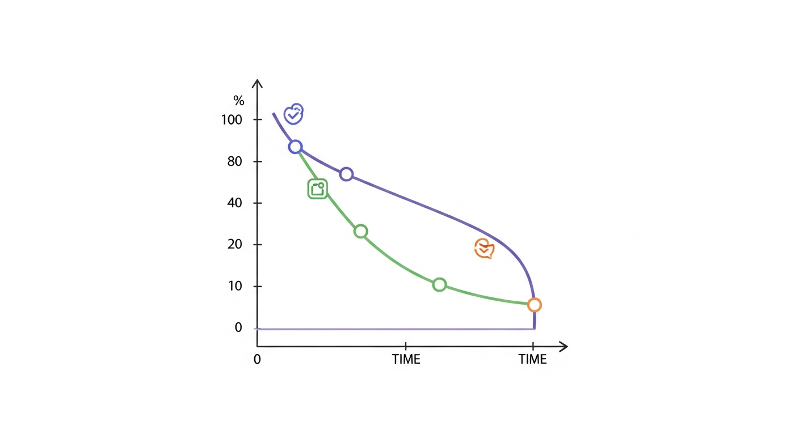
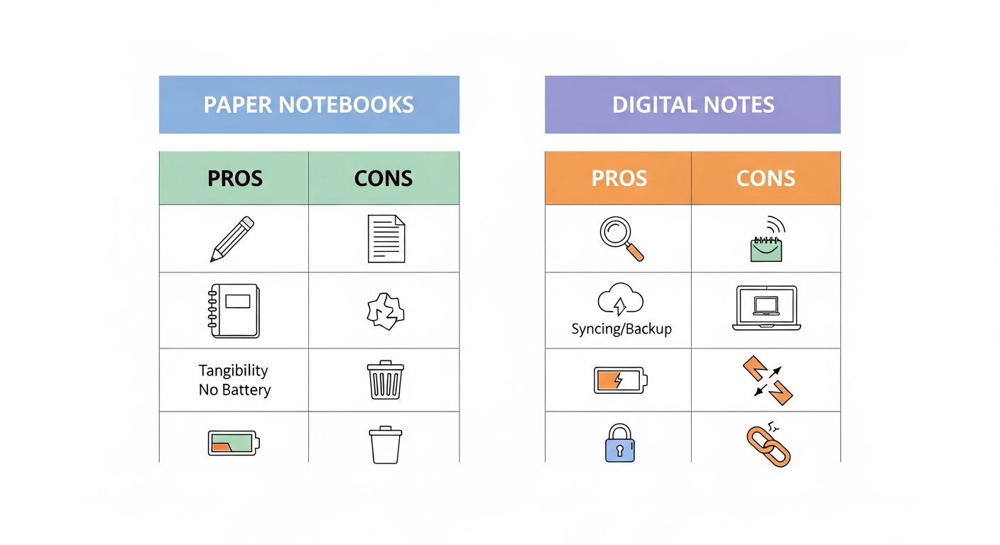
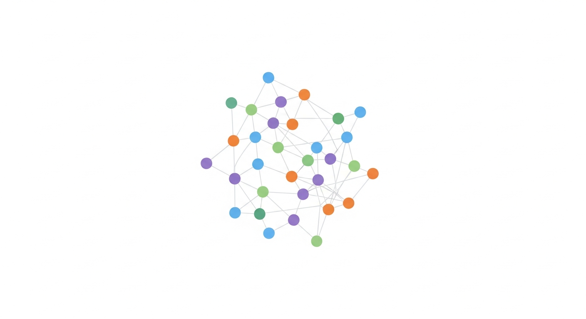
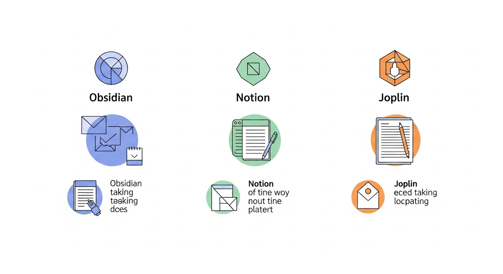

# 제1장: 왜 디지털 노트인가 — 종이 노트의 한계와 디지털의 가능성

여러분은 오늘 하루 동안 얼마나 많은 정보를 접했습니까? 아침에 뉴스 헤드라인을 훑고, 출근길에 팟캐스트를 듣고, 회의에서 새로운 프로젝트 방향을 전달받고, 점심시간에 읽은 기사에서 괜찮은 아이디어를 발견했을 겁니다. 그런데 지금 이 순간, 그중 몇 가지나 기억하고 계십니까? 이 책은 바로 그 문제에서 출발합니다. 쏟아지는 정보 속에서 "내 것"을 건져 올리고, 체계적으로 정리하고, 언제든 다시 꺼내 쓸 수 있는 디지털 노트의 세계로 여러분을 안내하려 합니다.

---

## 정보 과부하 시대, 우리의 뇌는 괜찮은가

### 하루에 쏟아지는 정보의 양

현대인이 하루에 접하는 정보량은 과거와 비교할 수 없을 만큼 방대합니다. 미국 캘리포니아대학교 연구에 따르면, 한 사람이 하루에 소비하는 정보량은 약 34기가바이트에 달한다고 합니다. 이것은 종이책으로 환산하면 대략 10만 단어, 즉 소설 한 권 분량에 해당합니다. 매일 소설 한 권 분량의 정보가 우리 머릿속을 스쳐 지나가는 셈입니다.

문제는 우리 뇌가 이 모든 정보를 처리하도록 설계되지 않았다는 점입니다. 심리학에서 말하는 "작업 기억(Working Memory)"의 용량은 한 번에 약 4~7개 항목 정도에 불과합니다. 마치 책상 위에 올려놓을 수 있는 서류가 일곱 장뿐인데, 매 시간 수백 장의 서류가 배달되는 것과 같습니다.

### 기록하지 않으면 사라지는 것들

여러분도 이런 경험이 있을 겁니다. 회의 중에 번뜩이는 아이디어가 떠올랐는데, "이건 꼭 기억해야지" 하고 넘겼다가 30분 뒤에 완전히 잊어버린 경험 말입니다. 독일의 심리학자 헤르만 에빙하우스(Hermann Ebbinghaus)가 발견한 "망각 곡선(Forgetting Curve)"에 따르면, 새로운 정보를 접한 뒤 24시간 이내에 약 70%를 잊어버립니다.

이것은 개인의 기억력 문제가 아닙니다. 인간의 뇌가 원래 그렇게 작동하는 것입니다. 그래서 우리에게는 "외부 기억 장치"가 필요합니다. 과거에는 그것이 종이 노트였습니다. 하지만 지금 시대에 종이 노트만으로 충분할까요?

*그림 1-1. 에빙하우스의 망각 곡선 그래프 — 시간 경과에 따른 기억 보존률 변화를 보여주는 다이어그램*

---

## 종이 노트, 정말 최선이었을까

### 종이 노트의 장점을 먼저 인정하자

종이 노트를 무조건 나쁘다고 말하는 것은 공정하지 않습니다. 종이 노트에는 분명한 장점이 있습니다.

첫째, **즉시성**입니다. 앱을 열고 로그인할 필요 없이 펜만 들면 바로 쓸 수 있습니다. 둘째, **자유로운 표현**입니다. 글자, 그림, 화살표, 밑줄을 제약 없이 섞어 쓸 수 있습니다. 셋째, **집중력 향상**입니다. 손으로 직접 쓰는 행위가 뇌의 인코딩(정보를 기억으로 전환하는 과정)을 돕는다는 연구 결과도 있습니다.

실제로 프린스턴대학교와 UCLA의 공동 연구(2014)에서는 노트북 컴퓨터로 필기한 학생보다 손으로 필기한 학생이 개념 이해도 테스트에서 더 높은 점수를 받았다는 결과가 나오기도 했습니다.

### 그런데 왜 한계를 느끼는가

종이 노트의 진짜 문제는 "쓸 때"가 아니라 "찾을 때" 드러납니다. 한번 솔직하게 생각해 봅시다.

- 3개월 전에 적어둔 독서 메모를 지금 바로 찾을 수 있습니까?
- 지난달 회의에서 나온 핵심 결정 사항을 30초 안에 확인할 수 있습니까?
- 서로 다른 노트에 흩어져 있는 관련 내용을 하나로 엮어 볼 수 있습니까?

대부분의 사람은 이 질문에 "아니오"라고 답할 것입니다. 종이 노트는 **입력에는 강하지만 검색과 연결에는 치명적으로 약합니다**. 열 권의 노트에 걸쳐 흩어져 있는 아이디어 조각들을 하나로 모으려면, 결국 모든 노트를 처음부터 다시 넘겨봐야 합니다.

또 하나의 문제는 **휘발성**입니다. 커피를 쏟으면 한 페이지가 사라집니다. 노트를 잃어버리면 수개월의 기록이 한꺼번에 증발합니다. 백업이라는 개념 자체가 존재하지 않습니다.

*그림 1-2. 종이 노트와 디지털 노트의 장단점을 한눈에 비교하는 표 형식 인포그래픽*

### 종이 노트 vs 디지털 노트 — 핵심 비교

두 방식의 차이를 조금 더 구체적으로 살펴보겠습니다.

| 비교 항목 | 종이 노트 | 디지털 노트 |
|-----------|-----------|-------------|
| **기록 속도** | 손글씨 속도에 제한 | 타이핑·음성·사진 등 다양한 입력 |
| **검색** | 수동으로 페이지를 넘겨야 함 | 키워드로 즉시 검색 가능 |
| **정보 연결** | 물리적으로 불가능 | 링크·태그·그래프로 연결 |
| **백업** | 복사 어려움, 분실 위험 | 클라우드 자동 동기화 |
| **공간** | 물리적 보관 공간 필요 | 저장 공간 사실상 무제한 |
| **편집** | 지우개·수정 테이프 | 자유로운 수정·이동·재구성 |
| **공유** | 직접 전달하거나 복사 | 링크 하나로 즉시 공유 |
| **멀티미디어** | 텍스트·그림만 가능 | 이미지·동영상·오디오·파일 첨부 |

이 표를 보면 디지털 노트의 장점이 압도적으로 보입니다. 하지만 중요한 것은 "어느 쪽이 더 좋은가"가 아니라 "내 상황에 어느 쪽이 더 맞는가"입니다. 다만 이 책은 디지털 노트의 가능성을 최대한 활용하는 방법을 다루므로, 여기서부터는 디지털 노트의 세계에 집중하겠습니다.

---

## 디지털 노트가 바꾸는 생각 정리 방식

### "검색 가능한 기억"이라는 혁명

디지털 노트의 가장 큰 힘은 **검색**입니다. 이것은 단순한 편리함이 아니라, 기록에 대한 근본적인 태도를 바꿔 줍니다.

종이 노트 시절에는 "어디에 적어야 나중에 찾기 쉬울까?"를 고민해야 했습니다. 카테고리를 나누고, 인덱스를 만들고, 색인 탭을 붙이는 데 상당한 에너지가 소모되었습니다. 그런데도 찾을 때는 여전히 힘들었습니다.

디지털 노트에서는 이 고민이 크게 줄어듭니다. 일단 적어 놓기만 하면, 나중에 키워드 하나로 순식간에 찾을 수 있기 때문입니다. "일단 기록하고, 나중에 찾는다"는 전략이 비로소 현실적으로 작동하기 시작한 것입니다.

예를 들어 봅시다. 6개월 전 독서 모임에서 누군가가 "세컨드 브레인"이라는 개념을 언급했다고 합시다. 종이 노트였다면 그날의 노트를 찾는 것부터 난관입니다. 하지만 디지털 노트에서는 검색창에 "세컨드 브레인"을 입력하면 관련 메모가 모두 나열됩니다. 심지어 그 개념과 연결된 다른 메모까지 함께 확인할 수 있습니다.

### "연결되는 생각"의 힘

디지털 노트의 두 번째 혁명은 **연결**입니다. 종이 노트에서 서로 다른 페이지의 내용을 연결하려면 "p.42 참고"라고 적는 것이 최선이었습니다. 하지만 디지털 노트에서는 하이퍼링크(Hyperlink)와 태그(Tag)를 통해 관련 내용을 자유자재로 연결할 수 있습니다.

이것이 왜 중요할까요? 새로운 아이디어는 대부분 기존 아이디어들의 새로운 조합에서 탄생하기 때문입니다. 작가 스티븐 존슨(Steven Johnson)은 그의 책 『좋은 아이디어는 어디에서 오는가(Where Good Ideas Come From)』에서 이렇게 말했습니다.

> "혁신적인 아이디어는 갑자기 '유레카'하고 떠오르는 것이 아니라, 오랫동안 떠다니던 생각의 조각들이 서로 충돌하고 결합하면서 형성된다."

디지털 노트의 연결 기능은 바로 이 "생각의 충돌과 결합"을 의도적으로 만들어 낼 수 있게 해 줍니다. 특히 옵시디언(Obsidian)의 그래프 뷰(Graph View) 같은 기능을 사용하면, 자신의 메모들이 어떻게 연결되어 있는지를 시각적으로 확인할 수 있습니다. 마치 자신의 뇌 속 뉴런(Neuron) 네트워크를 바깥에서 들여다보는 것과 같은 경험입니다.

*그림 1-3. 옵시디언 그래프 뷰의 예시 — 노트들이 서로 연결된 네트워크 형태의 시각화*

### "진화하는 기록"이라는 새로운 패러다임

종이 노트에 한번 적은 내용을 수정하려면 지우개를 쓰거나 줄을 그어야 합니다. 수정이 잦아지면 노트는 금세 지저분해집니다. 그래서 종이 노트에서는 "한 번에 잘 정리해서 적자"는 압박이 생깁니다. 이 압박은 종종 기록 자체를 방해합니다. "완벽하게 정리할 시간이 없으니 아예 안 적자"는 결론에 도달하기 쉽습니다.

디지털 노트에서는 이 문제가 해소됩니다. 처음에는 거칠게 적어 놓고, 나중에 자유롭게 다듬을 수 있습니다. 문단을 이동하고, 내용을 추가하고, 불필요한 부분을 삭제하는 일이 아무런 비용 없이 가능합니다.

실제로 많은 디지털 노트 사용자들은 다음과 같은 워크플로(Workflow, 작업 흐름)를 활용합니다.

1. **빠른 메모**: 생각이 떠오르는 즉시 핵심 키워드만 적는다
2. **확장**: 여유가 있을 때 키워드를 문장으로 발전시킨다
3. **연결**: 기존 메모와의 관련성을 찾아 링크를 건다
4. **정제**: 충분히 성숙한 메모는 글이나 프로젝트로 발전시킨다

이 과정에서 하나의 메모는 씨앗에서 나무로, 나무에서 숲으로 자연스럽게 성장합니다. 종이 노트에서는 상상하기 어려운 일입니다.

---

## 그래서, 어떤 도구를 써야 할까

디지털 노트가 좋다는 건 알겠는데, 도구가 너무 많습니다. 에버노트(Evernote), 원노트(OneNote), 구글 킵(Google Keep), 베어(Bear), 로그세크(Logseq)... 선택지는 끝없이 늘어납니다. 이 책에서는 그중에서도 가장 대표적이고 서로 다른 철학을 가진 세 가지 도구에 집중합니다.

**옵시디언(Obsidian)** — "내 생각은 내 것"이라는 철학을 가진 마크다운(Markdown) 기반 노트 앱입니다. 모든 데이터가 내 컴퓨터에 일반 텍스트 파일로 저장됩니다. 양방향 링크(Backlink)와 그래프 뷰로 생각의 네트워크를 구축할 수 있습니다.

**노션(Notion)** — 노트, 데이터베이스, 위키, 프로젝트 관리를 하나의 워크스페이스(Workspace)에 통합한 올인원 도구입니다. 팀 협업에 특히 강하며, 블록(Block) 기반의 유연한 편집이 특징입니다.

**조플린(Joplin)** — 오픈 소스(Open Source, 소스 코드가 공개된 소프트웨어)이면서 무료인 노트 앱입니다. 에버노트의 대안으로 인기를 얻었으며, 프라이버시(Privacy, 개인 정보 보호)를 중시하는 사용자에게 적합합니다.

이 세 도구는 각각 다른 성격을 가지고 있습니다. 비유하자면 이렇습니다.

- **옵시디언**은 나만의 연구실입니다. 자유롭게 실험하고, 생각을 엮고, 깊이 있는 탐구를 할 수 있는 공간입니다.
- **노션**은 잘 정돈된 사무실입니다. 프로젝트를 관리하고, 팀과 협업하고, 모든 것을 체계적으로 운영할 수 있습니다.
- **조플린**은 신뢰할 수 있는 개인 금고입니다. 내 데이터를 내가 직접 관리하며, 어디에서든 안전하게 접근할 수 있습니다.

어떤 도구가 "최고"인지는 없습니다. 여러분의 필요와 성향에 맞는 도구가 "최선"입니다. 이 책은 세 가지 도구를 모두 다루면서, 여러분이 자신에게 맞는 선택을 할 수 있도록 돕겠습니다.

*그림 1-4. 옵시디언, 노션, 조플린 세 도구의 핵심 특징을 비교하는 인포그래픽 — 각 도구의 아이콘과 핵심 키워드*

---

## 이 책의 구성과 활용법

### 전체 구성 미리 보기

이 책은 총 11개의 챕터로 구성되어 있으며, 크게 다섯 부분으로 나눌 수 있습니다.

**Part 1. 디지털 노트, 왜 그리고 어떤 것을 (1~2장)**
- 제1장(지금 읽고 계신 이 장): 디지털 노트의 필요성과 이 책의 활용법
- 제2장: 옵시디언·노션·조플린 — 세 도구의 탄생 배경과 선택 가이드

**Part 2. 옵시디언 — 나만의 지식 그래프 (3~4장)**
- 제3장: 옵시디언 시작하기 — 설치, 볼트, 마크다운 기초
- 제4장: 옵시디언 깊이 쓰기 — 양방향 링크, 그래프 뷰, 플러그인

**Part 3. 노션 — 만능 워크스페이스 (5~6장)**
- 제5장: 노션 시작하기 — 페이지, 블록, 기본 구조
- 제6장: 노션 깊이 쓰기 — 데이터베이스, 팀 협업, AI 활용

**Part 4. 조플린 — 프라이버시 우선 오픈소스 노트 (7~8장)**
- 제7장: 조플린 시작하기 — 설치, 노트북, 마크다운 활용
- 제8장: 조플린 깊이 쓰기 — 암호화, 동기화, 플러그인

**Part 5. 실전과 통합 — 노트를 삶에 연결하기 (9~11장)**
- 제9장: 세 도구 비교와 나만의 조합 찾기
- 제10장: 실전 워크플로 — 독서, 업무, 프로젝트에 적용하기
- 제11장: 디지털 노트 습관 만들기 — 지속 가능한 기록 루틴

### 이 책을 읽는 세 가지 방법

이 책은 처음부터 끝까지 순서대로 읽을 수도 있지만, 독자의 상황에 따라 다르게 활용할 수도 있습니다.

**방법 1: 처음부터 차근차근 (초보자 추천)**
디지털 노트를 처음 접하는 분이라면 1장부터 순서대로 읽어 나가시길 권합니다. 각 장이 이전 장의 내용을 바탕으로 하기 때문에, 기초부터 탄탄하게 쌓아갈 수 있습니다.

**방법 2: 도구별로 골라 읽기 (특정 도구 사용자)**
이미 하나의 도구를 사용하고 있다면, 해당 도구의 내용만 골라서 읽어도 됩니다. 각 장에서 세 도구를 병렬적으로 다루므로, 자신이 사용하는 도구의 부분만 집중적으로 볼 수 있습니다.

**방법 3: 필요한 장만 골라 읽기 (경험자)**
디지털 노트를 이미 어느 정도 사용하고 있다면, 부족하다고 느끼는 영역의 장만 골라 읽으셔도 좋습니다. 각 장은 독립적인 주제를 다루므로, 필요한 부분만 참고해도 충분히 유용합니다.

### 각 장의 구성 패턴

모든 장은 일관된 패턴으로 구성되어 있습니다.

1. **도입 이야기**: 해당 주제와 관련된 일상적인 상황이나 문제 제시
2. **핵심 개념 설명**: 알아야 할 개념과 원리를 쉬운 말로 풀이
3. **도구별 실습 가이드**: 옵시디언·노션·조플린 각각에서의 구체적인 사용 방법
4. **실전 예시**: 실제 업무나 일상에서 바로 쓸 수 있는 활용 사례
5. **챕터 요약**: 핵심 내용 정리
6. **다음 장 미리 보기**: 이어지는 내용 안내

---

## 챕터 요약

이 장에서는 디지털 노트가 왜 필요한지를 살펴보았습니다. 정보 과부하 시대에 인간의 기억력만으로는 쏟아지는 정보를 감당할 수 없으며, 종이 노트는 기록에는 좋지만 검색과 연결에서 한계가 뚜렷합니다. 디지털 노트는 검색, 연결, 편집의 자유를 통해 생각을 정리하는 방식 자체를 바꿔 줍니다. 이 책에서는 옵시디언, 노션, 조플린이라는 세 가지 대표 도구를 중심으로, 초보자부터 경험자까지 모두가 활용할 수 있는 실전 가이드를 제공합니다.

---

## 다음 장 미리 보기

2장에서는 본격적으로 세 도구를 설치하고 첫 화면을 설정하는 과정을 함께 진행합니다. 아직 어떤 도구를 써야 할지 정하지 못했어도 괜찮습니다. 세 가지를 모두 설치해 보고 직접 느껴 보는 것이 가장 좋은 선택 방법이니까요.
