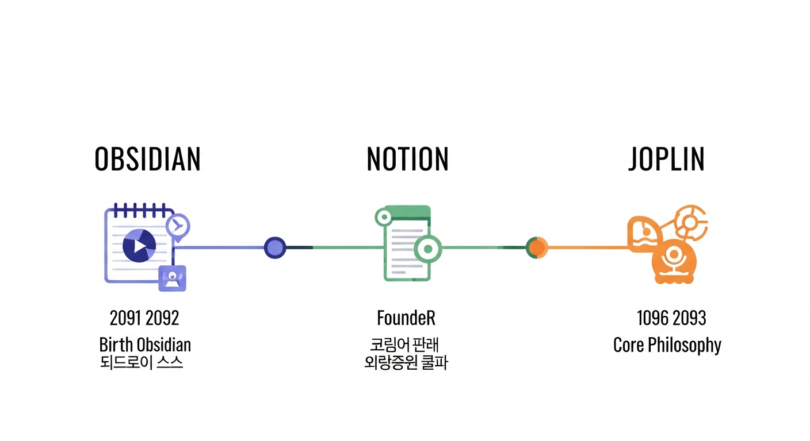
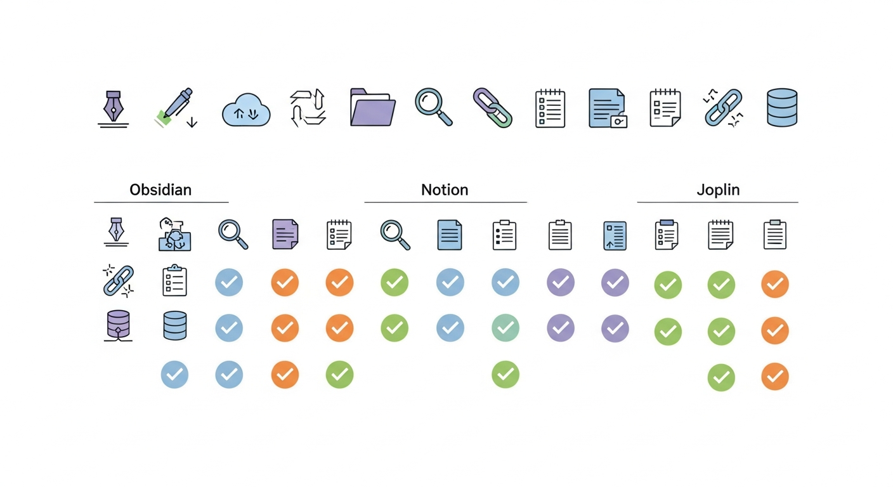
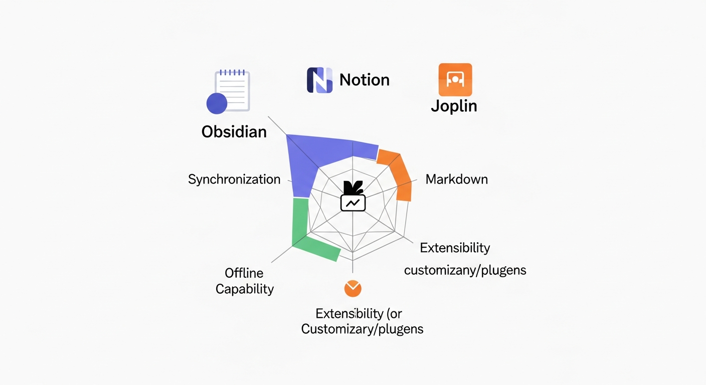
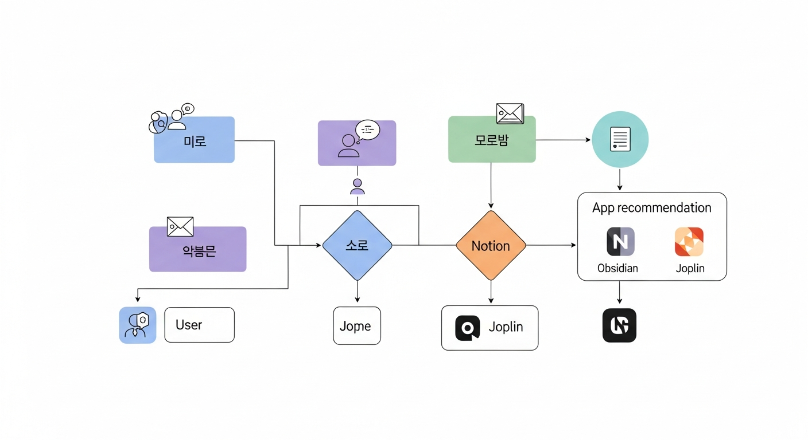

# 제2장: 세 앱 한눈에 보기 — 옵시디언·노션·조플린 비교 지도

새 노트 앱을 고르는 일은 마치 이사할 집을 찾는 것과 비슷합니다. 겉모습만 보고 계약했다가 "수납공간이 부족하네", "벽이 너무 얇네" 하고 후회하는 경우가 있듯이, 노트 앱도 막상 써 보면 "이 기능이 없네?", "이건 내 스타일이 아닌데?" 하는 순간이 옵니다. 이번 장에서는 옵시디언, 노션, 조플린 세 앱을 나란히 놓고 꼼꼼히 비교해 봅니다. 각 앱이 어떤 생각에서 태어났는지, 돈은 얼마나 드는지, 어떤 기능이 강하고 약한지를 한눈에 볼 수 있는 비교 지도를 함께 그려 보겠습니다.

---

## 세 앱은 어떻게 태어났는가

노트 앱을 제대로 이해하려면 "왜 이 앱이 만들어졌는가"부터 알아야 합니다. 도구의 철학을 이해하면, 그 도구의 강점과 한계가 자연스럽게 보이기 때문입니다.

### 옵시디언 — "내 데이터는 내 것이다"

옵시디언(Obsidian)은 2020년에 시다 리(Shida Li)와 에리카 쑤(Erica Xu)라는 두 명의 개발자가 공동 창립했습니다. 이들의 출발점은 단순하면서도 강력한 질문이었습니다. "왜 내 메모가 특정 회사의 서버에 갇혀 있어야 하지?"

당시 에버노트(Evernote)를 비롯한 대부분의 노트 앱은 사용자의 데이터를 자사 클라우드에 저장했습니다. 앱을 바꾸고 싶어도 데이터를 빼내기가 어려웠고, 회사가 문을 닫으면 내 메모도 함께 사라질 위험이 있었습니다.

옵시디언의 해답은 놀라울 정도로 단순했습니다. **모든 메모를 내 컴퓨터에 일반 텍스트 파일(.md)로 저장하는 것**입니다. 특별한 데이터베이스도, 독자적인 파일 형식도 없습니다. 윈도우 탐색기나 맥 파인더에서 직접 열어 볼 수 있는 평범한 텍스트 파일입니다.

이 철학은 마치 일기장을 남의 집 금고에 맡기는 대신, 내 책상 서랍에 보관하는 것과 같습니다. 열쇠는 오직 나만 가지고 있습니다.

거기에 옵시디언은 **양방향 링크(Backlink)**라는 강력한 무기를 더했습니다. 메모 A에서 메모 B를 링크하면, 메모 B에서도 자동으로 "A가 나를 참조하고 있다"는 정보가 표시됩니다. 이 양방향 연결이 쌓이면 메모끼리 그물처럼 엮이게 되고, 이것을 시각적으로 보여주는 것이 1장에서 잠깐 언급한 **그래프 뷰(Graph View)**입니다.

### 노션 — "하나의 앱으로 모든 것을 해결하자"

노션(Notion)의 역사는 조금 더 드라마틱합니다. 창업자 이반 자오(Ivan Zhao)는 원래 프로그래머가 아니라 디자이너였습니다. 그는 2013년에 회사를 설립했지만 첫 버전은 실패했습니다. 팀을 거의 해체하고 일본 교토로 건너가 3명이서 제품을 처음부터 다시 만들었습니다. 2018년에 재출시한 노션은 그야말로 폭발적인 성장을 이루었습니다.

노션의 핵심 철학은 **"레고 블록처럼 조립하는 워크스페이스"**입니다. 노션에서는 모든 것이 블록(Block)입니다. 텍스트 한 줄이 블록이고, 이미지가 블록이고, 표가 블록이고, 달력이 블록입니다. 이 블록들을 자유롭게 배치하고 조합하면, 단순한 메모장에서부터 프로젝트 관리 도구, 회사 위키, 개인 홈페이지까지 만들 수 있습니다.

비유하자면, 옵시디언이 고급 만년필이라면 노션은 스위스 군용 칼입니다. 하나의 도구 안에 칼, 가위, 드라이버, 병따개가 모두 들어 있는 것입니다.

노션의 또 다른 강점은 **협업**입니다. 같은 페이지에서 여러 사람이 동시에 작업할 수 있고, 댓글을 남기고, 멘션(@)으로 동료에게 알림을 보낼 수 있습니다. 이런 이유로 스타트업부터 대기업까지 팀 단위로 노션을 도입하는 경우가 많습니다.

### 조플린 — "에버노트는 좋았다, 하지만 자유롭지 못했다"

조플린(Joplin)은 2017년에 로랑 쿠아뇌(Laurent Cozic)라는 프랑스 개발자가 만들었습니다. 이름은 유명한 재즈 피아니스트 스콧 조플린(Scott Joplin)에서 따왔습니다. 탄생 배경은 명확합니다. 에버노트를 사용하던 그가 "왜 내 데이터를 내 마음대로 할 수 없지? 왜 무료 버전은 이렇게 제한이 많지?"라는 불만에서 직접 대안을 만든 것입니다.

조플린의 핵심 철학은 두 가지입니다. 첫째, **오픈 소스(Open Source)**입니다. 누구나 소스 코드를 볼 수 있고, 수정할 수 있고, 기여할 수 있습니다. 이것은 앱의 투명성을 보장합니다. 비밀스럽게 데이터를 수집하거나 갑자기 서비스를 종료할 위험이 적습니다. 둘째, **프라이버시 존중**입니다. 엔드투엔드 암호화(End-to-End Encryption, 발신자와 수신자 사이에서만 내용을 확인할 수 있는 기술)를 지원하며, 동기화 서버도 본인이 직접 선택할 수 있습니다.

조플린을 비유하자면, 오픈 소스 세계의 믿음직한 수첩이라 할 수 있습니다. 화려하지는 않지만, 정직하고 든든합니다.

*그림 2-1. 옵시디언·노션·조플린 세 앱의 탄생 연도, 창립자, 핵심 철학을 타임라인 형식으로 보여주는 인포그래픽*

---

## 돈 이야기 — 무료로 얼마나 쓸 수 있을까

노트 앱을 선택할 때 기능만큼이나 중요한 것이 비용입니다. "무료입니다"라는 말에도 여러 층위가 있습니다. 완전히 무료인 경우, 기본은 무료이되 핵심 기능에 과금하는 경우, 그리고 무료 체험 뒤 유료 전환하는 경우가 있습니다. 세 앱의 요금 구조를 솔직하게 비교해 보겠습니다.

### 옵시디언 — 개인 사용은 완전 무료

옵시디언의 핵심 앱은 **개인 사용 시 완전히 무료**입니다. 메모 수 제한도 없고, 플러그인 사용에도 제한이 없습니다. 커뮤니티가 만든 수천 개의 플러그인을 자유롭게 설치할 수 있습니다.

유료 서비스는 두 가지입니다.

- **싱크(Sync)**: 월 $4(약 5,300원) — 여러 기기 간 자동 동기화
- **퍼블리시(Publish)**: 월 $8(약 10,600원) — 메모를 웹사이트로 공개

중요한 점은 이 유료 서비스 없이도 앱의 모든 핵심 기능을 사용할 수 있다는 것입니다. 동기화가 필요하면 드롭박스(Dropbox)나 구글 드라이브(Google Drive) 같은 외부 클라우드 서비스를 이용하면 됩니다. 약간의 설정이 필요하지만, 비용은 들지 않습니다.

### 노션 — 개인은 넉넉, 팀은 유료

노션의 무료 플랜(Free Plan)은 개인 사용자에게 상당히 관대합니다. 페이지 수 무제한, 블록 수 무제한, 게스트 10명 초대 가능합니다. 개인이 노트와 간단한 프로젝트 관리용으로 사용한다면 무료 플랜으로도 충분합니다.

유료 플랜은 주로 팀 기능에 초점이 맞추어져 있습니다.

- **플러스(Plus)**: 월 $10/인 — 무제한 파일 업로드, 무제한 게스트
- **비즈니스(Business)**: 월 $18/인 — 고급 권한 관리, 감사 로그
- **엔터프라이즈(Enterprise)**: 별도 문의 — 대기업용 보안·관리 기능

개인 사용자가 주의할 점이 있습니다. 노션은 **인터넷 연결이 필요**합니다. 오프라인에서도 일부 작업은 가능하지만, 기본적으로 클라우드 기반 서비스입니다. 이 점은 비용과 직접 관련은 없지만, "무료"의 대가로 인터넷 의존성을 감수해야 한다는 뜻입니다.

### 조플린 — 앱 자체는 100% 무료

조플린은 오픈 소스이므로 **앱 자체는 완전히 무료**입니다. 데스크톱, 모바일, 터미널 버전 모두 무료로 사용할 수 있습니다.

동기화를 위한 옵션은 여러 가지입니다.

- **조플린 클라우드(Joplin Cloud)**: 월 $2.99(약 4,000원)부터 — 공식 동기화 서비스
- **외부 클라우드 직접 연결**: 무료 — 드롭박스, 원드라이브, 넥스트클라우드(Nextcloud) 등
- **자체 서버 구축**: 무료 — 기술 지식이 있다면 완전한 자율성 확보

조플린의 매력은 동기화 방법을 사용자가 직접 선택할 수 있다는 점입니다. 가장 쉬운 방법은 조플린 클라우드를 쓰는 것이고, 비용을 아끼고 싶다면 드롭박스 연결만으로도 충분합니다.

### 요금 비교 한눈에 보기

| 항목 | 옵시디언 | 노션 | 조플린 |
|------|---------|------|-------|
| **기본 앱** | 무료 | 무료 | 무료 (오픈 소스) |
| **개인 사용 시 제한** | 없음 | 없음 (게스트 10명) | 없음 |
| **공식 동기화** | 월 $4 | 무료 (기본 포함) | 월 $2.99 |
| **팀 협업** | 없음 | 월 $10/인부터 | 월 $7.49/인부터 |
| **무료 동기화 방법** | 외부 클라우드 | 기본 포함 | 외부 클라우드 |
| **학생 할인** | 없음 | 교육용 무료 플랜 | 해당 없음 (이미 무료) |

*그림 2-2. 세 앱의 무료 기능 범위를 벤 다이어그램 또는 아이콘 기반 비교표로 시각화한 인포그래픽*

**한줄 요약**: 개인 사용 기준으로 세 앱 모두 핵심 기능은 무료입니다. 돈이 드는 부분은 주로 "동기화"와 "팀 협업"입니다. 학생이거나 팀 단위로 쓸 예정이라면 노션의 교육용 무료 플랜이 매력적이고, 비용을 최소화하고 싶다면 조플린이 유리합니다.

---

## 핵심 기능 비교 — 진짜 중요한 것들

이제 가장 많이 궁금해하실 부분입니다. "그래서 기능 차이가 뭔데?" 세 앱의 핵심 기능을 하나씩 비교해 보겠습니다.

### 오프라인 사용

인터넷 없이 노트를 쓸 수 있느냐는 생각보다 중요한 문제입니다. 비행기 안에서, 지하철에서, 와이파이가 불안한 카페에서도 메모를 해야 할 때가 있으니까요.

- **옵시디언**: **완벽한 오프라인 지원**. 파일이 내 컴퓨터에 있으므로 인터넷과 전혀 무관합니다. 비행기 모드에서도 모든 기능이 동일하게 작동합니다.
- **노션**: **제한적 오프라인**. 최근에 열어본 페이지는 캐시(Cache, 임시 저장)되어 오프라인에서 볼 수 있지만, 새로운 페이지를 만들거나 검색하는 데는 제한이 있습니다. 오프라인 지원이 점차 개선되고 있지만, 여전히 온라인 환경이 기본 전제입니다.
- **조플린**: **완벽한 오프라인 지원**. 옵시디언과 마찬가지로 모든 데이터가 로컬에 저장됩니다. 동기화는 인터넷이 연결될 때 자동으로 이루어집니다.

### 동기화

여러 기기에서 같은 메모를 보고 편집하는 것, 즉 동기화(Sync)도 빠뜨릴 수 없습니다.

- **옵시디언**: 공식 싱크 서비스($4/월)가 가장 깔끔하지만, iCloud·드롭박스·Syncthing 등 무료 대안이 존재합니다. 설정이 약간 번거로울 수 있습니다.
- **노션**: **별도 설정 없이 자동 동기화**. 계정만 있으면 어떤 기기에서든 동일한 내용을 볼 수 있습니다. 이 부분에서는 노션이 가장 편리합니다.
- **조플린**: 조플린 클라우드, 드롭박스, 원드라이브, 넥스트클라우드 등 다양한 동기화 옵션을 제공합니다. 선택지가 많다는 것은 자유롭다는 뜻이기도 하고, 초보자에게는 복잡하다는 뜻이기도 합니다.

### 마크다운 지원

마크다운(Markdown)은 `# 제목`, `**굵게**`, `- 목록` 같은 간단한 기호로 문서를 꾸미는 방식입니다. 프로그래머들 사이에서 시작되었지만, 요즘은 일반 사용자도 많이 씁니다. 한번 익히면 마우스 없이 키보드만으로 깔끔한 문서를 작성할 수 있어서 매우 효율적입니다.

- **옵시디언**: **마크다운이 기본 언어**. 모든 메모가 .md 파일로 저장되므로, 마크다운과 떼려야 뗄 수 없는 관계입니다. 실시간 미리보기도 지원합니다.
- **노션**: **블록 기반 편집이 기본**. 마크다운 문법을 입력하면 자동으로 서식이 적용되긴 하지만, 저장 형식 자체는 마크다운이 아닙니다. 마크다운 내보내기(Export)는 가능합니다.
- **조플린**: **마크다운 전면 지원**. 옵시디언과 유사하게 마크다운을 기본 편집 방식으로 사용합니다. 에디터와 미리보기를 나란히 놓고 작업할 수 있습니다.

### 협업 기능

혼자만 쓰는 앱과 팀과 함께 쓰는 앱은 필요한 기능이 다릅니다.

- **옵시디언**: **기본적으로 개인용**. 팀 협업 기능은 거의 없습니다. 옵시디언 퍼블리시로 메모를 공개하거나, 깃(Git)을 활용해 파일을 공유하는 우회 방법은 있지만, 실시간 공동 편집은 지원하지 않습니다.
- **노션**: **협업의 왕**. 실시간 공동 편집, 댓글, 멘션, 권한 관리, 팀스페이스까지 팀워크에 필요한 거의 모든 기능을 갖추고 있습니다.
- **조플린**: **제한적 협업**. 조플린 클라우드의 팀 플랜에서 노트 공유가 가능하지만, 노션 수준의 실시간 협업은 아닙니다.

### 확장성과 플러그인

앱을 자신의 필요에 맞게 커스터마이즈(Customize, 맞춤 설정)할 수 있느냐도 중요합니다.

- **옵시디언**: **플러그인 생태계가 가장 풍부**. 커뮤니티가 만든 플러그인이 1,500개 이상이며, 달력, 칸반 보드, 마인드맵, 데이터뷰 등 상상할 수 있는 대부분의 기능을 플러그인으로 추가할 수 있습니다.
- **노션**: **자체 기능이 풍부하여 플러그인 필요성이 낮음**. 외부 연동(Integration)과 API를 통해 다른 서비스와 연결할 수 있지만, 옵시디언만큼의 자유도는 아닙니다.
- **조플린**: **플러그인 시스템 존재**. 옵시디언보다 규모는 작지만, 오픈 소스이므로 직접 기능을 추가하거나 수정할 수 있는 근본적인 자유가 있습니다.

### 핵심 기능 비교표

| 기능 | 옵시디언 | 노션 | 조플린 |
|------|---------|------|-------|
| **오프라인 사용** | ★★★ 완벽 | ★☆☆ 제한적 | ★★★ 완벽 |
| **동기화 편의성** | ★★☆ 설정 필요 | ★★★ 자동 | ★★☆ 설정 필요 |
| **마크다운** | ★★★ 기본 | ★★☆ 부분 지원 | ★★★ 기본 |
| **협업** | ★☆☆ 미지원 | ★★★ 최강 | ★★☆ 제한적 |
| **플러그인/확장** | ★★★ 최다 | ★★☆ API 연동 | ★★☆ 오픈소스 |
| **양방향 링크** | ★★★ 핵심 기능 | ★★☆ 지원 | ★★☆ 지원 |
| **그래프 뷰** | ★★★ 내장 | ☆☆☆ 미지원 | ☆☆☆ 미지원(플러그인) |
| **데이터베이스** | ★☆☆ 플러그인 | ★★★ 핵심 기능 | ☆☆☆ 미지원 |
| **웹 클리핑** | ★★☆ 플러그인 | ★★★ 공식 지원 | ★★★ 공식 지원 |
| **암호화** | ☆☆☆ 미지원 | ☆☆☆ 미지원 | ★★★ E2EE 지원 |
| **데이터 소유권** | ★★★ 로컬 파일 | ★☆☆ 클라우드 | ★★★ 로컬+선택 |

*그림 2-3. 세 앱의 핵심 기능을 레이더 차트(방사형 그래프)로 비교하는 시각화 — 오프라인, 동기화, 마크다운, 협업, 확장성, 보안 축*

---

## 세 앱의 성격을 한마디로

기능표를 눈으로 봐도 감이 잘 안 올 수 있습니다. 그래서 비유를 하나씩 더 해 보겠습니다.

**옵시디언은 자기만의 서재를 짓는 사람을 위한 앱입니다.** 책을 직접 분류하고, 선반을 직접 짜고, 책과 책 사이의 연결 고리를 직접 만드는 즐거움을 아는 사람에게 최적입니다. 초반에 약간의 세팅이 필요하지만, 일단 자리를 잡으면 "이것은 완전히 내 것"이라는 만족감을 줍니다.

**노션은 만능 사무 도우미입니다.** 메모부터 프로젝트 관리, 팀 위키, 간단한 데이터베이스까지 한 곳에서 해결합니다. "이것저것 앱을 여러 개 쓰기 귀찮다"는 사람에게 딱입니다. 다만 인터넷 없이는 힘이 빠진다는 점을 기억해야 합니다.

**조플린은 프라이버시를 최우선으로 여기는 사람의 선택입니다.** 오픈 소스의 투명함, 암호화의 안전함, 동기화 방식을 직접 고르는 자유까지 갖추고 있습니다. 화려한 UI보다 실용성과 신뢰를 중시하는 사람에게 어울립니다.

---

## 나에게 맞는 앱 고르기 체크리스트

"비교표는 알겠는데, 결국 나는 뭘 써야 하는 거야?"라는 질문이 남아 있을 겁니다. 아래 체크리스트를 따라가면 자신에게 맞는 앱을 좁힐 수 있습니다. 해당하는 항목에 체크해 보세요.

### A 그룹 — 옵시디언이 어울리는 사람

- [ ] 내 데이터가 내 컴퓨터에 있어야 마음이 편하다
- [ ] 생각과 생각을 연결하는 작업에 관심이 있다
- [ ] 마크다운을 이미 알고 있거나, 배울 의향이 있다
- [ ] 플러그인으로 앱을 내 취향대로 바꾸고 싶다
- [ ] 오프라인에서도 자유롭게 작업하고 싶다
- [ ] 팀 협업보다는 개인 지식 관리가 목적이다
- [ ] 직접 설정하고 꾸미는 과정 자체가 즐겁다

### B 그룹 — 노션이 어울리는 사람

- [ ] 설치 후 바로 쓸 수 있는 간편함을 원한다
- [ ] 노트뿐 아니라 프로젝트 관리, 일정 관리도 한 앱에서 하고 싶다
- [ ] 팀이나 가족과 함께 사용할 계획이 있다
- [ ] 예쁜 페이지 꾸미기를 좋아한다
- [ ] 데이터베이스 기능(표, 필터, 정렬)이 필요하다
- [ ] 항상 인터넷에 연결된 환경에서 주로 작업한다
- [ ] 다양한 템플릿을 활용해서 빠르게 시작하고 싶다

### C 그룹 — 조플린이 어울리는 사람

- [ ] 개인 정보 보호와 보안이 최우선이다
- [ ] 오픈 소스 소프트웨어를 선호한다
- [ ] 에버노트에서 이전할 대안을 찾고 있다
- [ ] 동기화 방법을 직접 선택하고 싶다 (드롭박스, 자체 서버 등)
- [ ] 비용을 최소한으로 유지하고 싶다
- [ ] 리눅스(Linux)를 사용한다
- [ ] 화려한 디자인보다 안정적인 기능을 중시한다

**결과 해석**: 가장 많이 체크한 그룹의 앱이 여러분에게 맞을 확률이 높습니다. 만약 두 그룹이 비슷하다면? 걱정하지 마세요. 이 책은 세 앱을 모두 다루니까, 일단 두 가지를 모두 설치해서 써 보면 됩니다. 실제로 많은 사용자가 용도에 따라 두 가지 앱을 병행합니다. 예를 들어 "개인 지식 관리는 옵시디언, 팀 프로젝트는 노션"처럼 말입니다.

### 상황별 추천 정리

| 이런 상황이라면 | 추천 앱 | 이유 |
|----------------|---------|------|
| 대학생, 개인 학습 정리 | 옵시디언 또는 노션 | 옵시디언은 깊이 있는 학습, 노션은 과제·일정 관리에 강점 |
| 직장인, 회의록·업무 관리 | 노션 | 팀 공유와 프로젝트 관리 기능이 탁월 |
| 작가, 연구자 | 옵시디언 | 양방향 링크와 그래프 뷰로 아이디어 연결에 최적 |
| 프라이버시 중시, 기술 친화적 | 조플린 | 암호화와 오픈 소스의 이중 안전장치 |
| 에버노트 대체 앱을 찾는 사람 | 조플린 | 가장 유사한 사용 경험 + 에버노트 데이터 가져오기 지원 |
| 가족·소모임 공동 노트 | 노션 | 간편한 공유와 동시 편집 |
| 개발자, 기술 노트 정리 | 옵시디언 또는 조플린 | 마크다운 기본 지원, 깃 연동 가능 |

*그림 2-4. 사용자 유형별 추천 앱을 플로차트 형태로 보여주는 의사결정 트리 다이어그램*

---

## 하나만 골라야 할까? — 조합 전략

사실 꼭 하나만 써야 하는 법은 없습니다. 도구는 목적에 맞게 쓰는 것이 정답입니다.

실제로 많은 파워 유저(Power User, 도구를 깊이 활용하는 사용자)들은 앱을 조합해서 씁니다. 몇 가지 현실적인 조합을 소개합니다.

**조합 1: 옵시디언 + 노션**
가장 인기 있는 조합입니다. 옵시디언으로 개인적인 생각과 아이디어를 관리하고, 노션으로 팀 프로젝트와 공유 문서를 관리합니다. 머릿속은 옵시디언에, 회의실은 노션에 두는 셈입니다.

**조합 2: 옵시디언 + 조플린**
보안과 프라이버시를 중시하면서도 지식 관리를 깊이 하고 싶은 사람에게 맞습니다. 장기 보관 자료와 민감한 정보는 조플린의 암호화 노트에, 일상적인 메모와 지식 연결은 옵시디언에서 처리합니다.

**조합 3: 노션 + 조플린**
팀 협업은 노션으로, 개인적이고 민감한 기록은 조플린으로 분리하는 전략입니다. 회사 업무는 노션에, 개인 일기나 건강 기록 같은 사적인 내용은 조플린에 보관합니다.

물론 처음부터 여러 앱을 동시에 쓸 필요는 전혀 없습니다. 이 책을 읽으면서 하나씩 익혀 가고, 나중에 필요가 생기면 그때 조합을 고려해도 늦지 않습니다.

---

## 챕터 요약

이 장에서는 옵시디언, 노션, 조플린 세 앱을 다각도로 비교했습니다. 옵시디언은 로컬 파일 저장과 양방향 링크를 앞세운 개인 지식 관리의 강자이고, 노션은 블록 기반의 올인원 워크스페이스로 협업에 탁월하며, 조플린은 오픈 소스와 암호화를 바탕으로 프라이버시를 보장하는 실용적 선택지입니다. 세 앱 모두 개인 사용 시 핵심 기능은 무료이며, 오프라인 지원·동기화·마크다운·협업·확장성 등에서 각기 다른 강점을 가지고 있습니다. 자신의 사용 목적, 환경, 성향에 맞는 앱을 선택하되, 필요하다면 두 가지를 조합하는 전략도 유효합니다.

---

## 다음 장 미리 보기

3장에서는 세 앱을 실제로 설치하고 첫 화면을 세팅하는 과정을 단계별로 함께 진행합니다. 스크린샷과 함께 따라 하다 보면 어느새 첫 번째 노트를 작성하게 될 것입니다.
