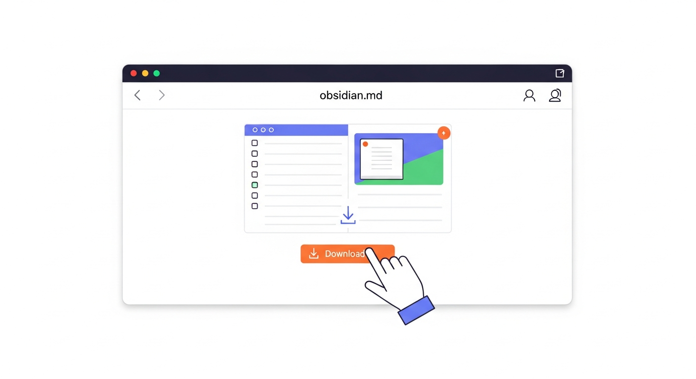
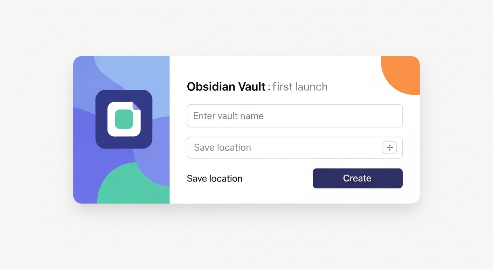
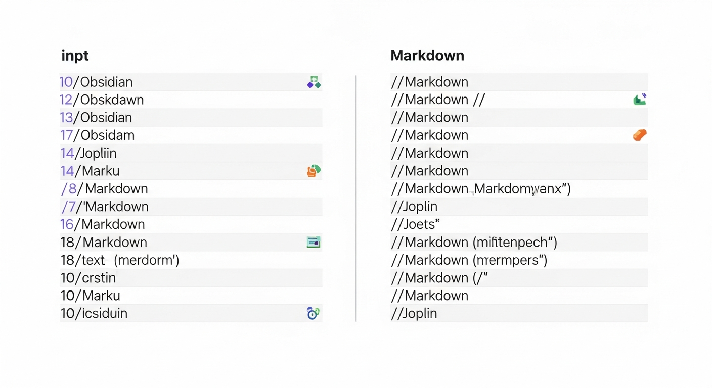
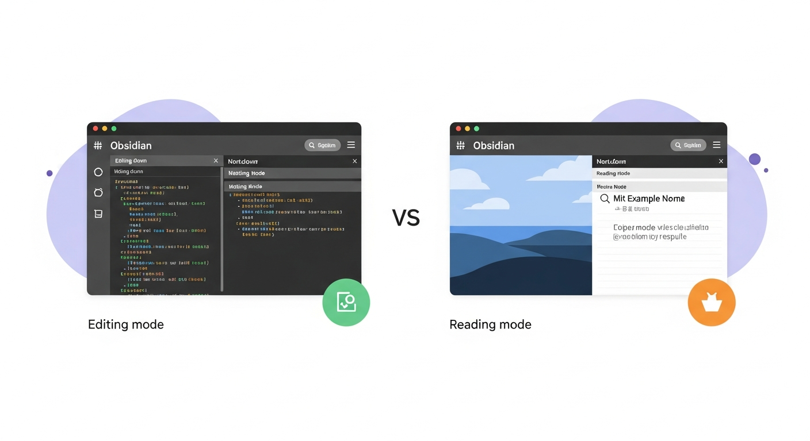
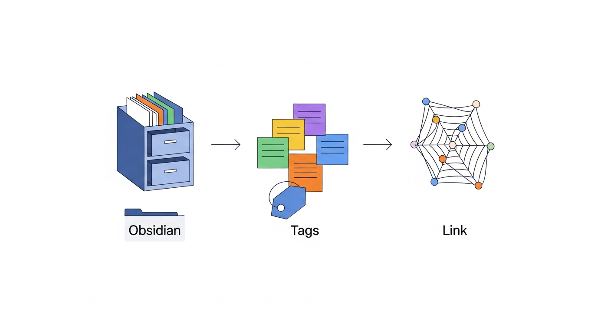
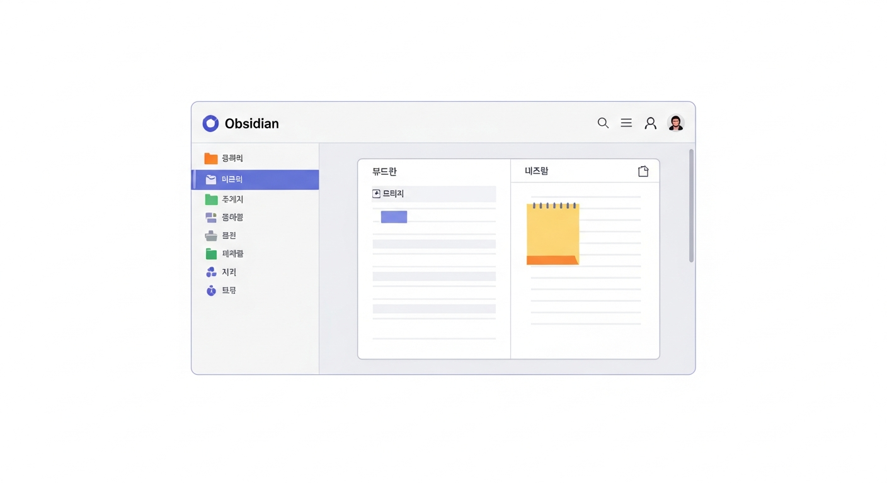

# 제3장: 옵시디언 시작하기 — 설치부터 첫 번째 노트까지

2장에서 옵시디언, 노션, 조플린의 특징을 비교 지도로 살펴보았습니다. 이제 비교는 끝나고, 직접 손을 움직일 차례입니다. 이 장에서는 옵시디언을 내 컴퓨터와 휴대폰에 설치하고, 볼트(Vault)라는 작업 공간을 만들고, 마크다운이라는 글쓰기 방식을 빠르게 익힌 뒤, 실제로 첫 번째 노트를 작성해 보겠습니다. 마지막에는 "폴더로 정리할까, 태그로 정리할까"라는 초보자의 영원한 고민에 대한 실용적인 해답도 함께 드립니다.

---

## 설치 및 볼트(Vault) 만들기

### 옵시디언 설치 — 3분이면 끝납니다

옵시디언 설치는 놀라울 정도로 간단합니다. 여느 앱을 설치하는 것과 다르지 않습니다. 운영 체제별로 하나씩 따라가 봅시다.

#### Windows에서 설치하기

1. 웹 브라우저를 열고 주소창에 `obsidian.md`를 입력합니다.
2. 홈페이지 중앙의 **"Get Obsidian for Windows"** 버튼을 클릭합니다.
3. 다운로드된 설치 파일(`Obsidian-x.x.x.exe`)을 실행합니다.
4. 설치 마법사가 나타나면 **"설치"** 버튼을 클릭합니다.
5. 몇 초 후 설치가 완료되고, 옵시디언이 자동으로 실행됩니다.

끝입니다. 계정을 만들 필요도 없고, 이메일 인증을 할 필요도 없습니다. 2장에서 "옵시디언은 로컬 앱"이라고 했던 것, 기억나시나요? 로그인 없이 바로 쓸 수 있다는 것이 바로 그 의미입니다.


*그림 3-1. 옵시디언 공식 홈페이지(obsidian.md)에서 다운로드 버튼을 클릭하는 화면을 보여주는 스크린샷 스타일 일러스트레이션*

#### Mac에서 설치하기

1. `obsidian.md`에 접속합니다.
2. **"Get Obsidian for macOS"** 버튼을 클릭합니다.
3. 다운로드된 `.dmg` 파일을 엽니다.
4. 옵시디언 아이콘을 **Applications 폴더**로 드래그합니다.
5. Applications 폴더에서 옵시디언을 더블 클릭하여 실행합니다.

Mac 사용자라면 익숙한 설치 방식일 것입니다. 처음 실행할 때 "인터넷에서 다운로드한 앱인데 열겠습니까?"라는 보안 경고가 뜰 수 있는데, **"열기"**를 클릭하면 됩니다.

#### 모바일(iOS/Android)에서 설치하기

스마트폰에서 옵시디언을 쓰고 싶다면 더 간단합니다.

- **iPhone/iPad**: App Store에서 "Obsidian"을 검색하여 설치합니다.
- **Android**: Google Play Store에서 "Obsidian"을 검색하여 설치합니다.

모바일 버전도 무료이며, 데스크톱과 동일한 핵심 기능을 제공합니다. 다만 화면이 작은 만큼, 긴 글을 쓰기보다는 짧은 메모를 빠르게 남기거나 기존 노트를 확인하는 용도로 활용하는 것이 좋습니다.

> **팁**: 컴퓨터와 모바일 간 노트를 동기화하려면 옵시디언 싱크(Sync, 월 $4)를 사용하거나, iCloud(iOS의 경우) 또는 서드파티 클라우드 서비스를 활용할 수 있습니다. 동기화 설정은 7장에서 자세히 다룹니다. 지금은 한 기기에서 먼저 시작하는 것에 집중하겠습니다.

### 볼트(Vault) 만들기 — 나만의 서재 문을 여는 순간

옵시디언을 처음 실행하면 반가운 인사 대신 한 가지 질문이 나옵니다. **"볼트를 만들겠습니까, 아니면 기존 폴더를 열겠습니까?"**

여기서 **볼트(Vault)**란 무엇일까요? 볼트는 쉽게 말해 **노트를 담는 폴더**입니다. 영어로 "금고"라는 뜻인데, 옵시디언에서는 여러분의 모든 노트가 저장되는 최상위 폴더를 볼트라고 부릅니다.

비유하자면 이렇습니다. 볼트는 서재이고, 그 안에 들어가는 노트(.md 파일)들은 책입니다. 서재 안에 책장(폴더)을 세울 수도 있고, 책에 색인표(태그)를 붙일 수도 있습니다. 하나의 서재에서 시작하는 것이 보통이지만, 필요에 따라 "업무용 서재"와 "개인용 서재"처럼 여러 개를 만들 수도 있습니다.

#### 첫 번째 볼트 만들기 실습

1. 옵시디언을 실행합니다.
2. **"Create new vault"** (또는 "새 볼트 만들기") 버튼을 클릭합니다.
3. **볼트 이름**을 정합니다.
   - 예: `내 노트`, `MyBrain`, `공부 노트` 등 자유롭게
   - 추천: 한글이나 영어 모두 가능하지만, 나중에 다른 도구와 연동할 가능성을 생각하면 **영어 이름이 좀 더 안전**합니다.
4. **저장 위치**를 선택합니다.
   - Windows 기본값: `C:\Users\사용자이름\Documents\`
   - Mac 기본값: `/Users/사용자이름/Documents/`
   - 추천: 기본 위치 그대로 사용해도 좋습니다. 만약 클라우드 동기화를 계획한다면, 드롭박스나 iCloud 폴더 안에 만드는 것도 방법입니다.
5. **"만들기"** 버튼을 클릭합니다.

축하합니다. 여러분만의 서재가 열렸습니다.


*그림 3-2. 옵시디언 첫 실행 시 나타나는 볼트 생성 화면 — 볼트 이름 입력란과 저장 위치 선택 영역, 만들기 버튼이 표시된 UI 일러스트레이션*

#### 볼트의 정체를 눈으로 확인해 봅시다

볼트가 진짜 "그냥 폴더"인지 직접 확인해 보겠습니다.

1. 윈도우라면 **파일 탐색기**, 맥이라면 **파인더**를 엽니다.
2. 아까 볼트를 만든 위치(예: `문서/내 노트`)로 이동합니다.
3. 폴더 안에 `.obsidian`이라는 숨김 폴더가 하나 있을 것입니다.

이 `.obsidian` 폴더에는 옵시디언의 설정 파일(테마, 플러그인 설정 등)이 들어 있습니다. 그 외에는 정말 빈 폴더입니다. 앞으로 여러분이 만드는 모든 노트는 이 폴더 안에 `.md` 파일로 저장됩니다. 특별한 데이터베이스도, 암호화된 저장소도 없습니다. 그래서 옵시디언을 언제든 삭제해도, 이 폴더만 남아 있다면 메모는 사라지지 않습니다. 메모장이나 VS Code 같은 다른 텍스트 에디터로도 열 수 있습니다.

이것이 바로 2장에서 말한 "내 데이터는 내 것"이라는 철학의 실체입니다.

> **초보자 질문**: "볼트를 여러 개 만들어도 되나요?"
> 네, 됩니다. 예를 들어 `업무 노트`와 `개인 일기`를 완전히 분리하고 싶다면 볼트를 두 개 만들면 됩니다. 하지만 처음에는 **하나의 볼트로 시작**하는 것을 강력히 추천합니다. 나중에 나누는 것은 쉽지만, 나눈 것을 합치는 것은 번거롭기 때문입니다.

---

## 마크다운 기초 문법 속성 훑기

옵시디언에서 글을 쓰려면 **마크다운(Markdown)**이라는 방식을 알아야 합니다. 하지만 겁먹지 마세요. 마크다운은 프로그래밍 언어가 아닙니다. 카카오톡에서 `*별표*`로 글자를 꾸미는 것과 비슷한 수준입니다.

### 마크다운이 뭔가요?

마크다운은 2004년에 존 그루버(John Gruber)라는 블로거가 만든 글쓰기 규칙입니다. 복잡한 서식 도구 없이, **몇 개의 기호만으로** 제목, 굵은 글씨, 목록, 링크 등을 표현할 수 있습니다.

워드프로세서(한글, MS 워드)에서 제목을 만들려면 텍스트를 마우스로 드래그하고, 메뉴에서 "제목 1"을 선택해야 합니다. 마크다운에서는 그냥 글 앞에 `#`을 붙이면 됩니다.

```
# 이것은 큰 제목입니다
## 이것은 중간 제목입니다
### 이것은 작은 제목입니다
```

이게 전부냐고요? 기본적으로는 그렇습니다. 물론 더 많은 기능이 있지만, 아래 10가지만 알면 일상적인 노트 작성에 전혀 부족함이 없습니다.

### 10분 만에 끝내는 마크다운 핵심 문법

아래 표를 출력하거나 화면 한쪽에 띄워 놓고, 옵시디언에서 직접 따라 쳐 보세요. 눈으로 보는 것보다 직접 타이핑하는 것이 세 배는 빨리 익힙니다.

| 용도 | 마크다운 문법 | 결과 |
|------|-------------|------|
| 큰 제목 | `# 제목` | **제목** (큰 글씨) |
| 중간 제목 | `## 제목` | **제목** (중간 글씨) |
| 작은 제목 | `### 제목` | **제목** (작은 글씨) |
| **굵게** | `**굵은 글씨**` | **굵은 글씨** |
| *기울임* | `*기울인 글씨*` | *기울인 글씨* |
| ~~취소선~~ | `~~취소된 글씨~~` | ~~취소된 글씨~~ |
| 순서 없는 목록 | `- 항목` | • 항목 |
| 순서 있는 목록 | `1. 항목` | 1. 항목 |
| 체크리스트 | `- [ ] 할 일` | ☐ 할 일 |
| 링크 | `[텍스트](URL)` | 클릭 가능한 링크 |
| 인용 | `> 인용문` | 회색 세로 줄 + 들여쓰기 |
| 구분선 | `---` | 가로 줄 |
| 코드 | `` `코드` `` | `코드` (고정폭 글꼴) |


*그림 3-3. 마크다운 문법 10가지를 왼쪽에는 입력 형태, 오른쪽에는 실제 렌더링 결과를 나란히 보여주는 비교 일러스트레이션*

### 옵시디언만의 특별한 문법: 양방향 링크

마크다운 기본 문법 외에, 옵시디언에는 한 가지 중요한 추가 문법이 있습니다. 바로 **양방향 링크**인 `[[대괄호 두 개]]`입니다.

```
오늘 [[마크다운]] 문법을 배웠다.
```

이렇게 쓰면, "마크다운"이라는 이름의 노트로 연결되는 링크가 만들어집니다. 해당 노트가 아직 없어도 괜찮습니다. 링크를 클릭하면 자동으로 새 노트가 생성됩니다.

이것이 1장에서 언급한 **양방향 링크(Backlink)**의 핵심입니다. "마크다운" 노트를 나중에 열면, 이 노트를 참조하고 있는 모든 다른 노트가 하단에 자동으로 표시됩니다. 마치 백과사전의 "이 항목을 참조하는 문서" 목록과 같습니다.

지금은 이 기능의 위력이 실감나지 않을 수 있습니다. 하지만 노트가 50개, 100개, 500개로 늘어나면, 이 작은 `[[링크]]`가 여러분의 지식을 그물처럼 연결해 주는 마법을 경험하게 됩니다.

> **한눈에 정리**: 옵시디언에서 기억할 핵심 문법은 세 가지뿐입니다.
> 1. `#` → 제목
> 2. `**텍스트**` → 굵게
> 3. `[[노트 이름]]` → 다른 노트로 연결
>
> 나머지는 쓰다 보면 자연스럽게 익힙니다.

---

## 첫 노트 작성 실습: 오늘 읽은 기사 정리

이론은 충분합니다. 이제 실제로 노트를 하나 만들어 봅시다. 첫 노트의 주제는 "오늘 읽은 기사 정리"입니다. 뉴스든, 블로그 글이든, 유튜브 영상 내용이든 상관없습니다. 최근에 읽거나 본 콘텐츠 하나를 떠올려 보세요.

예시로, "재택근무가 생산성에 미치는 영향"이라는 기사를 읽었다고 가정하겠습니다.

### 단계 1: 새 노트 만들기

1. 옵시디언 화면 왼쪽 상단에서 **"새 노트 만들기"** 아이콘(종이 모양)을 클릭합니다.
   - 또는 키보드 단축키를 사용합니다: `Ctrl + N` (Windows) / `Cmd + N` (Mac)
2. 노트 제목을 입력합니다: `재택근무와 생산성`

이것으로 새 노트가 만들어졌습니다. 파일 탐색기에서 확인하면 볼트 폴더 안에 `재택근무와 생산성.md`라는 파일이 생긴 것을 볼 수 있습니다.

### 단계 2: 내용 작성하기

아래 내용을 옵시디언에 직접 타이핑해 보세요. 복사-붙여넣기보다 직접 치는 것이 마크다운에 익숙해지는 가장 빠른 길입니다.

```markdown
# 재택근무와 생산성

## 기사 정보
- **출처**: 한국경제신문
- **날짜**: 2024년 3월 15일
- **링크**: https://example.com/article

## 핵심 내용
재택근무가 **집중이 필요한 업무**에서는 생산성을 높이지만,
**팀 협업이 필요한 업무**에서는 오히려 효율이 떨어진다는 연구 결과.

### 주요 통계
1. 집중 업무 생산성: 재택 근무 시 **13% 향상**
2. 협업 업무 생산성: 재택 근무 시 **8% 감소**
3. 하이브리드 근무(주 2-3일 출근)가 가장 높은 만족도

## 내 생각
> 나도 집에서 글 쓸 때 더 집중이 잘 되는 것 같다.
> 하지만 팀 회의는 확실히 대면이 낫다.

## 관련 키워드
- [[생산성]]
- [[재택근무]]
- [[하이브리드 근무]]
```

### 단계 3: 결과 확인하기

타이핑을 마치면 옵시디언이 실시간으로 마크다운을 렌더링해 줍니다. `#`으로 시작한 줄은 제목으로, `**`로 감싼 텍스트는 굵게, `>`로 시작한 줄은 인용 박스로 표시됩니다.

화면 오른쪽 상단의 **"읽기 모드"** 버튼(안경 모양)을 클릭하면 마크다운 기호 없이 깔끔하게 서식이 적용된 결과물을 볼 수 있습니다. 다시 편집하려면 **"편집 모드"** 버튼(연필 모양)을 클릭하거나 텍스트 아무 곳이나 클릭하면 됩니다.


*그림 3-4. 옵시디언에서 위 예시 노트를 편집 모드와 읽기 모드로 나란히 보여주는 비교 화면 일러스트레이션 — 왼쪽은 마크다운 원문, 오른쪽은 렌더링된 결과*

### 단계 4: 양방향 링크 확인하기

방금 작성한 노트 아래쪽에 `[[생산성]]`, `[[재택근무]]`, `[[하이브리드 근무]]`라는 링크가 보일 것입니다. 이 중 하나를 클릭해 보세요. 예를 들어 `[[생산성]]`을 클릭하면, "생산성"이라는 이름의 새 노트가 자동으로 만들어집니다.

아직은 빈 노트이지만, 나중에 생산성에 관한 다른 기사를 읽고 또 노트를 만들 때 마찬가지로 `[[생산성]]` 링크를 넣으면, "생산성" 노트 아래쪽의 **역링크(Backlinks)** 패널에서 관련된 모든 노트를 한눈에 볼 수 있게 됩니다.

이것이 옵시디언의 진정한 힘입니다. 하나의 노트는 그저 메모이지만, 링크로 연결된 수많은 노트는 **나만의 지식 네트워크**가 됩니다.

### 실습 응용: 여러분만의 노트 만들어 보기

방금 연습한 패턴을 활용해서, 실제로 본인이 최근에 읽은 기사나 영상을 하나 골라 노트로 만들어 보세요. 구조는 이렇게 간단하게 시작하면 됩니다.

```markdown
# [제목]

## 출처 정보
- **출처**:
- **날짜**:
- **링크**:

## 핵심 내용
(3줄 이내로 요약)

## 내 생각
> (한 줄이라도 좋으니 자신의 생각을 적기)

## 관련 키워드
- [[키워드1]]
- [[키워드2]]
```

이 틀을 템플릿(Template, 반복해서 쓸 수 있는 양식)으로 저장해 두면 매번 구조를 새로 짤 필요가 없습니다. 템플릿 기능은 이후 챕터에서 더 자세히 다룹니다.

---

## 폴더 구조 vs 태그 — 초보자 추천 정리법

첫 노트를 만들고 나면 곧바로 이런 고민이 시작됩니다. "노트가 쌓이면 어떻게 정리하지?" 옵시디언에서 노트를 정리하는 방법은 크게 세 가지입니다. **폴더**, **태그**, 그리고 **링크**입니다. 각각의 장단점을 살펴보겠습니다.

### 방법 1: 폴더로 정리하기

가장 직관적인 방법입니다. 컴퓨터에서 파일을 관리하듯, 주제별로 폴더를 만들어 노트를 분류합니다.

```
내 노트/ (볼트)
├── 📁 독서 노트/
│   ├── 사피엔스.md
│   └── 아토믹 해빗.md
├── 📁 업무/
│   ├── 회의록 2024-03.md
│   └── 프로젝트 계획.md
├── 📁 일상/
│   ├── 맛집 리스트.md
│   └── 여행 계획.md
└── 📁 학습/
    ├── 마크다운 문법.md
    └── 재택근무와 생산성.md
```

**장점**: 눈에 보이는 구조라 이해하기 쉽습니다. "어디에 뭐가 있는지" 직관적으로 파악됩니다.

**단점**: 하나의 노트가 여러 주제에 걸칠 때 곤란합니다. "재택근무와 생산성" 노트는 "업무" 폴더에 넣어야 할까요, "학습" 폴더에 넣어야 할까요? 또 폴더가 많아지면 "이 노트를 어디에 넣었더라?" 하고 찾아다니게 됩니다.

### 방법 2: 태그로 정리하기

태그(Tag)는 노트에 붙이는 라벨(이름표)입니다. 옵시디언에서는 `#태그이름` 형태로 노트 본문 어디에나 태그를 넣을 수 있습니다.

```markdown
# 재택근무와 생산성

#업무 #생산성 #재택근무

(본문 내용...)
```

**장점**: 하나의 노트에 여러 태그를 붙일 수 있습니다. "재택근무와 생산성" 노트에 `#업무`와 `#생산성`을 동시에 달면, 어느 쪽으로 검색해도 이 노트를 찾을 수 있습니다.

**단점**: 태그 이름을 체계 없이 만들면 금방 혼란스러워집니다. `#업무`, `#work`, `#일`, `#직장` — 같은 의미인데 다른 태그가 난립하는 상황이 벌어질 수 있습니다.

> **팁**: 옵시디언에서는 중첩 태그(Nested Tag)도 지원합니다. `#독서/자기계발`, `#독서/과학` 이런 식으로 계층 구조를 만들 수 있어서, 태그가 늘어나도 체계적으로 관리할 수 있습니다.

### 방법 3: 링크로 정리하기 (옵시디언의 진짜 방식)

사실 옵시디언이 가장 강력하게 밀고 있는 정리 방법은 폴더도 태그도 아닌, **링크**입니다. 앞에서 배운 `[[양방향 링크]]`를 적극적으로 활용하는 것입니다.

노트에 관련 키워드를 `[[링크]]`로 연결해 두면, 별도의 분류 없이도 노트끼리 자연스럽게 엮입니다. 시간이 지나면 옵시디언의 **그래프 뷰(Graph View)**에서 자신의 지식이 어떻게 연결되어 있는지 시각적으로 볼 수 있습니다.

```markdown
오늘 읽은 기사에 따르면 [[재택근무]]가 [[생산성]]에 미치는 영향은
업무 유형에 따라 다르다고 한다. [[하이브리드 근무]]가 대안이 될 수 있다.
```

이 방식의 매력은 "이 노트를 어디에 분류해야 하지?"라는 고민 자체가 사라진다는 것입니다. 관련 있는 것끼리 링크만 걸어 두면, 나머지는 옵시디언이 알아서 연결 지도를 그려 줍니다.


*그림 3-5. 세 가지 정리 방법(폴더, 태그, 링크)을 비유적으로 보여주는 다이어그램 — 폴더는 서류함, 태그는 색상 스티커, 링크는 실로 연결된 거미줄*

### 그래서 뭘 추천하나요? — 초보자를 위한 현실적 제안

정답은 **"세 가지를 섞어 쓰되, 비율을 조절하는 것"**입니다. 하지만 처음부터 세 가지를 모두 신경 쓰면 피곤해지니까, 단계적으로 접근하겠습니다.

#### 1단계: 시작할 때 (노트 1~30개)

- **폴더**: 최소한으로. `일상`, `업무`, `학습` 정도의 큰 분류 3~4개만 만듭니다.
- **태그**: 아직 쓰지 않아도 됩니다.
- **링크**: 노트를 쓸 때마다 관련 키워드에 `[[]]`를 습관적으로 붙입니다.

이 단계에서 가장 중요한 것은 **"일단 쓰는 것"**입니다. 정리에 에너지를 쏟느라 노트 작성 자체를 미루게 되면 본말전도입니다.

#### 2단계: 익숙해졌을 때 (노트 30~100개)

- **폴더**: 필요하면 하위 폴더를 추가하되, 3단계 이상 깊어지지 않도록 합니다.
- **태그**: 자주 반복되는 키워드가 보이면 태그로 만듭니다. `#중요`, `#나중에읽기`, `#프로젝트A` 같은 상태 표시용 태그가 유용합니다.
- **링크**: 자연스럽게 늘어납니다. 그래프 뷰를 한 번씩 열어 보면서 연결 패턴을 확인합니다.

#### 3단계: 파워 유저가 되었을 때 (노트 100개 이상)

- **폴더**: 최소한으로 유지하거나, 아예 줄이는 사람도 많습니다.
- **태그**: 중첩 태그를 활용해 체계적으로 관리합니다.
- **링크**: 주력 정리 수단이 됩니다. MOC(Map of Contents, 목차 노트)를 만들어 주제별 허브 노트를 운영합니다.

### 정리 방법 비교표

| 항목 | 폴더 | 태그 | 링크 |
|------|------|------|------|
| **직관성** | ★★★ 매우 직관적 | ★★☆ 익숙해지면 편함 | ★★☆ 개념 이해 필요 |
| **유연성** | ★☆☆ 한 곳에만 속함 | ★★★ 여러 태그 가능 | ★★★ 자유로운 연결 |
| **검색 편의** | ★★☆ 폴더 탐색 | ★★★ 태그 클릭 | ★★★ 역링크 자동 |
| **확장성** | ★☆☆ 폴더 난립 위험 | ★★☆ 태그 난립 위험 | ★★★ 자연스러운 확장 |
| **옵시디언과의 궁합** | ★★☆ 기본 지원 | ★★☆ 기본 지원 | ★★★ 핵심 기능 |

**한줄 요약**: 처음에는 폴더 3~4개 + 링크 습관 만들기로 시작하고, 노트가 쌓이면 태그를 추가하세요. 완벽한 분류 체계를 먼저 만들려고 하지 마세요. 노트가 쌓여야 어떤 분류가 필요한지 보입니다.

---

## 첫날 세팅 체크리스트

이 장에서 다룬 내용을 한 장짜리 체크리스트로 정리합니다. 모두 마쳤다면 옵시디언 첫날 세팅은 완료입니다.

- [ ] 옵시디언 설치 완료 (Windows/Mac/모바일 중 하나 이상)
- [ ] 첫 번째 볼트 생성 완료
- [ ] 볼트 폴더가 실제 파일 탐색기에서 보이는지 확인
- [ ] 마크다운 기본 문법 연습: `#`, `**`, `-`, `[[]]`
- [ ] 첫 번째 노트 작성 완료 (기사 정리 또는 자유 주제)
- [ ] 양방향 링크(`[[]]`) 최소 1개 사용해 보기
- [ ] 읽기 모드와 편집 모드 전환해 보기
- [ ] 기본 폴더 2~3개 만들기 (예: 일상, 업무, 학습)


*그림 3-6. 첫날 세팅 완료 후 옵시디언 화면 — 왼쪽 사이드바에 폴더 구조가 보이고, 가운데에는 첫 번째 노트가 열려 있는 전체 UI 레이아웃 일러스트레이션*

---

## 챕터 요약

이 장에서는 옵시디언을 직접 설치하고 첫 번째 노트를 작성하는 데까지의 모든 과정을 단계별로 진행했습니다. 옵시디언은 계정 없이 바로 설치할 수 있는 로컬 앱이며, 볼트(Vault)라는 폴더에 모든 노트가 일반 텍스트(.md) 파일로 저장됩니다. 마크다운은 `#`(제목), `**`(굵게), `[[]]`(양방향 링크) 세 가지만 기억하면 시작할 수 있습니다. 노트 정리는 폴더·태그·링크 세 가지 방법을 조합하되, 처음에는 폴더 3~4개와 링크 습관 만들기에 집중하는 것이 현실적입니다.

---

## 다음 장 미리 보기

4장에서는 노션의 세계로 넘어갑니다. 회원가입부터 첫 페이지 만들기, 그리고 노션만의 핵심 개념인 "블록"과 "데이터베이스"를 실습과 함께 알아봅니다. 옵시디언과는 또 다른 매력을 가진 노션의 세계가 기다리고 있습니다.
