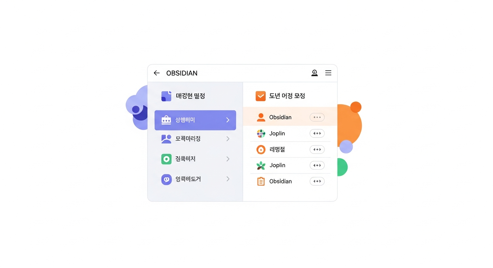
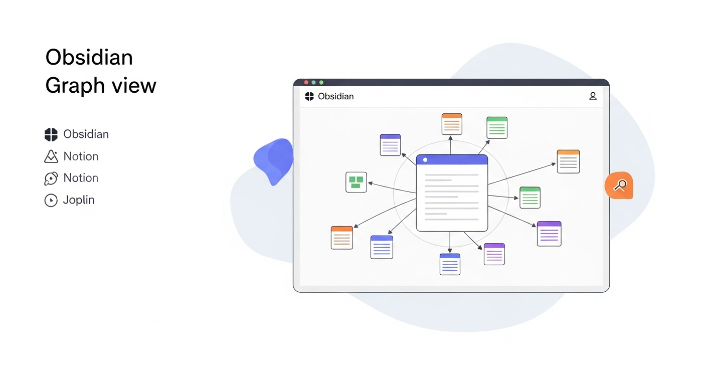
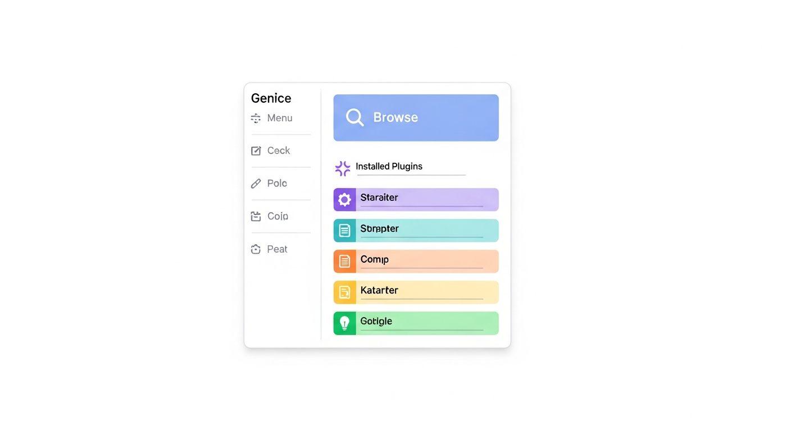
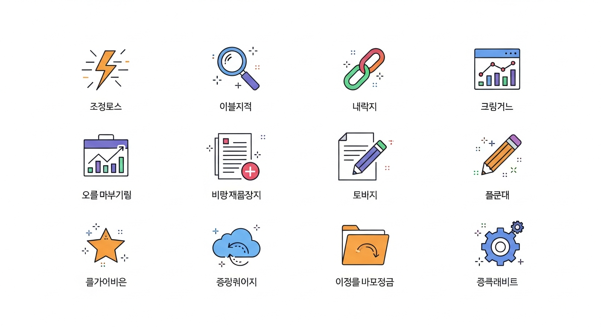
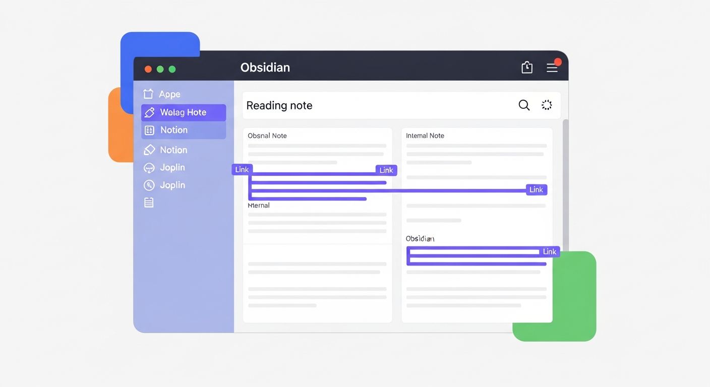
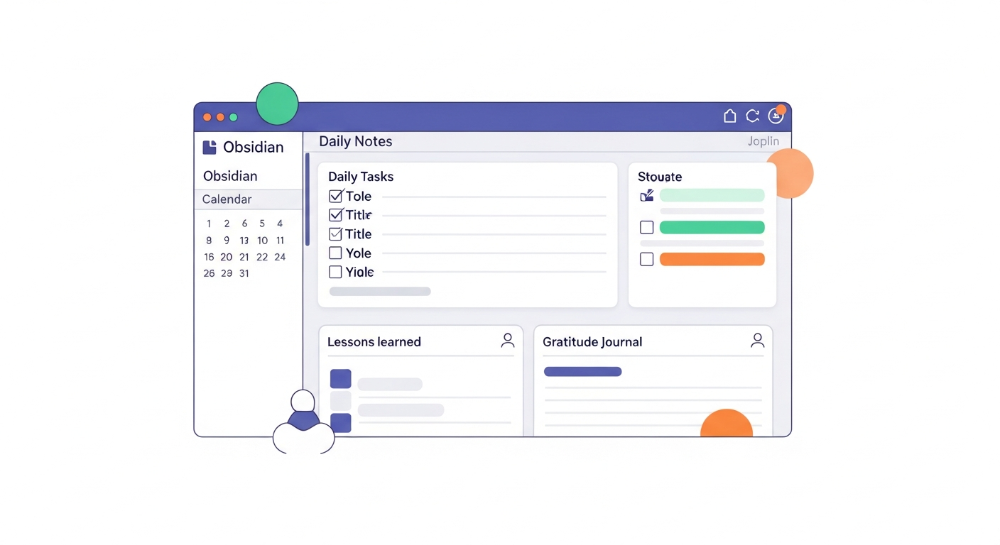

# 제4장: 옵시디언 활용하기 — 링크·그래프·플러그인의 세계

3장에서 옵시디언을 설치하고, 볼트를 만들고, 첫 번째 노트까지 작성해 보았습니다. 마크다운 문법도 익혔고, `[[]]`라는 양방향 링크도 살짝 맛보았습니다. 이번 장에서는 그 "살짝 맛본" 링크를 본격적으로 활용합니다. 노트와 노트를 연결하고, 그래프 뷰로 내 생각의 지도를 눈으로 확인하고, 커뮤니티 플러그인으로 옵시디언을 나만의 도구로 변신시키는 방법을 다룹니다. 마지막에는 독서 노트 시스템과 데일리 노트라는 두 가지 실전 예시를 통해, 오늘 배운 것을 바로 써먹을 수 있게 하겠습니다.

---

## [[내부 링크]]와 백링크로 지식 연결하기

### 링크는 왜 중요한가 — 폴더의 한계를 넘어서

3장에서 우리는 폴더, 태그, 링크라는 세 가지 정리법을 비교했습니다. 그중 링크에 대해 "습관을 들이라"고 권했는데, 그 이유를 이제 제대로 설명할 차례입니다.

종이 노트를 떠올려 봅시다. 독서 노트에 "이 책의 저자는 《사피엔스》에서도 비슷한 주장을 했다"라고 적었다고 해 봅시다. 종이에서는 이 문장이 그냥 텍스트일 뿐입니다. 《사피엔스》 노트를 찾으려면 노트 더미를 뒤져야 합니다. 하지만 옵시디언에서는 `[[사피엔스]]`라고 쓰는 순간, 두 노트가 연결됩니다. 클릭 한 번이면 바로 이동할 수 있고, 반대쪽에서도 "누가 나를 언급했는지" 알 수 있습니다.

이것이 바로 **내부 링크(Internal Link)**와 **백링크(Backlink)**의 핵심입니다.

### 내부 링크 만들기 — 대괄호 두 번의 마법

내부 링크를 만드는 방법은 3장에서 잠깐 다뤘지만, 좀 더 깊이 들어가 봅시다.

**기본 문법**: `[[노트 이름]]`

예를 들어, "습관의 힘"이라는 노트가 이미 있다면:

```markdown
오늘 읽은 기사에서 습관 형성의 3단계를 다뤘는데,
이것은 [[습관의 힘]]에서 말한 '신호-반복-보상' 루프와 정확히 일치한다.
```

이렇게 쓰면 "습관의 힘" 텍스트에 자동으로 링크가 걸립니다. 클릭하면 해당 노트로 이동합니다.

**아직 노트가 없어도 괜찮습니다.** 옵시디언에서 `[[아직 없는 노트]]`라고 쓰면, 링크는 생기지만 연한 색으로 표시됩니다. 나중에 그 링크를 클릭하면 새 노트가 자동으로 만들어집니다. 이 방식이 왜 좋냐면, "지금 당장 정리할 시간은 없지만 나중에 따로 노트를 만들어야지"라는 의도를 기록해 둘 수 있기 때문입니다.

![옵시디언 에디터에서 [[내부 링크]]를 입력하는 모습 — 자동 완성 드롭다운이 나타나 기존 노트 목록을 보여주는 화면](img/ch04_fig01_illustration.png)
*그림 4-1. 옵시디언 에디터에서 [[내부 링크]]를 입력하는 모습 — 자동 완성 드롭다운이 나타나 기존 노트 목록을 보여주는 화면*

**유용한 링크 변형들**:

| 문법 | 결과 | 언제 사용하나요? |
|------|------|------------------|
| `[[노트 이름]]` | 노트 이름 그대로 표시 | 가장 기본적인 링크 |
| `[[노트 이름\|표시할 텍스트]]` | "표시할 텍스트"로 표시 | 문장 흐름에 자연스럽게 넣고 싶을 때 |
| `[[노트 이름#헤딩]]` | 특정 헤딩으로 바로 이동 | 긴 노트의 특정 부분을 가리킬 때 |
| `[[노트 이름^블록ID]]` | 특정 문단으로 이동 | 정확한 문단을 참조할 때 |

실제로 자주 쓰게 되는 것은 첫 번째와 두 번째입니다. 나머지는 "이런 것도 된다" 정도로 알아 두시면 됩니다.

### 백링크 — "누가 나를 언급했는지" 자동으로 알려줍니다

백링크는 내부 링크의 거울입니다. 제가 "프로젝트 관리" 노트에서 `[[GTD 방법론]]`이라고 링크를 걸었다면, "GTD 방법론" 노트를 열었을 때 오른쪽 패널에 "프로젝트 관리"가 자동으로 나타납니다. "아, 이 노트를 저기서 언급했구나"를 알 수 있는 것입니다.

**백링크 패널 열기**:
1. 아무 노트를 엽니다.
2. 오른쪽 사이드바에서 **"백링크(Backlinks)"** 아이콘을 클릭합니다. (화살표가 뒤를 가리키는 모양입니다.)
3. **"링크된 언급(Linked mentions)"**과 **"링크되지 않은 언급(Unlinked mentions)"** 두 섹션이 보입니다.

여기서 "링크되지 않은 언급"이 흥미롭습니다. 다른 노트에서 `[[]]` 없이 그냥 텍스트로 "GTD 방법론"이라고 쓴 곳도 찾아줍니다. 즉, 링크를 걸지 않았지만 같은 단어를 쓴 곳을 보여주는 것입니다. 이 기능을 통해 "아, 여기도 연결해야겠다"라고 발견하는 순간이 꽤 자주 생깁니다.


*그림 4-2. 옵시디언 백링크 패널 — '링크된 언급'과 '링크되지 않은 언급' 두 섹션이 나뉘어 표시된 사이드바 화면*

### 링크를 거는 습관 만들기 — 세 가지 팁

처음에는 링크를 거는 것이 어색할 수 있습니다. "이걸 링크로 걸어야 하나, 말아야 하나" 고민하게 됩니다. 다음 세 가지 규칙으로 시작해 보세요.

1. **고유명사는 무조건 링크합니다.** 책 이름, 사람 이름, 프로젝트 이름 등. 나중에 따로 정리할 가능성이 높은 대상입니다.
2. **"나중에 더 알고 싶다"는 느낌이 드는 개념은 링크합니다.** 예를 들어 "간헐적 단식"이라는 단어가 나왔는데 흥미가 생겼다면 `[[간헐적 단식]]`으로 감싸 두세요.
3. **완벽하지 않아도 됩니다.** 링크를 깜빡 걸지 않아도, 백링크의 "링크되지 않은 언급" 기능이 나중에 잡아줍니다.

> **핵심 포인트**: 링크는 "정리"가 아니라 "연결"입니다. 완벽한 분류 체계를 세우는 것이 아니라, 떠오르는 대로 연결하면 됩니다. 시간이 지나면 그 연결이 자연스럽게 하나의 구조를 만들어 냅니다.

---

## 그래프 뷰로 내 생각의 지도 그리기

### 그래프 뷰란 무엇인가

링크를 꾸준히 걸다 보면, 어느 날 신기한 경험을 하게 됩니다. 옵시디언의 **그래프 뷰(Graph View)**를 열면, 내 모든 노트가 점(노드)으로 표시되고, 링크로 연결된 노트 사이에 선이 그어져 있습니다. 마치 별자리 지도처럼 내 생각의 연결망이 눈앞에 펼쳐지는 것입니다.

**그래프 뷰 열기**: 왼쪽 사이드바에서 그래프 아이콘(점과 선이 연결된 모양)을 클릭하거나, 단축키 `Ctrl+G`(Mac: `Cmd+G`)를 누릅니다.

처음에는 노트가 몇 개 안 되니 별로 인상적이지 않을 수 있습니다. 하지만 노트가 30개, 50개, 100개로 늘어나면 이야기가 달라집니다. 링크가 많이 걸린 노트는 큰 점으로 표시되고, 자주 함께 언급되는 노트들은 자연스럽게 군집(클러스터)을 이룹니다.


*그림 4-3. 옵시디언 그래프 뷰 — 여러 노트가 점으로 표시되고 링크로 연결된 네트워크 지도, 중심에 크게 표시된 허브 노트와 주변의 작은 노트들이 보이는 화면*

### 그래프 뷰 활용법

그래프 뷰가 단순히 "예쁘기만 한" 기능은 아닙니다. 실제로 유용한 활용법이 있습니다.

**1. 고립된 노트 발견하기**

그래프 뷰에서 다른 노트와 연결되지 않은 점들이 보입니다. 이것은 "섬(island)"처럼 떨어져 있는 노트입니다. 이 노트들은 아직 다른 생각과 연결되지 않았다는 뜻입니다. 주기적으로 이런 고립된 노트들을 살펴보면서 "이 노트와 연결할 수 있는 다른 노트가 없을까?" 생각해 보세요.

**2. 허브 노트 확인하기**

유독 많은 선이 연결된 큰 점이 있다면, 그것이 여러분의 "허브 노트"입니다. 예를 들어 "생산성"이라는 노트에 10개의 다른 노트가 링크되어 있다면, 생산성이 여러분의 핵심 관심사라는 뜻입니다. 이 허브 노트를 좀 더 잘 정리하면 나머지 노트들도 자연스럽게 구조화됩니다.

**3. 예상치 못한 연결 발견하기**

이것이 가장 재미있는 부분입니다. 그래프 뷰에서 서로 멀리 있을 줄 알았던 두 노트가 의외로 가까이 있는 경우가 있습니다. "요리 레시피"와 "프로젝트 관리"가 "체크리스트"라는 노트를 통해 연결되어 있다든지, "여행 일기"와 "경제학"이 "환율"이라는 노트로 이어져 있다든지. 이런 예상치 못한 연결에서 새로운 아이디어가 탄생하기도 합니다.

### 로컬 그래프 — 특정 노트의 이웃만 보기

전체 그래프가 너무 복잡하게 느껴진다면, **로컬 그래프(Local Graph)**를 사용해 보세요. 특정 노트를 연 상태에서 오른쪽 사이드바의 "로컬 그래프" 탭을 열면, 해당 노트와 직접 연결된 노트들만 보여줍니다. 한두 단계 떨어진 이웃까지 범위를 넓힐 수도 있어서, "이 주제와 관련된 내 생각들"을 한눈에 파악할 때 유용합니다.

> **팁**: 그래프 뷰에서 점을 드래그하면 위치를 옮길 수 있습니다. 필터 옵션을 열면 특정 폴더의 노트만 보거나, 태그로 색상을 구분하는 것도 가능합니다. 처음에는 기본 설정 그대로 사용하고, 노트가 많아지면 필터를 활용해 보세요.

---

## 꼭 써볼 커뮤니티 플러그인 BEST 10

### 커뮤니티 플러그인이란?

옵시디언의 진짜 강점은 **커뮤니티 플러그인(Community Plugins)** 생태계에 있습니다. 옵시디언 자체는 깔끔하고 가벼운 노트 앱이지만, 플러그인을 설치하면 작업 관리 도구, 캘린더, 마인드맵, 심지어 간단한 데이터베이스까지 될 수 있습니다. 마치 스마트폰에 앱을 설치하는 것과 비슷합니다.

2025년 기준으로 커뮤니티 플러그인은 2,000개가 넘습니다. 이 중에서 초보자에게 특히 유용한 10가지를 골라 소개하겠습니다.

**플러그인 설치 방법** (한 번만 알면 됩니다):

1. 설정(⚙️)을 엽니다.
2. **"커뮤니티 플러그인(Community Plugins)"**을 클릭합니다.
3. 처음이라면 **"커뮤니티 플러그인 켜기(Turn on community plugins)"** 버튼을 클릭합니다.
4. **"찾아보기(Browse)"** 버튼을 클릭합니다.
5. 원하는 플러그인을 검색하고, **"설치(Install)"** → **"활성화(Enable)"**를 순서대로 클릭합니다.


*그림 4-4. 옵시디언 커뮤니티 플러그인 설정 화면 — 찾아보기 버튼과 설치된 플러그인 목록이 보이는 설정 패널*

### BEST 10 플러그인 소개

**1. Calendar (캘린더)**

데일리 노트를 달력 형태로 시각화해 줍니다. 사이드바에 작은 달력이 나타나고, 날짜를 클릭하면 해당 날짜의 데일리 노트로 바로 이동합니다. 노트가 있는 날에는 점이 표시되어, "이번 달에 며칠이나 기록했나" 한눈에 볼 수 있습니다. 데일리 노트를 쓸 계획이라면 거의 필수입니다.

**2. Dataview (데이터뷰)**

옵시디언에 데이터베이스의 힘을 더해주는 강력한 플러그인입니다. 노트에 적은 정보를 표(table)로 정리하거나, 특정 조건에 맞는 노트를 자동으로 모아 보여줍니다. 예를 들어 "읽은 책 목록에서 별점 4점 이상인 것만 보여줘"라는 것이 가능합니다. 처음에는 어렵게 느껴질 수 있지만, 기본적인 사용법만 익히면 매우 유용합니다.

**3. Templater (템플레이터)**

노트 템플릿을 만들어주는 플러그인입니다. 예를 들어 독서 노트를 쓸 때마다 "제목, 저자, 별점, 한줄평, 인상 깊은 구절" 같은 형식이 자동으로 생성되게 할 수 있습니다. 날짜 자동 삽입, 조건부 텍스트 등 고급 기능도 있지만, 기본적인 템플릿 기능만으로도 시간을 크게 절약할 수 있습니다.

**4. Kanban (칸반)**

노트를 칸반 보드(Kanban Board) 형태로 정리할 수 있습니다. "할 일 → 진행 중 → 완료" 같은 열(column)을 만들고, 카드를 드래그해서 옮길 수 있습니다. 프로젝트 관리나 업무 추적에 유용합니다. 노션의 보드 뷰가 그리울 때 이 플러그인을 써 보세요.

**5. Excalidraw (엑스칼리드로)**

옵시디언 안에서 직접 그림을 그릴 수 있게 해줍니다. 마인드맵, 다이어그램, 간단한 스케치 등을 노트와 함께 관리할 수 있습니다. 손으로 그린 듯한 스타일이 특징이라 부담 없이 사용할 수 있습니다.

**6. Quick Add (퀵 애드)**

자주 반복하는 작업을 빠르게 수행할 수 있는 플러그인입니다. 예를 들어 "독서 노트 만들기" 버튼을 하나 만들어 두면, 클릭 한 번으로 미리 설정한 폴더에 미리 설정한 템플릿으로 노트가 생성됩니다. Templater와 함께 사용하면 시너지가 큽니다.

**7. Periodic Notes (정기 노트)**

데일리 노트를 넘어서, 주간 노트와 월간 노트까지 자동으로 만들어줍니다. 매주 금요일에 한 주를 돌아보는 주간 회고를 쓰고 싶다면 이 플러그인이 유용합니다. Calendar 플러그인과 함께 쓰면 달력에서 주 단위를 클릭해서 주간 노트로 이동할 수도 있습니다.

**8. Admonition / Callout Manager**

노트에 경고, 팁, 메모, 주의사항 같은 강조 상자를 예쁘게 넣을 수 있습니다. 옵시디언은 기본적으로 콜아웃(Callout) 문법을 지원하지만, 이 플러그인을 쓰면 더 다양한 스타일과 아이콘을 사용할 수 있습니다.

**9. Tag Wrangler (태그 관리자)**

태그 이름을 일괄 변경하거나, 태그를 계층 구조(예: `#독서/소설`, `#독서/비소설`)로 관리할 때 편리합니다. 태그가 많아지기 시작하면 이 플러그인이 정리를 도와줍니다.

**10. Obsidian Git**

노트를 Git이라는 버전 관리 시스템으로 자동 백업해 줍니다. 기술적인 지식이 조금 필요하지만, 한 번 설정해 두면 노트의 모든 변경 이력이 보존되고, GitHub 같은 원격 저장소에 자동으로 백업됩니다. "실수로 노트를 삭제하면 어떡하지?"라는 걱정이 있다면 최고의 보험입니다.


*그림 4-5. 추천 플러그인 10개를 아이콘과 한줄 설명으로 정리한 인포그래픽 스타일 일러스트레이션*

### 초보자를 위한 플러그인 설치 우선순위

10개를 한꺼번에 설치할 필요는 없습니다. 다음 순서를 추천합니다.

| 단계 | 플러그인 | 이유 |
|------|----------|------|
| 1주차 | Calendar, Templater | 데일리 노트 시작에 필수 |
| 2주차 | Quick Add, Periodic Notes | 반복 작업 자동화 |
| 3주차 | Kanban, Tag Wrangler | 정리와 관리 |
| 필요할 때 | Dataview, Excalidraw, Admonition, Obsidian Git | 특정 목적에 따라 |

> **주의**: 플러그인은 편리하지만, 너무 많이 설치하면 옵시디언이 느려지거나 복잡해질 수 있습니다. "이 플러그인이 정말 필요한가?"를 한 번 더 생각하고, 한 번에 하나씩 설치하는 것이 좋습니다. 쓰지 않는 플러그인은 과감히 비활성화하세요.

---

## 실전 예시: 독서 노트 시스템 구축

이론은 충분합니다. 이제 오늘 배운 링크, 그래프 뷰, 플러그인을 한데 엮어서 **독서 노트 시스템**을 직접 만들어 봅시다. 이 시스템을 완성하면, 읽은 책을 체계적으로 기록하고 책과 책 사이의 연결을 발견할 수 있게 됩니다.

### 1단계: 폴더와 템플릿 준비

먼저 간단한 폴더 구조를 만듭니다.

```
내 볼트/
├── 📚 독서 노트/           ← 개별 책 노트가 들어갈 폴더
├── 🏷️ 주제 노트/           ← 주제별 정리 노트 (예: 습관, 경제학, 심리학)
├── 📝 일상/                ← 데일리 노트
└── 📋 템플릿/              ← 템플릿 모음
```

다음으로 `📋 템플릿` 폴더에 **독서 노트 템플릿**을 만듭니다. 새 노트를 만들고 이름을 `독서 노트 템플릿`으로 지은 뒤, 다음 내용을 입력합니다.

```markdown
---
title: "{{title}}"
author: "{{author}}"
date_read: {{date}}
rating: /5
tags: [독서]
---

# {{title}}
**저자**: {{author}}
**읽은 날짜**: {{date}}
**별점**: ⭐ /5

## 한줄 요약


## 핵심 내용
-

## 인상 깊은 구절
>

## 내 생각과 연결
- 이 책은 [[]]와 관련이 있다
-

## 실천할 것
- [ ]
```

이 템플릿에서 주목할 부분은 **"내 생각과 연결"** 섹션입니다. 여기에 `[[]]`를 써서 다른 노트와 연결하는 것이 이 시스템의 핵심입니다.

### 2단계: 실제로 독서 노트 쓰기

예를 들어, 제임스 클리어의 《아주 작은 습관의 힘》(Atomic Habits)을 읽었다고 해 봅시다.

```markdown
---
title: "아주 작은 습관의 힘"
author: "제임스 클리어"
date_read: 2025-03-15
rating: 4.5/5
tags: [독서, 자기계발, 습관]
---

# 아주 작은 습관의 힘
**저자**: 제임스 클리어
**읽은 날짜**: 2025-03-15
**별점**: ⭐ 4.5/5

## 한줄 요약
습관은 의지력이 아니라 시스템의 문제다. 1%의 개선을 매일 반복하면 1년 뒤 37배가 된다.

## 핵심 내용
- 습관의 4단계: 신호 → 갈망 → 반응 → 보상
- 좋은 습관을 만드는 4가지 법칙: 분명하게, 매력적으로, 쉽게, 만족스럽게
- 나쁜 습관을 없애려면 4가지 법칙을 반대로 적용
- 정체성 기반 습관: "나는 ~하는 사람이다"로 자기 정의를 바꾸기

## 인상 깊은 구절
> "목표를 달성하는 것이 아니라, 시스템을 만드는 것에 집중하라."
> "습관은 자기 개선이라는 복리의 이자다."

## 내 생각과 연결
- 이 책의 "시스템" 강조는 [[GTD 방법론]]의 철학과 일맥상통한다
- [[뽀모도로 기법]]을 "쉽게 만들기" 원칙에 적용할 수 있을 것 같다
- [[독서 루틴]] 만들기에 이 책의 습관 쌓기(habit stacking) 개념을 활용하자

## 실천할 것
- [ ] 아침 6시 기상 후 바로 10분 독서 (습관 쌓기 적용)
- [ ] 독서 장소를 고정하기 (환경 설계)
- [ ] 매주 일요일 독서 노트 정리하기
```


*그림 4-6. 독서 노트 예시 — 위의 노트 내용이 옵시디언 미리보기 모드로 깔끔하게 표시된 화면, 내부 링크가 보라색으로 강조된 모습*

### 3단계: 주제 노트로 연결 확장하기

독서 노트를 몇 권 쓰다 보면, 같은 주제가 반복적으로 등장하는 것을 발견하게 됩니다. 이때 **주제 노트(MOC: Map of Content)**를 만듭니다.

예를 들어 `🏷️ 주제 노트` 폴더에 `습관`이라는 노트를 만들고:

```markdown
# 습관

습관 형성과 변화에 관한 내 생각과 자료를 모아 둔 곳.

## 관련 도서
- [[아주 작은 습관의 힘]] — 습관의 4단계와 시스템 기반 접근
- [[습관의 힘]] — 습관 루프(신호-반복-보상)의 과학
- [[타이탄의 도구들]] — 성공한 사람들의 아침 루틴

## 핵심 개념
- [[습관 루프]]: 신호 → 반복 → 보상
- [[습관 쌓기]]: 기존 습관 뒤에 새 습관 연결
- [[환경 설계]]: 의지력 대신 환경을 바꾸기

## 내가 실천 중인 습관
- 아침 독서 10분 (3월 15일~)
- 저녁 산책 20분 (3월 1일~)
```

이렇게 하면 "습관"이라는 노트가 여러 독서 노트와 개념 노트를 연결하는 **허브(Hub)** 역할을 합니다. 그래프 뷰에서 보면 이 노트가 큰 점으로 나타나고, 관련 노트들이 주변에 모여 있는 것을 볼 수 있습니다.

### 4단계: Dataview로 독서 목록 자동 생성

Dataview 플러그인을 설치했다면, 한 가지 마법을 더 부릴 수 있습니다. 아무 노트에 다음 코드를 입력해 보세요.

~~~markdown
```dataview
TABLE author AS "저자", rating AS "별점", date_read AS "읽은 날짜"
FROM "📚 독서 노트"
SORT date_read DESC
```
~~~

이렇게 하면 `📚 독서 노트` 폴더의 모든 노트가 자동으로 표 형태로 정리됩니다. 새 독서 노트를 추가하면 이 표도 자동으로 업데이트됩니다. 노션의 데이터베이스 뷰와 비슷하다고 느끼실 겁니다.

---

## 데일리 노트로 하루 루틴 관리하기

### 데일리 노트란?

데일리 노트는 말 그대로 매일 하나씩 쓰는 노트입니다. "2025년 3월 16일"처럼 날짜가 제목인 노트를 만들고, 그날 할 일, 배운 것, 생각한 것을 자유롭게 기록합니다.

"그냥 일기 아닌가요?"라고 생각하실 수 있습니다. 맞기도 하고 틀리기도 합니다. 일기와 다른 점은, 데일리 노트에도 `[[링크]]`를 걸 수 있다는 것입니다. 오늘 읽은 책, 진행한 프로젝트, 떠오른 아이디어를 링크로 연결하면, 데일리 노트가 단순한 일기를 넘어서 **생각의 일지(thought journal)**가 됩니다.

### 데일리 노트 설정하기

옵시디언에는 데일리 노트 기능이 기본으로 내장되어 있습니다.

1. 설정(⚙️) → **"코어 플러그인(Core Plugins)"**에서 **"데일리 노트(Daily Notes)"**가 활성화되어 있는지 확인합니다.
2. 설정 → **"데일리 노트"** 옵션에서:
   - **날짜 형식**: `YYYY-MM-DD` (추천. 파일이 날짜순으로 자동 정렬됩니다.)
   - **새 파일 위치**: `📝 일상` 폴더를 지정합니다.
   - **템플릿 파일 위치**: 데일리 노트 전용 템플릿을 지정합니다.
3. 왼쪽 사이드바의 **달력 아이콘**을 클릭하면 오늘 날짜의 데일리 노트가 자동으로 생성됩니다.

### 데일리 노트 템플릿 만들기

`📋 템플릿` 폴더에 `데일리 노트 템플릿`이라는 노트를 만들고 다음 내용을 입력합니다.

```markdown
# {{date:YYYY년 MM월 DD일 (ddd)}}

## 오늘 할 일
- [ ]
- [ ]
- [ ]

## 오늘 배운 것
-

## 오늘 떠오른 생각
-

## 감사한 것 3가지
1.
2.
3.

## 내일 할 일
- [ ]
```


*그림 4-7. 데일리 노트 작성 예시 — 날짜 제목 아래 할 일 체크리스트, 배운 것, 감사 일기가 깔끔하게 정리된 옵시디언 화면과 사이드바의 Calendar 플러그인*

### 데일리 노트 활용 팁

**1. 아침에 열고, 저녁에 마무리하세요.**

아침에 데일리 노트를 열어서 오늘 할 일을 적고, 저녁에 배운 것과 감사한 것을 정리하는 루틴을 만들어 보세요. 2~3일만 반복해도 습관이 되기 시작합니다.

**2. 무엇이든 링크하세요.**

"오늘 [[아주 작은 습관의 힘]] 3장을 읽었다"처럼 데일리 노트에서 다른 노트로 링크를 거세요. 나중에 그 책의 노트를 열면 백링크에 "3월 16일에 3장을 읽었다"는 기록이 자동으로 남아 있습니다.

**3. 완벽하지 않아도 괜찮습니다.**

빈칸이 있어도 됩니다. 한 줄만 써도 됩니다. 중요한 것은 매일 노트를 "여는" 것 자체입니다. 빈 노트가 몇 개 있어도 전혀 문제없습니다.

**4. 주간 리뷰와 연결하세요.**

Periodic Notes 플러그인을 설치했다면, 매주 일요일에 주간 노트를 만들어서 그 주의 데일리 노트를 돌아보세요. "이번 주에 가장 인상 깊었던 것", "다음 주에 개선할 것"을 정리하면 데일리 노트의 가치가 몇 배로 올라갑니다.

> **핵심 포인트**: 데일리 노트는 "기록의 습관"을 만드는 가장 좋은 시작점입니다. 처음에는 형식에 구애받지 말고, 쓰고 싶은 것을 쓰세요. 시간이 지나면 자신만의 스타일이 자연스럽게 만들어집니다.

---

## 챕터 요약

이번 장에서 배운 내용을 정리합니다.

- **내부 링크(`[[]]`)와 백링크**는 옵시디언의 핵심 기능입니다. 노트와 노트를 연결하면 폴더 분류의 한계를 넘어 자유로운 지식 네트워크를 만들 수 있습니다. 고유명사와 흥미로운 개념에 링크를 거는 습관을 들이세요.

- **그래프 뷰**는 내 노트의 연결 상태를 시각적으로 보여줍니다. 고립된 노트를 발견하고, 허브 노트를 확인하고, 예상치 못한 연결을 발견하는 데 활용하세요.

- **커뮤니티 플러그인**은 옵시디언을 나만의 도구로 확장합니다. Calendar, Templater, Dataview 등 10가지 추천 플러그인을 소개했으며, 한 번에 하나씩 필요한 것부터 설치하는 것이 좋습니다.

- **독서 노트 시스템**은 템플릿 → 독서 노트 작성 → 주제 노트(MOC)로 연결 → Dataview로 자동 목록 생성의 4단계로 구축할 수 있습니다.

- **데일리 노트**는 매일 하루를 기록하는 습관을 만들어 줍니다. 링크를 통해 다른 노트와 연결하면, 단순한 일기를 넘어서 생각의 일지가 됩니다.

---

## 다음 챕터 예고

옵시디언의 세계를 탐험해 보았으니, 이제 또 다른 도구를 만나볼 차례입니다. 5장에서는 **노션(Notion)**의 세계로 넘어갑니다. 노션은 옵시디언과는 전혀 다른 철학을 가진 도구입니다. 데이터베이스, 칸반 보드, 캘린더가 하나의 페이지 안에 어우러지는 노션만의 매력을 함께 살펴보겠습니다. 옵시디언과 어떤 점이 다르고, 어떤 상황에서 노션이 더 빛을 발하는지도 비교해 보겠습니다.
