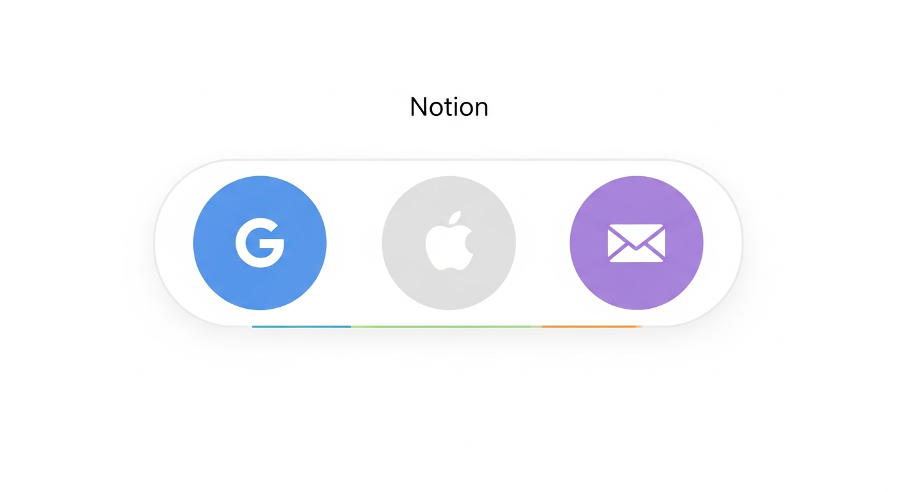
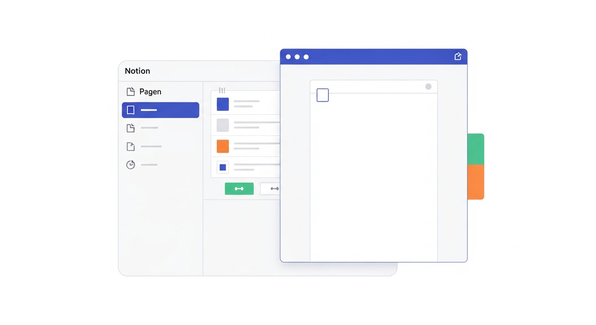
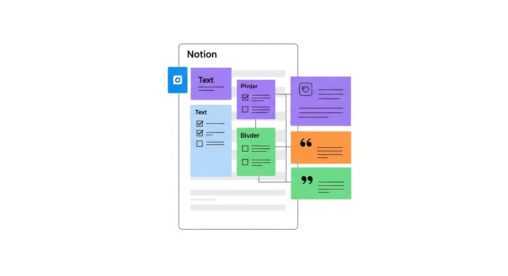
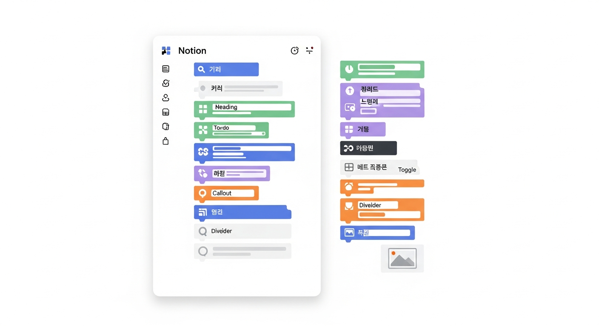
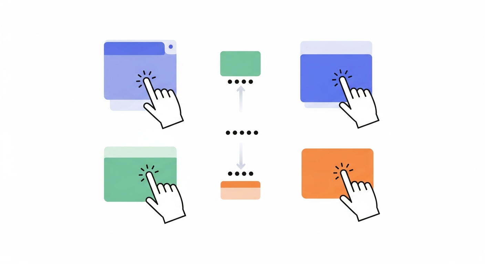
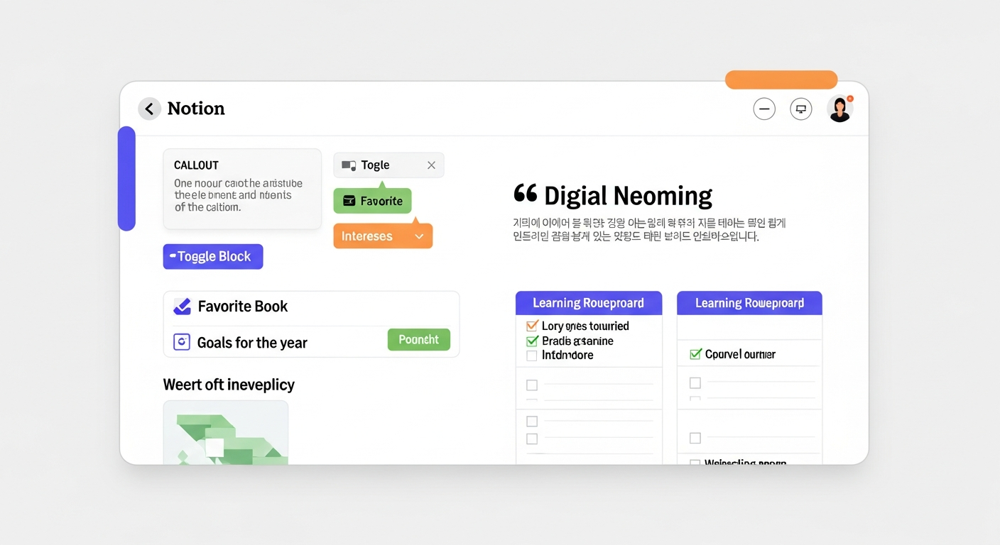
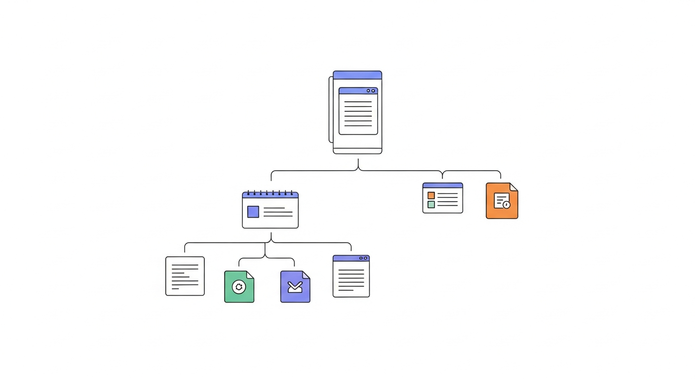
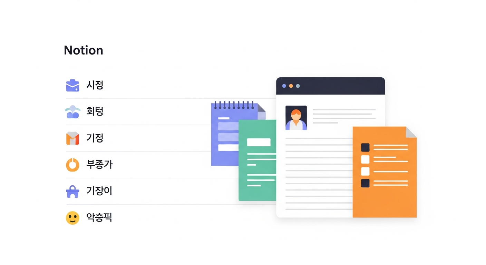
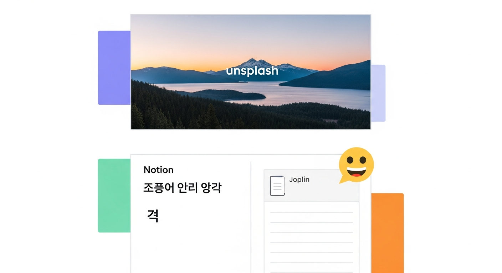
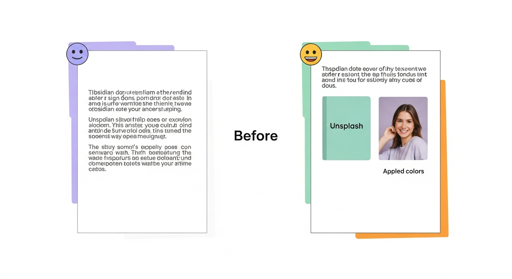

# 제5장: 노션 시작하기 — 가입부터 첫 페이지 꾸미기까지

4장까지 우리는 옵시디언이라는 도구를 깊이 탐험했습니다. 로컬 파일 기반, 마크다운, 양방향 링크, 그래프 뷰 — 옵시디언만의 매력에 푹 빠졌을 분들도 계실 겁니다. 이번 장부터는 전혀 다른 철학을 가진 도구, **노션(Notion)**을 만나봅니다. 노션은 "하나의 앱으로 거의 모든 것을 할 수 있다"는 야심 찬 목표를 가진 도구입니다. 메모장이기도 하고, 데이터베이스이기도 하고, 프로젝트 관리 도구이기도 합니다. 이번 장에서는 가입부터 시작해서, 노션만의 핵심 개념인 "블록"을 이해하고, 직접 첫 페이지를 만들어 보겠습니다.

---

## 가입 및 워크스페이스 세팅

### 노션 가입하기 — 5분이면 충분합니다

노션은 웹 기반 서비스입니다. 옵시디언이 내 컴퓨터에 설치하는 프로그램이었다면, 노션은 웹 브라우저에서 바로 쓸 수 있고, 별도의 앱도 제공합니다. 가입 절차는 아주 간단합니다.

**가입 단계**:

1. 웹 브라우저에서 [notion.so](https://notion.so)에 접속합니다.
2. **"무료로 시작하기(Get Notion free)"** 버튼을 클릭합니다.
3. 가입 방법을 선택합니다:
   - **구글 계정**: 가장 빠릅니다. 클릭 한 번이면 끝.
   - **애플 계정**: 맥이나 아이폰 사용자라면 편리합니다.
   - **이메일**: 구글이나 애플 계정을 쓰고 싶지 않다면 이메일로 가입합니다.
4. 간단한 설문(용도, 직업 등)에 답합니다. 대충 골라도 괜찮습니다. 나중에 바꿀 수 있습니다.
5. 끝입니다. 바로 노션 화면이 나타납니다.

"이게 끝이야?" 싶을 정도로 간단합니다. 옵시디언에서 볼트를 만들고, 마크다운 문법을 익히고, 플러그인을 설치하던 것과 비교하면, 노션의 시작은 놀라울 정도로 가볍습니다.


*그림 5-1. 노션 가입 화면 — 구글, 애플, 이메일 세 가지 가입 옵션이 나란히 표시된 심플한 랜딩 페이지*

### 무료 vs 유료 — 어떤 플랜을 골라야 할까?

노션에 처음 가입하면 **무료 플랜(Free Plan)**으로 시작합니다. 좋은 소식은, 개인 사용자라면 무료 플랜만으로도 충분히 쓸 수 있다는 것입니다.

| 기능 | 무료(Free) | 플러스(Plus) |
|------|-----------|-------------|
| 페이지 개수 | 무제한 | 무제한 |
| 블록 개수 | 무제한 | 무제한 |
| 파일 업로드 크기 | 5MB 이하 | 무제한 |
| 게스트 초대 | 10명까지 | 100명까지 |
| 버전 기록 | 7일 | 30일 |
| 가격 | 0원 | 월 $10 (약 13,000원) |

핵심은 **페이지와 블록이 무제한**이라는 점입니다. 노트를 아무리 많이 만들어도 무료입니다. 유료 플랜은 대용량 파일 첨부나 팀 협업이 필요할 때 고려하시면 됩니다. 이 책에서 다루는 모든 내용은 무료 플랜으로 따라 할 수 있으니 안심하세요.

### 워크스페이스란 무엇인가

가입이 완료되면 **워크스페이스(Workspace)**라는 공간이 자동으로 만들어집니다. 워크스페이스는 옵시디언의 볼트(Vault)와 비슷한 개념입니다. 내 모든 페이지와 데이터가 담기는 큰 상자라고 생각하시면 됩니다.

다만, 중요한 차이가 있습니다:

- **옵시디언 볼트**: 내 컴퓨터 안에 있는 폴더입니다. 파일은 내 하드디스크에 저장됩니다.
- **노션 워크스페이스**: 노션의 서버(클라우드)에 있습니다. 인터넷만 되면 어디서든 접속할 수 있습니다.

이 차이 때문에 노션은 컴퓨터, 태블릿, 스마트폰 어디서든 똑같은 내용을 볼 수 있습니다. 반면에, 인터넷이 안 되면 사용이 제한될 수 있습니다. (최근에는 오프라인 모드도 지원하지만, 옵시디언만큼 완벽하지는 않습니다.)

### 워크스페이스 기본 세팅

가입 직후의 화면을 보면, 왼쪽에 **사이드바(Sidebar)**가 있고 오른쪽에 **메인 영역**이 있습니다. 사이드바에는 노션이 기본으로 만들어 둔 몇 가지 페이지가 있을 겁니다. "Getting Started", "Quick Note" 같은 것들입니다.

먼저 해 두면 좋은 세팅 몇 가지를 알려드리겠습니다.

**1. 언어를 한국어로 바꾸기**

노션은 한국어를 완벽하게 지원합니다. 처음 접속했을 때 영어로 표시된다면:
- 왼쪽 사이드바 상단의 **"Settings & members"**(설정)를 클릭합니다.
- **"Language & region"**에서 **"한국어"**를 선택합니다.
- 모든 메뉴가 한국어로 바뀝니다.

**2. 다크 모드 설정 (선택)**

어두운 화면이 편하신 분은:
- **설정 → 내 알림 및 설정 → 표시 모드**에서 다크 모드를 켤 수 있습니다.

**3. 기본 페이지 정리하기**

노션이 자동으로 만들어 둔 페이지들이 거슬린다면, 과감히 삭제해도 됩니다. 왼쪽 사이드바에서 페이지 위에 마우스를 올리면 **점 세 개(⋯)** 메뉴가 나타납니다. 거기서 **"삭제"**를 선택하면 됩니다. 삭제한 페이지는 **휴지통(Trash)**에 30일간 보관되니, 실수로 지워도 복구할 수 있습니다.


*그림 5-2. 노션 워크스페이스 초기 화면 — 왼쪽 사이드바에 기본 페이지 목록이 있고, 오른쪽 메인 영역에 빈 페이지가 표시된 깔끔한 인터페이스*

> **핵심 포인트**: 노션의 시작은 가볍습니다. 가입 5분, 한국어 설정, 기본 페이지 정리 — 이 세 가지만 하면 준비 완료입니다. 복잡한 초기 설정 없이 바로 노트를 쓰기 시작할 수 있습니다.

---

## 블록 시스템 이해하기 — 노션의 핵심 DNA

### 노션에서는 모든 것이 "블록"입니다

옵시디언이 마크다운 기반이라면, 노션은 **블록(Block)** 기반입니다. 이것이 노션을 이해하는 가장 중요한 열쇠입니다.

블록이란 무엇일까요? 레고를 생각해 보세요. 레고에서는 작은 조각들을 쌓아서 집도 만들고, 자동차도 만들고, 우주선도 만듭니다. 노션에서도 마찬가지입니다. **한 줄의 텍스트, 하나의 이미지, 하나의 체크리스트 항목** — 이 모든 것이 각각 하나의 블록입니다. 이 블록들을 조합해서 페이지를 만드는 것이 노션의 방식입니다.

구체적으로 예를 들어 보겠습니다. 이런 페이지가 있다고 합시다:

```
📚 이번 달 읽을 책

올해 목표: 월 2권 이상 읽기

□ 아주 작은 습관의 힘
□ 사피엔스
□ 나는 4시간만 일한다

---

"한 권의 책을 읽는 것은 새로운 세계의 문을 여는 것이다."
```

이 페이지는 겉보기에는 하나의 덩어리처럼 보이지만, 노션 내부에서는 이렇게 나뉘어 있습니다:

| 블록 번호 | 블록 유형 | 내용 |
|-----------|----------|------|
| 1 | 제목(Heading) | 📚 이번 달 읽을 책 |
| 2 | 텍스트(Text) | 올해 목표: 월 2권 이상 읽기 |
| 3 | 할 일 목록(To-do) | □ 아주 작은 습관의 힘 |
| 4 | 할 일 목록(To-do) | □ 사피엔스 |
| 5 | 할 일 목록(To-do) | □ 나는 4시간만 일한다 |
| 6 | 구분선(Divider) | --- |
| 7 | 인용(Quote) | "한 권의 책을 읽는 것은…" |

총 7개의 블록으로 이루어진 것입니다. 각 블록은 독립적이어서 순서를 바꾸거나, 다른 페이지로 옮기거나, 유형을 변경할 수 있습니다.


*그림 5-3. 노션 페이지의 블록 구조 — 하나의 페이지가 텍스트 블록, 체크리스트 블록, 구분선 블록, 인용 블록 등으로 나뉘어 있는 모습을 색상으로 구분한 다이어그램*

### 블록의 종류 — 자주 쓰는 것부터 알아봅시다

노션에는 수십 가지 블록 유형이 있지만, 처음부터 다 알 필요는 없습니다. 가장 자주 쓰는 것부터 익혀 봅시다.

#### 기본 블록들

**텍스트 블록**: 가장 기본입니다. 그냥 타이핑하면 텍스트 블록이 만들어집니다. 굵게(**볼드**), 기울임(*이탤릭*), 밑줄, 취소선, 하이라이트 등의 서식을 적용할 수 있습니다. 텍스트를 드래그하면 서식 도구 모음이 뜹니다.

**제목 블록 (Heading 1, 2, 3)**: 문서 구조를 잡는 제목입니다. H1이 가장 크고, H3이 가장 작습니다. 옵시디언의 `#`, `##`, `###`과 같은 역할입니다.

**할 일 목록 (To-do)**: 체크박스가 달린 항목입니다. 클릭하면 체크 표시가 되면서 취소선이 그어집니다. 장보기 목록부터 프로젝트 할 일까지, 생각보다 정말 자주 쓰게 됩니다.

**글머리 기호 목록 (Bulleted list)**: 점이 앞에 붙는 일반 목록입니다.

**번호 매기기 목록 (Numbered list)**: 1, 2, 3 순서가 있는 목록입니다.

#### 자주 쓰이는 고급 블록들

**토글 블록 (Toggle)**: 노션에서 제가 가장 좋아하는 블록 중 하나입니다. 제목을 클릭하면 내용이 접혔다 펼쳐지는 블록입니다. "FAQ" 페이지나 "정리 노트"에 특히 유용합니다. 예를 들어:

```
▶ 옵시디언과 노션의 차이점은? (클릭하면 펼쳐짐)
   옵시디언은 로컬 기반 마크다운 에디터이고,
   노션은 클라우드 기반 블록 에디터입니다...
```

긴 내용을 깔끔하게 숨겨 둘 수 있어서, 페이지가 지저분해지는 것을 방지합니다.

**콜아웃 블록 (Callout)**: 중요한 내용을 눈에 띄게 강조하는 상자입니다. 이모지와 배경색이 함께 표시되어, 주의사항이나 팁을 전달할 때 유용합니다.

```
💡 팁: 노션에서 '/'를 입력하면 블록 유형을 검색할 수 있습니다.
```

**인용 블록 (Quote)**: 왼쪽에 세로 줄이 그어진 인용 형식입니다. 다른 사람의 말이나 중요한 문장을 강조할 때 쓰입니다.

**구분선 블록 (Divider)**: 가로 줄 하나를 그어 섹션을 구분합니다.

**이미지 블록**: 사진이나 그림을 삽입합니다. 컴퓨터에서 업로드하거나, 웹 링크를 붙여 넣거나, Unsplash에서 무료 이미지를 바로 검색해서 넣을 수 있습니다.


*그림 5-4. 노션의 주요 블록 유형 모음 — 텍스트, 제목, 할 일 목록, 토글, 콜아웃, 인용, 구분선, 이미지 블록이 한 페이지에 예시로 나열된 화면*

### 블록 만들기 — 슬래시(/) 명령어의 마법

블록을 만드는 방법은 여러 가지가 있지만, 가장 중요한 것은 **슬래시(/) 명령어**입니다.

빈 줄에서 `/`를 입력하면, 사용 가능한 블록 유형들이 목록으로 나타납니다. 여기서 원하는 것을 검색하거나 선택하면 됩니다.

**자주 쓰는 슬래시 명령어**:

| 입력 | 결과 |
|------|------|
| `/텍스트` 또는 `/text` | 텍스트 블록 |
| `/제목1` 또는 `/h1` | 큰 제목 |
| `/제목2` 또는 `/h2` | 중간 제목 |
| `/할일` 또는 `/todo` | 체크리스트 |
| `/토글` 또는 `/toggle` | 접기/펼치기 블록 |
| `/콜아웃` 또는 `/callout` | 강조 상자 |
| `/인용` 또는 `/quote` | 인용 블록 |
| `/구분선` 또는 `/divider` | 가로 구분선 |
| `/이미지` 또는 `/image` | 이미지 삽입 |
| `/코드` 또는 `/code` | 코드 블록 |

한국어와 영어 모두 검색됩니다. 예를 들어 `/토`만 입력해도 "토글" 블록이 나타납니다.

> **핵심 포인트**: 노션을 능숙하게 쓰는 사람과 그렇지 않은 사람의 차이는 `/` 명령어를 얼마나 자연스럽게 쓰느냐에 있습니다. 마우스로 메뉴를 찾는 대신, `/`를 입력하고 원하는 것을 검색하는 습관을 들이세요.

### 블록 조작하기 — 드래그, 변환, 복제

블록은 만들기만 하는 것이 아닙니다. 이미 만든 블록을 자유자재로 다루는 것이 노션의 진짜 매력입니다.

**블록 이동하기**: 블록 왼쪽에 마우스를 올리면 **점 여섯 개(⋮⋮)** 모양의 핸들이 나타납니다. 이것을 잡고 끌어다 놓으면(드래그 앤 드롭) 블록의 순서를 바꿀 수 있습니다. 심지어 블록을 옆으로 끌면 **컬럼(단) 레이아웃**이 만들어집니다.

**블록 유형 변환하기**: 텍스트로 쓴 내용을 나중에 체크리스트로 바꾸고 싶다면? 블록 핸들(⋮⋮)을 클릭하고 **"전환(Turn into)"**을 선택하면 됩니다. 텍스트 → 제목, 텍스트 → 할 일 목록, 제목 → 토글 등 자유롭게 변환할 수 있습니다.

**블록 복제하기**: 핸들 메뉴에서 **"복제(Duplicate)"**를 선택하거나, `Ctrl+D`(Mac: `Cmd+D`)를 누르면 블록이 복사됩니다.

**블록 삭제하기**: 핸들 메뉴에서 **"삭제(Delete)"**를 선택하거나, 블록을 선택한 후 `Delete` 키를 누르면 됩니다.


*그림 5-5. 노션에서 블록을 드래그하여 순서를 변경하는 모습 — 점 여섯 개 핸들을 잡고 블록을 위아래로 이동시키는 동작 시퀀스*

> **핵심 포인트**: 노션의 블록 시스템은 레고와 같습니다. 각 블록을 만들고, 옮기고, 바꾸고, 복제할 수 있습니다. 처음에는 텍스트와 제목, 체크리스트 세 가지만 익히면 충분합니다. 나머지는 필요할 때 하나씩 배워가면 됩니다.

---

## 첫 페이지 만들기 실습: 자기소개 페이지

### 왜 자기소개 페이지인가

노션의 기본을 익히는 가장 좋은 방법은 직접 만들어 보는 것입니다. 그런데 무엇을 만들어 볼까요? "할 일 목록"은 너무 단순하고, "프로젝트 대시보드"는 너무 복잡합니다. **자기소개 페이지**가 딱 좋습니다. 다양한 블록을 자연스럽게 사용할 수 있고, 완성했을 때 뿌듯함도 느낄 수 있기 때문입니다.

자, 함께 만들어 봅시다.

### 실습 단계

**단계 1: 새 페이지 만들기**

1. 왼쪽 사이드바 하단에 **"+ 새 페이지"** 버튼을 클릭합니다.
2. 빈 페이지가 열리면, 제목란에 **"자기소개"**라고 입력합니다.
3. 제목 아래 "아무 곳에 입력해 보세요(Press Enter to continue with an empty page)"라는 안내가 보일 겁니다. Enter를 눌러 본문 영역으로 이동합니다.

**단계 2: 인사말 작성하기**

본문 첫 줄에 자신을 소개하는 문장을 써 봅시다.

```
안녕하세요! 저는 디지털 노트에 관심이 많은 홍길동입니다.
이 페이지는 노션을 배우면서 만든 첫 번째 페이지입니다 🎉
```

이렇게 입력하면 두 개의 텍스트 블록이 만들어집니다.

**단계 3: 콜아웃 블록으로 한 줄 소개 만들기**

다음 줄에서 `/콜아웃`을 입력하고 선택합니다. 노란 배경의 상자가 나타날 겁니다.

```
💡 한 줄 소개: 책 읽는 것을 좋아하고, 배운 것을 정리하는 습관을 기르는 중입니다.
```

이모지는 콜아웃 왼쪽의 아이콘을 클릭하면 바꿀 수 있습니다. 💡 대신 👋나 ✨ 등 원하는 것으로 바꿔 보세요.

**단계 4: 토글 블록으로 상세 정보 정리하기**

`/토글`을 입력해서 토글 블록을 만듭니다. 토글 제목에 이렇게 쓰세요:

```
▶ 📖 좋아하는 책 Top 3
```

토글 안에 들어가서 (제목을 클릭하면 펼쳐집니다) 번호 목록을 만듭니다:

```
1. 아주 작은 습관의 힘 — 제임스 클리어
2. 사피엔스 — 유발 하라리
3. 나는 4시간만 일한다 — 팀 페리스
```

같은 방식으로 토글 블록을 두 개 더 만들어 봅시다:

```
▶ 🎯 올해 목표
▶ 🛠️ 사용 중인 도구
```

**단계 5: 구분선과 인용 블록 추가하기**

토글 블록들 아래에 `/구분선`을 입력해서 가로 줄을 넣습니다. 그 아래에 `/인용`을 선택하고 좋아하는 명언이나 좌우명을 적어 봅시다.

```
"배움에는 왕도가 없다. 다만 꾸준함이 왕도를 만든다."
```

**단계 6: 체크리스트로 "노션 학습 로드맵" 만들기**

마지막으로 `/제목2`로 섹션 제목을 하나 만들고, 체크리스트를 추가합니다.

```
## 📋 노션 학습 로드맵
□ 블록 시스템 이해하기 ✓
□ 첫 페이지 만들어 보기 (지금 하는 중!)
□ 하위 페이지 구조 익히기
□ 데이터베이스 시작하기
□ 템플릿 활용하기
```


*그림 5-6. 완성된 자기소개 노션 페이지 — 콜아웃 한 줄 소개, 토글 블록(좋아하는 책, 올해 목표), 인용 명언, 체크리스트 학습 로드맵이 포함된 깔끔한 페이지*

### 완성된 페이지 돌아보기

축하합니다! 방금 여러분은 첫 번째 노션 페이지를 만들었습니다. 잠깐 돌아보면, 이 페이지 하나에 벌써 다양한 블록을 사용했습니다:

- **텍스트 블록**: 인사말
- **콜아웃 블록**: 한 줄 소개
- **토글 블록**: 접기/펼치기 상세 정보
- **번호 목록**: 좋아하는 책 순위
- **구분선**: 섹션 구분
- **인용 블록**: 좌우명
- **제목 블록**: 섹션 제목
- **할 일 목록**: 학습 로드맵

8가지 블록을 자연스럽게 써 본 것입니다. 이것이 노션의 매력입니다. 특별한 문법을 외우지 않아도, `/` 하나로 다양한 콘텐츠를 만들 수 있습니다.

> **핵심 포인트**: 노션의 실력은 "블록을 얼마나 다양하게 조합하느냐"에서 나옵니다. 자기소개 페이지 하나만 만들어도 8가지 블록을 익힐 수 있습니다. 첫 페이지가 마음에 안 들어도 괜찮습니다. 언제든 수정하면 됩니다.

---

## 페이지 안의 페이지 — 하위 페이지 구조 익히기

### 노션의 페이지는 러시아 인형과 같습니다

노션에서 가장 독특한 개념 중 하나가 바로 **하위 페이지(Sub-page)**입니다. 노션에서는 페이지 안에 또 다른 페이지를 넣을 수 있습니다. 마치 러시아 인형(마트료시카)처럼, 페이지 안에 페이지, 그 안에 또 페이지를 담을 수 있는 것입니다.

이것은 옵시디언에는 없는 개념입니다. 옵시디언에서는 모든 노트가 폴더 안의 파일로 평등하게 존재합니다. 하지만 노션에서는 페이지 사이에 **부모-자식 관계**가 있습니다.

예를 들어 이런 구조가 가능합니다:

```
📚 독서 노트 (최상위 페이지)
├── 📖 아주 작은 습관의 힘 (하위 페이지)
│   ├── 1장 메모 (하위의 하위 페이지)
│   ├── 2장 메모
│   └── 핵심 문장 모음
├── 📖 사피엔스
│   ├── 1부 메모
│   └── 2부 메모
└── 📖 나는 4시간만 일한다
```


*그림 5-7. 노션의 하위 페이지 구조 — 트리 형태로 최상위 페이지 아래에 하위 페이지들이 계층적으로 연결된 다이어그램*

### 하위 페이지 만드는 세 가지 방법

**방법 1: 본문에서 만들기**

1. 아무 페이지에서 `/페이지`(또는 `/page`)를 입력합니다.
2. 새로운 하위 페이지가 만들어지고, 바로 그 페이지로 이동합니다.
3. 뒤로 가기를 누르면 원래 페이지로 돌아옵니다. 본문에 하위 페이지 링크가 추가되어 있습니다.

**방법 2: 사이드바에서 만들기**

1. 왼쪽 사이드바에서 원하는 페이지에 마우스를 올립니다.
2. **"+" 버튼**이 나타납니다. 클릭하면 그 페이지의 하위 페이지가 만들어집니다.
3. 사이드바에서 부모 페이지 옆의 **화살표(▶)**를 클릭하면 하위 페이지 목록이 펼쳐집니다.

**방법 3: 드래그로 만들기**

1. 사이드바에서 한 페이지를 다른 페이지 위로 드래그합니다.
2. 드래그한 페이지가 다른 페이지의 하위 페이지가 됩니다.
3. 반대로 하위 페이지를 밖으로 끌어내면 독립 페이지가 됩니다.

### 하위 페이지, 언제 어떻게 쓸까?

하위 페이지는 강력하지만, 무분별하게 쓰면 미로처럼 복잡해질 수 있습니다. 몇 가지 가이드라인을 드리겠습니다.

**이럴 때 하위 페이지를 만드세요**:
- 하나의 주제가 여러 세부 항목으로 나뉠 때 (예: "독서 노트" → 각 책별 페이지)
- 페이지 내용이 너무 길어져서 나눌 필요가 있을 때
- 카테고리별로 묶어야 할 때 (예: "레시피" → "한식", "양식", "디저트")

**이럴 때는 하위 페이지 대신 토글 블록을 쓰세요**:
- 내용이 짧은 경우 (한두 문단 정도)
- 한 페이지에서 한눈에 보고 싶은 내용인 경우
- 페이지를 오가며 확인하기 번거로운 경우

**추천 깊이: 최대 3단계까지**

```
✅ 좋은 예: 프로젝트 → 작업 목록 → 작업 상세 (3단계)
❌ 나쁜 예: 노트 → 카테고리 → 서브 카테고리 → 항목 → 상세 → 부록 (6단계)
```

3단계를 넘어가면 원하는 페이지를 찾아가기가 어려워집니다. 이때는 하위 페이지 대신 **데이터베이스**(6장에서 다룹니다)를 활용하는 것이 더 좋습니다.

> **핵심 포인트**: 하위 페이지는 노션만의 강력한 정리 도구입니다. "큰 주제 → 세부 항목"으로 나눌 때 활용하되, 3단계 이상 깊어지지 않도록 주의하세요. 깊이보다 넓이를 택하는 것이 더 좋은 구조를 만듭니다.

---

## 아이콘·커버·이모지로 보기 좋게 꾸미기

### 왜 꾸미기가 중요한가

"노트를 예쁘게 꾸미는 게 무슨 의미가 있어?"라고 생각하실 수 있습니다. 하지만 노션에서 꾸미기는 단순한 장식이 아닙니다. **시각적 구분**의 역할을 합니다.

사이드바에 페이지가 10개 있다고 해 봅시다. 모두 글자만 있으면, 원하는 페이지를 찾으려면 하나하나 읽어야 합니다. 하지만 이모지 아이콘이 있으면? 📚 는 독서, 🏋️ 는 운동, 💰 는 가계부 — 아이콘만 봐도 내용을 짐작할 수 있습니다. 뇌는 텍스트보다 이미지를 훨씬 빠르게 처리하니까요.

### 페이지 아이콘 설정하기

모든 노션 페이지에는 아이콘을 넣을 수 있습니다.

1. 페이지 제목 위에 마우스를 올리면 **"아이콘 추가(Add icon)"**라는 버튼이 나타납니다.
2. 클릭하면 이모지 선택 창이 열립니다.
3. 원하는 이모지를 고릅니다. 검색도 가능합니다 ("book"을 검색하면 📚, 📖, 📕 등이 나옵니다).
4. 선택한 이모지가 페이지 제목 앞과 사이드바에 모두 표시됩니다.

**아이콘 활용 팁**:

| 용도 | 추천 이모지 |
|------|------------|
| 독서/학습 | 📚 📖 🎓 |
| 업무/프로젝트 | 💼 📋 🎯 |
| 일상/라이프 | 🏠 🍳 🏋️ |
| 재무/가계부 | 💰 📊 🧾 |
| 여행/취미 | ✈️ 🎨 🎵 |
| 중요/긴급 | ⭐ 🔴 ⚡ |

이모지 외에도 **커스텀 이미지**를 아이콘으로 쓸 수 있습니다. 아이콘 선택 창에서 "Upload an image"를 선택하면, 내가 원하는 작은 이미지를 아이콘으로 설정할 수 있습니다.


*그림 5-8. 노션 사이드바에서 이모지 아이콘이 적용된 페이지 목록 — 각 페이지 앞에 📚, 💼, 🏠, 💰 등 이모지가 붙어 시각적으로 구분되는 모습*

### 커버 이미지 설정하기

페이지 상단에 넓은 **커버 이미지(Cover Image)**를 넣으면, 페이지가 훨씬 풍성해 보입니다. 마치 블로그 글의 대표 이미지와 비슷한 역할입니다.

1. 페이지 제목 위에 마우스를 올리면 **"커버 추가(Add cover)"** 버튼이 보입니다.
2. 클릭하면 노션이 기본 제공하는 이미지 중 하나가 자동으로 적용됩니다.
3. 커버 이미지에 마우스를 올리면 **"커버 변경(Change cover)"** 버튼이 나타납니다.
4. 여기서 선택할 수 있는 옵션:
   - **Gallery**: 노션이 제공하는 기본 이미지 컬렉션
   - **Upload**: 내 이미지 업로드
   - **Link**: 웹 이미지 URL 붙여넣기
   - **Unsplash**: 고품질 무료 사진 검색 (가장 추천!)

**Unsplash 활용 팁**: Unsplash에서 "workspace", "notebook", "study" 같은 키워드로 검색하면 분위기 있는 이미지를 바로 찾을 수 있습니다. 저작권 걱정 없이 무료로 사용할 수 있습니다.

**커버 위치 조정**: 커버 이미지를 클릭한 상태에서 위아래로 드래그하면 이미지의 보이는 영역을 조정할 수 있습니다. "Reposition" 버튼을 클릭하고 조절한 뒤 저장하면 됩니다.


*그림 5-9. 노션 페이지에 Unsplash 커버 이미지와 이모지 아이콘이 적용된 모습 — 상단에 넓은 풍경 사진 커버, 그 아래 📚 이모지와 '나의 독서 노트'라는 제목이 있는 세련된 페이지*

### 본문 꾸미기 — 색상과 배경색 활용

노션에서는 텍스트 색상과 배경색도 바꿀 수 있습니다. 텍스트를 드래그해서 선택하면 나타나는 도구 모음에서 **"A"**(색상) 버튼을 클릭하면 됩니다.

**글자 색상**: 빨강, 주황, 노랑, 초록, 파랑, 보라, 분홍, 갈색, 회색 등
**배경 색상**: 같은 색상들의 연한 버전이 배경색으로 제공됩니다.

블록 단위로도 배경색을 적용할 수 있습니다. 블록 핸들(⋮⋮) → "색상(Color)" 메뉴에서 설정합니다.

**색상 활용 팁**:
- **빨간색**: 중요하거나 주의가 필요한 내용
- **파란색**: 링크나 참고 정보
- **초록색**: 완료되었거나 긍정적인 내용
- **노란색 배경**: 하이라이트, 나중에 다시 볼 내용
- **회색**: 부차적인 정보, 메타 데이터

다만, 색상을 너무 많이 쓰면 오히려 정신이 없어집니다. **2~3가지 색상**만 정해서 일관되게 쓰는 것을 추천합니다.

### 아까 만든 자기소개 페이지를 꾸며 봅시다

자기소개 페이지로 돌아가서, 배운 것을 적용해 봅시다.

1. **아이콘 추가**: 제목 위에서 "아이콘 추가"를 클릭하고, 👋 이모지를 선택합니다.
2. **커버 추가**: "커버 추가"를 클릭하고, Unsplash에서 "workspace"를 검색해서 마음에 드는 이미지를 선택합니다.
3. **콜아웃 배경색 변경**: 콜아웃 블록의 아이콘을 👋에서 ✨로 바꿔 봅니다.
4. **제목 색상**: "노션 학습 로드맵" 제목에 파란색을 적용해 봅니다.

어떤가요? 같은 내용이지만, 훨씬 보기 좋아졌을 겁니다. 노션 페이지를 공유할 일이 생기면(노션은 페이지를 웹으로 공유할 수 있습니다), 이런 꾸미기가 첫인상을 좌우합니다.


*그림 5-10. 꾸미기 전과 후 비교 — 왼쪽은 아이콘과 커버 없이 텍스트만 있는 밋밋한 페이지, 오른쪽은 이모지 아이콘, Unsplash 커버 이미지, 색상이 적용된 세련된 같은 페이지*

> **핵심 포인트**: 노션의 꾸미기는 장식이 아니라 기능입니다. 아이콘은 빠른 시각적 구분을, 커버는 페이지의 분위기를, 색상은 정보의 중요도를 전달합니다. 과하지 않게, 일관되게 꾸미는 것이 핵심입니다.

---

## 챕터 요약

이번 장에서 배운 내용을 정리합니다.

- **노션 가입과 세팅**은 5분이면 끝납니다. 무료 플랜으로 페이지와 블록을 무제한 사용할 수 있으며, 워크스페이스는 클라우드에 저장되어 어디서든 접속 가능합니다.

- **블록은 노션의 핵심 DNA**입니다. 텍스트, 제목, 할 일 목록, 토글, 콜아웃, 인용 등 모든 것이 블록이며, `/` 명령어로 빠르게 만들 수 있습니다. 블록은 드래그, 변환, 복제가 자유롭습니다.

- **자기소개 페이지 실습**을 통해 8가지 블록을 실전에서 사용해 보았습니다. `/` 명령어로 블록을 만들고, 다양한 유형을 조합하는 감각을 익혔습니다.

- **하위 페이지**는 페이지 안에 페이지를 넣는 노션만의 구조입니다. "큰 주제 → 세부 항목"으로 정리할 때 유용하며, 3단계 이내로 유지하는 것이 좋습니다.

- **아이콘, 커버, 색상**은 단순한 장식이 아니라 정보의 시각적 구분 도구입니다. 일관된 이모지 체계와 2~3가지 색상 규칙을 정해 두면 페이지를 빠르게 탐색할 수 있습니다.

---

## 다음 챕터 예고

노션의 기본기를 익혔으니, 6장에서는 노션의 진짜 강점인 **데이터베이스**의 세계로 들어갑니다. 노션의 데이터베이스는 엑셀처럼 표를 만드는 것을 넘어, 같은 데이터를 테이블, 보드, 캘린더, 갤러리 등 다양한 형태로 볼 수 있는 강력한 도구입니다. 독서 목록, 습관 트래커, 프로젝트 관리 보드를 직접 만들어 보면서, "아, 노션이 이래서 인기구나"를 실감하게 될 것입니다.
