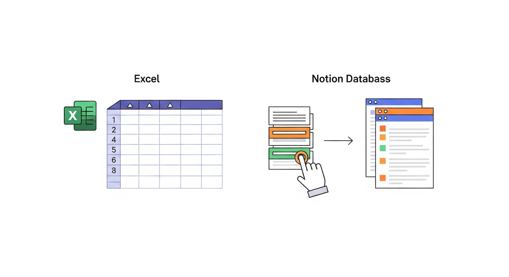
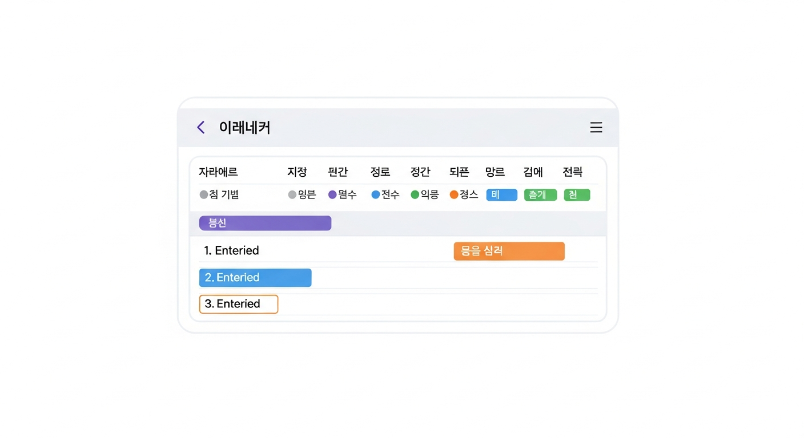
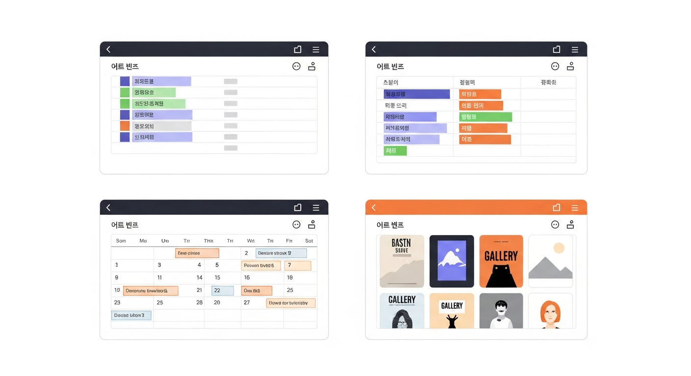
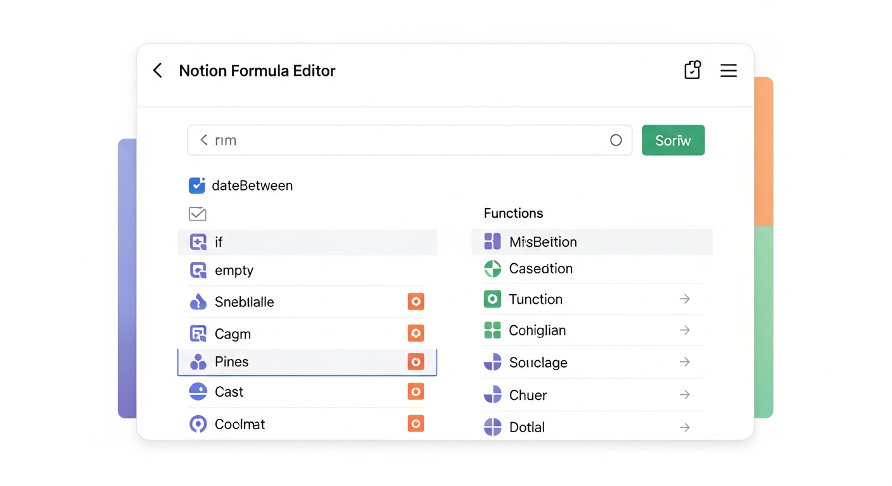
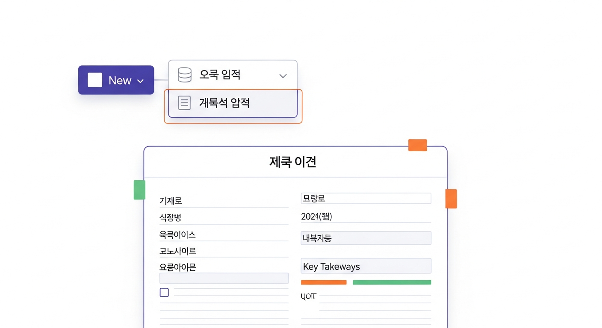
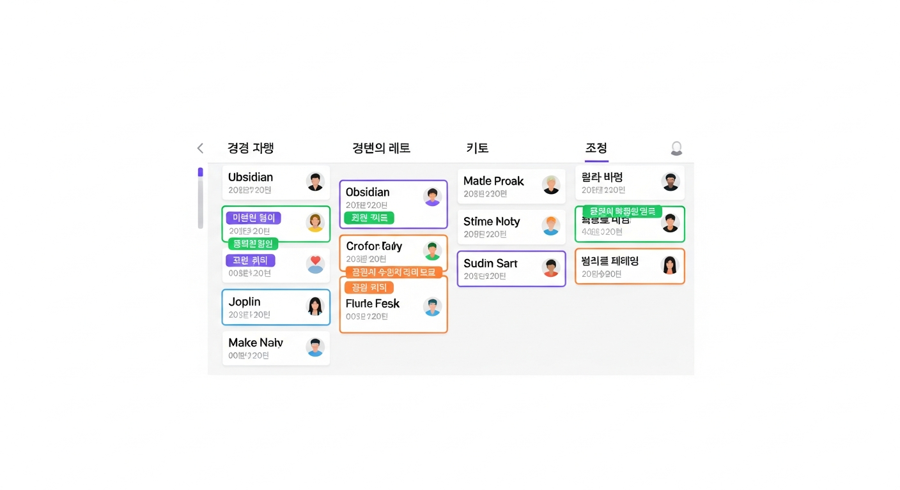
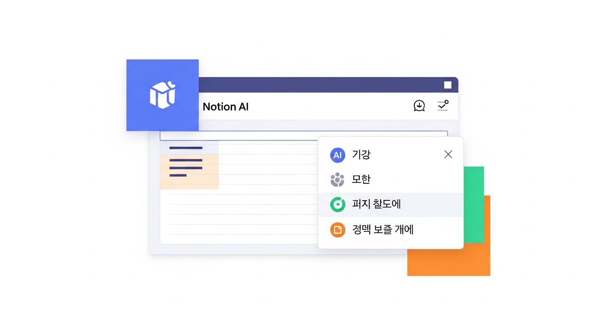
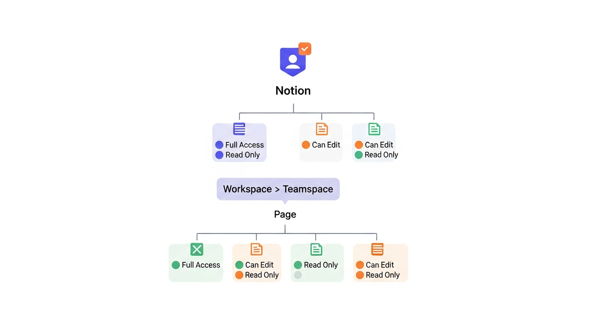

# 제6장: 노션 활용하기 — 데이터베이스·템플릿·자동화

5장에서 노션의 기본기를 익혔습니다. 블록을 만들고, 하위 페이지를 구성하고, 아이콘과 커버로 꾸미는 법까지. 여기까지만 해도 노션은 꽤 쓸 만한 노트 앱입니다. 하지만 솔직히 말하면, 여기까지는 맛보기에 불과합니다. 노션의 진짜 강점은 **데이터베이스**에 있습니다. 이번 장을 읽고 나면 "아, 사람들이 노션 노션 하는 이유가 이거였구나"라는 감탄이 나올 겁니다. 데이터베이스, 템플릿, 자동화 — 이 세 가지가 노션을 단순한 노트 앱에서 **나만의 생산성 시스템**으로 바꿔 주는 핵심 기능입니다.

---

## 데이터베이스 기초: 테이블·보드·캘린더·갤러리 뷰

### 노션 데이터베이스란 무엇인가

"데이터베이스"라는 단어가 좀 무섭게 느껴질 수 있습니다. 프로그래머들이 쓰는 그 어려운 거 아닌가? 걱정 마세요. 노션의 데이터베이스는 **엑셀 표의 업그레이드 버전**이라고 생각하시면 됩니다.

엑셀을 떠올려 보세요. 행(row)과 열(column)이 있고, 각 칸에 데이터를 넣습니다. 노션의 데이터베이스도 비슷합니다. 다만, 결정적인 차이가 하나 있습니다.

**엑셀에서는** 각 칸이 그냥 "칸"입니다.
**노션에서는** 각 행이 하나의 **페이지**입니다.

이것이 핵심입니다. 노션의 데이터베이스에서 행 하나를 클릭하면, 그 안에 또 다른 세계가 펼쳐집니다. 텍스트, 이미지, 체크리스트, 심지어 하위 데이터베이스까지 넣을 수 있습니다. 엑셀의 셀에 메모를 다는 것과는 차원이 다릅니다.


*그림 6-1. 엑셀 표와 노션 데이터베이스의 비교 다이어그램 — 왼쪽은 엑셀의 단순 셀 구조, 오른쪽은 노션에서 행을 클릭하면 페이지가 열리는 모습을 화살표로 연결한 비교 일러스트*

### 첫 데이터베이스 만들기

직접 만들어 보겠습니다. **독서 목록 데이터베이스**를 만들어 봅시다.

1. 빈 페이지를 하나 만들고, 제목을 **"나의 독서 목록"**으로 지정합니다.
2. `/` 명령어를 입력하고 **"테이블"** 또는 **"table"**을 검색합니다.
3. **"테이블 뷰 - 전체 페이지(Table view - Full page)"**를 선택합니다.
4. 빈 테이블이 나타납니다. 기본으로 "이름(Name)", "태그(Tags)", "상태(Status)" 열이 있습니다.

이제 이 테이블을 독서 목록에 맞게 커스터마이징해 봅시다.

**열(속성) 설정하기**:

| 열 이름 | 속성 유형 | 설명 |
|--------|----------|------|
| 책 제목 | 제목(Title) | 기본 이름 열을 변경 |
| 저자 | 텍스트(Text) | 작가 이름 |
| 상태 | 선택(Select) | 읽기 전 / 읽는 중 / 완독 |
| 평점 | 선택(Select) | ⭐~⭐⭐⭐⭐⭐ |
| 시작일 | 날짜(Date) | 읽기 시작한 날 |
| 완료일 | 날짜(Date) | 다 읽은 날 |
| 메모 | 텍스트(Text) | 한 줄 감상 |

열 이름을 바꾸려면 열 제목을 클릭하고, **"속성 편집(Edit property)"**을 선택합니다. 속성 유형도 여기서 바꿀 수 있습니다. "텍스트"를 "선택"으로 바꾸면, 미리 정해진 옵션 중에서 고르는 드롭다운이 됩니다.

**데이터 입력하기**:

테이블 하단의 **"+ 새로 만들기(New)"**를 클릭하면 새 행이 추가됩니다. 각 셀을 클릭해서 데이터를 넣어 보세요. "상태" 열은 드롭다운으로 선택하고, "시작일" 열은 달력에서 날짜를 고릅니다.

세 권 정도 넣어 보세요. 최근에 읽은 책, 지금 읽는 책, 앞으로 읽고 싶은 책 하나씩이면 딱 좋습니다.


*그림 6-2. 독서 목록 데이터베이스 예시 — '책 제목, 저자, 상태, 평점, 시작일, 완료일, 메모' 열이 있는 테이블에 3권의 책이 입력되어 있는 모습. 상태 열에는 컬러 태그(읽기 전=회색, 읽는 중=파랑, 완독=초록)가 표시됨*

### 같은 데이터, 다른 뷰 — 노션의 마법

여기서부터가 진짜 재미있는 부분입니다. 방금 만든 테이블 데이터를 전혀 다른 모습으로 볼 수 있습니다. 데이터는 하나인데, 보는 방식이 여러 가지인 겁니다. 마치 같은 풍경을 드론으로 위에서 보기도 하고, 정면에서 보기도 하고, 파노라마로 보기도 하는 것과 같습니다.

노션이 제공하는 뷰(View)는 크게 네 가지입니다.

**1. 테이블 뷰 (Table View)**

가장 기본이 되는 표 형태입니다. 엑셀처럼 행과 열로 데이터를 한눈에 봅니다. 데이터 입력과 비교에 가장 좋습니다.

- **이럴 때 유용**: 전체 목록을 한눈에 보고 싶을 때, 데이터를 빠르게 입력할 때
- **독서 목록 예시**: 읽은 책 전체 리스트를 스프레드시트처럼 관리

**2. 보드 뷰 (Board View)**

칸반(Kanban) 보드라고도 불립니다. 트렐로(Trello)를 써 보셨다면 익숙한 형태입니다. 카드가 열(column)별로 분류되어 있고, 드래그해서 옮길 수 있습니다.

- **이럴 때 유용**: 진행 상태를 시각적으로 파악하고 싶을 때
- **독서 목록 예시**: "읽기 전", "읽는 중", "완독" 세 칸으로 나누어 책 카드를 이동

**3. 캘린더 뷰 (Calendar View)**

말 그대로 달력 형태입니다. 날짜 속성을 기준으로 데이터가 달력 위에 표시됩니다.

- **이럴 때 유용**: 일정이나 마감일을 기준으로 데이터를 볼 때
- **독서 목록 예시**: 언제 어떤 책을 읽었는지, 독서 타임라인을 한눈에 확인

**4. 갤러리 뷰 (Gallery View)**

카드 형태로 이미지가 크게 보이는 뷰입니다. 핀터레스트(Pinterest)처럼 시각적으로 브라우징할 수 있습니다.

- **이럴 때 유용**: 이미지가 중요한 콘텐츠를 관리할 때
- **독서 목록 예시**: 각 책의 표지 이미지를 크게 보면서 고르기


*그림 6-3. 하나의 독서 목록 데이터베이스를 네 가지 뷰로 본 모습 — 왼쪽 상단 테이블 뷰, 오른쪽 상단 보드 뷰(읽기 전/읽는 중/완독 컬럼), 왼쪽 하단 캘린더 뷰(달력에 책 제목 표시), 오른쪽 하단 갤러리 뷰(책 표지 카드)가 2×2 그리드로 배치된 비교 일러스트*

### 뷰 추가하는 법

뷰를 추가하는 것은 아주 간단합니다.

1. 데이터베이스 왼쪽 상단에 현재 뷰 이름(예: "Table view")이 보입니다.
2. 그 옆에 **"+"** 버튼을 클릭합니다.
3. 원하는 뷰 유형(테이블, 보드, 캘린더, 갤러리, 리스트, 타임라인)을 선택합니다.
4. 뷰 이름을 지정합니다 (예: "진행 상태 보드", "독서 캘린더").

이제 뷰 이름 탭을 클릭하면 같은 데이터를 다른 형태로 전환할 수 있습니다. 데이터를 한 곳에서 수정하면 모든 뷰에 자동으로 반영됩니다. 이것이 노션 데이터베이스의 핵심 철학입니다 — **하나의 데이터, 다양한 시점**.

> **핵심 포인트**: 노션 데이터베이스는 엑셀 표처럼 보이지만, 각 행이 페이지입니다. 같은 데이터를 테이블·보드·캘린더·갤러리 등 다양한 뷰로 볼 수 있어, 상황에 따라 가장 적합한 형태를 선택할 수 있습니다.

---

## 필터·정렬·수식으로 데이터 다루기

데이터베이스에 데이터가 쌓이기 시작하면, "전체 목록"만으로는 부족해집니다. 읽은 책만 보고 싶을 때, 평점 높은 순으로 정렬하고 싶을 때, 올해 읽은 책만 확인하고 싶을 때 — 이럴 때 필터와 정렬이 필요합니다.

### 필터 (Filter): 보고 싶은 데이터만 걸러내기

필터는 조건에 맞는 데이터만 화면에 표시하는 기능입니다. 커피숍에서 "아이스 음료만 보여 주세요"라고 말하는 것과 같습니다.

**필터 설정 방법**:

1. 데이터베이스 상단의 **"필터(Filter)"** 버튼을 클릭합니다.
2. **"+ 필터 추가(Add a filter)"**를 선택합니다.
3. 세 가지를 지정합니다:
   - **어떤 속성**: 예) 상태
   - **어떤 조건**: 예) ~인 것 (is)
   - **어떤 값**: 예) 읽는 중

이렇게 하면 "읽는 중"인 책만 표시됩니다.

**필터를 여러 개 걸 수도 있습니다**:

- 상태 = "완독" **그리고(AND)** 평점 = "⭐⭐⭐⭐⭐" → 다 읽은 책 중 최고 평점만
- 상태 = "읽기 전" **또는(OR)** 상태 = "읽는 중" → 아직 다 안 읽은 책들

**실전 활용 팁**: 자주 쓰는 필터 조합은 별도의 뷰로 저장해 두세요. 예를 들어, "읽는 중만 보는 뷰", "올해 완독한 뷰" 같은 식으로 뷰를 만들면, 탭 하나로 원하는 목록을 바로 볼 수 있습니다.

### 정렬 (Sort): 원하는 순서로 나열하기

정렬은 데이터를 특정 기준으로 순서를 매기는 것입니다.

**정렬 설정 방법**:

1. 데이터베이스 상단의 **"정렬(Sort)"** 버튼을 클릭합니다.
2. **"+ 정렬 추가(Add a sort)"**를 선택합니다.
3. 기준 속성과 방향(오름차순/내림차순)을 지정합니다.

**유용한 정렬 예시**:

- **평점 높은 순**: 평점 → 내림차순 → 최고의 책이 맨 위에
- **최근 읽은 순**: 완료일 → 내림차순 → 가장 최근에 읽은 책이 맨 위에
- **시작일 순**: 시작일 → 오름차순 → 독서 이력을 시간순으로

정렬도 여러 기준을 동시에 적용할 수 있습니다. 예를 들어, 1차로 "상태"별로 묶고, 2차로 "평점" 높은 순으로 정렬하면, 상태별로 그룹화된 상태에서 평점 순으로 정리됩니다.

### 수식 (Formula): 데이터를 자동 계산하기

수식은 엑셀의 함수와 비슷합니다. 다른 속성의 값을 이용해서 새로운 값을 자동으로 계산합니다.

**간단한 수식 예시**:

독서 목록에 **"독서 기간"**이라는 계산 속성을 추가해 봅시다. 완료일에서 시작일을 빼면 며칠 동안 읽었는지 알 수 있겠죠?

1. **"+ 속성 추가(Add a property)"**를 클릭합니다.
2. 속성 이름: **"독서 기간"**
3. 속성 유형: **"수식(Formula)"**을 선택합니다.
4. 수식 편집기에 다음을 입력합니다:

```
dateBetween(prop("완료일"), prop("시작일"), "days")
```

이 수식은 "완료일과 시작일 사이의 일수를 계산하라"는 의미입니다.

**자주 쓰는 수식 패턴**:

| 용도 | 수식 | 결과 |
|------|------|------|
| 날짜 차이 | `dateBetween(prop("완료일"), prop("시작일"), "days")` | 독서 일수 |
| 빈 칸 확인 | `empty(prop("메모"))` | 메모가 비었으면 true |
| 조건부 텍스트 | `if(prop("상태") == "완독", "✅", "📖")` | 완독이면 ✅, 아니면 📖 |
| 문자열 합치기 | `prop("책 제목") + " - " + prop("저자")` | "책 제목 - 저자" 형태 |

수식이 처음에는 어려워 보일 수 있습니다. 하지만 위의 네 가지 패턴만 알아도 대부분의 상황을 커버할 수 있습니다. 나머지는 필요할 때 노션 공식 문서나 커뮤니티에서 찾아보면 됩니다.


*그림 6-4. 노션 수식 편집기 화면 — 상단에 수식 입력 필드가 있고, 하단에 사용 가능한 함수 목록(dateBetween, if, empty 등)이 카테고리별로 나열된 모습*

> **핵심 포인트**: 필터는 보고 싶은 데이터만 걸러내고, 정렬은 원하는 순서로 나열하며, 수식은 데이터를 자동 계산합니다. 이 세 가지를 조합하면 단순한 표가 똑똑한 관리 도구로 변합니다.

---

## 템플릿 버튼으로 반복 작업 줄이기

매주 같은 양식의 주간 회고를 쓴다고 해 봅시다. 매번 제목 쓰고, 질문 항목 만들고, 구분선 넣고... 번거롭습니다. 10번 반복하다 보면 "이걸 자동으로 할 수 없나?"라는 생각이 듭니다.

할 수 있습니다. 바로 **템플릿**입니다.

### 데이터베이스 템플릿이란

노션의 데이터베이스 템플릿은, 새 항목을 추가할 때 미리 정해진 양식이 자동으로 채워지는 기능입니다. 빈 페이지 대신, 이미 구조가 잡힌 페이지가 열리는 것입니다.

**템플릿 없이 새 항목을 만들면**: 빈 페이지가 열립니다. 처음부터 다 만들어야 합니다.
**템플릿이 있으면**: 제목 서식, 질문 항목, 체크리스트, 구분선 — 필요한 구조가 이미 세팅된 페이지가 열립니다.

마치 서류를 처음부터 작성하는 것과, 미리 인쇄된 양식에 빈칸만 채우는 것의 차이입니다.

### 데이터베이스 템플릿 만들기

독서 목록 데이터베이스에 **"독서 노트 템플릿"**을 만들어 봅시다. 새 책을 추가할 때마다 감상문 구조가 자동으로 생기도록 하겠습니다.

1. 데이터베이스에서 **"+ 새로 만들기"** 옆의 **작은 화살표(▼)**를 클릭합니다.
2. **"+ 새 템플릿(New template)"**을 선택합니다.
3. 템플릿 편집 화면이 열립니다. 이 안에 원하는 구조를 만듭니다:

```markdown
## 📖 기본 정보
- 장르:
- 페이지 수:
- 추천인/경로:

## 💡 핵심 인사이트 (3가지)
1.
2.
3.

## 📝 인상 깊은 구절
> (여기에 옮겨 적기)

## 🤔 나의 생각
(자유롭게 감상 쓰기)

## ✅ 실천 항목
- [ ]
- [ ]
```

4. 왼쪽 상단의 **"뒤로(Back)"**를 클릭해서 저장합니다.

이제 **"+ 새로 만들기"** 옆 화살표를 클릭하면 **"독서 노트"** 템플릿이 나타납니다. 선택하면 위 구조가 자동으로 채워진 새 페이지가 만들어집니다!


*그림 6-5. 노션 데이터베이스 템플릿 선택 화면 — '새로 만들기' 버튼 옆 드롭다운에서 '빈 페이지'와 '독서 노트' 템플릿 두 가지 옵션이 표시되고, 독서 노트 템플릿을 선택하면 미리 구조화된 페이지가 열리는 과정을 보여주는 일러스트*

### 실전 템플릿 아이디어

데이터베이스 템플릿은 반복되는 모든 양식에 적용할 수 있습니다. 몇 가지 아이디어를 드리겠습니다.

**주간 회고 템플릿**:
- 이번 주 잘한 일 (3가지)
- 이번 주 아쉬운 점 (3가지)
- 다음 주 목표 (3가지)
- 배운 것 한 가지

**회의록 템플릿**:
- 참석자:
- 안건:
- 논의 내용:
- 결정 사항:
- 다음 할 일 (체크리스트)

**프로젝트 기획서 템플릿**:
- 프로젝트 개요
- 목표와 성과 지표
- 타임라인
- 필요한 리소스
- 리스크 요인

한 번 잘 만들어 두면, 이후로는 클릭 한 번에 일관된 양식으로 작성할 수 있습니다. 반복 작업이 사라지면, 그만큼 내용에 집중할 수 있습니다.

> **핵심 포인트**: 템플릿은 반복 작업의 적입니다. 데이터베이스에 템플릿을 만들어 두면, 새 항목 추가 시 미리 짜여진 구조가 자동으로 생깁니다. 한 번 세팅해 두면 수십 번의 수작업을 아낄 수 있습니다.

---

## 실전 예시: 프로젝트 관리 보드 만들기

지금까지 배운 데이터베이스, 뷰, 필터, 템플릿을 모두 활용해서 **프로젝트 관리 보드**를 하나 만들어 보겠습니다. 이 실습을 마치면, 노션으로 실제 업무나 개인 프로젝트를 관리할 수 있게 됩니다.

### Step 1: 데이터베이스 구조 설계

새 페이지를 만들고 제목을 **"프로젝트 관리 보드"**로 지정합니다. `/table`로 테이블 뷰 데이터베이스를 만들고, 다음 속성들을 설정합니다.

| 속성 이름 | 유형 | 옵션 |
|-----------|------|------|
| 작업명 | 제목(Title) | - |
| 상태 | 선택(Select) | 할 일 / 진행 중 / 완료 / 보류 |
| 우선순위 | 선택(Select) | 🔴 긴급 / 🟡 보통 / 🟢 낮음 |
| 담당자 | 사람(Person) | (나 자신 또는 팀원) |
| 마감일 | 날짜(Date) | - |
| 카테고리 | 다중선택(Multi-select) | 기획 / 디자인 / 개발 / 마케팅 |
| 진행률 | 숫자(Number) | 퍼센트 형식 |

### Step 2: 보드 뷰 추가

테이블 뷰 옆의 **"+"** 버튼을 눌러 **보드 뷰**를 추가합니다. "상태" 속성을 기준으로 그룹화하면, "할 일", "진행 중", "완료", "보류" 네 개의 열이 만들어집니다. 작업 카드를 드래그해서 상태를 바꿀 수 있습니다.

### Step 3: 캘린더 뷰 추가

**"+"** 버튼을 눌러 **캘린더 뷰**를 하나 더 추가합니다. "마감일"을 기준으로 설정하면, 달력 위에 각 작업이 표시됩니다. 이번 주에 뭘 해야 하는지 한눈에 보입니다.

### Step 4: 필터로 "내 할 일" 뷰 만들기

보드 뷰를 하나 더 만들고, 이름을 **"내 할 일"**로 지정합니다. 필터를 추가해서:
- 담당자 = 나 자신
- 상태 ≠ 완료

이렇게 하면 내가 해야 할 일만 보이는 개인 대시보드가 됩니다.

### Step 5: 작업 템플릿 만들기

데이터베이스에 템플릿을 추가합니다.

**"새 작업" 템플릿**:
```markdown
## 작업 설명
(무엇을 해야 하는지 구체적으로)

## 완료 기준
- [ ] 기준 1
- [ ] 기준 2
- [ ] 기준 3

## 참고 자료
(관련 링크, 문서 등)

## 진행 로그
| 날짜 | 내용 |
|------|------|
|      |      |
```

### Step 6: 샘플 데이터 넣기

만든 템플릿으로 작업 3~5개를 넣어 보세요. 예를 들어:

- "프로젝트 기획서 작성" — 🔴 긴급, 진행 중, 마감일 이번 주 금요일
- "디자인 시안 검토" — 🟡 보통, 할 일, 마감일 다음 주 월요일
- "테스트 진행" — 🟢 낮음, 할 일, 마감일 다음 주 수요일

보드 뷰에서 카드를 "할 일"에서 "진행 중"으로 드래그해 보세요. 캘린더 뷰로 전환해서 일정이 잘 표시되는지 확인해 보세요. 필터가 적용된 "내 할 일" 뷰에서 자신의 작업만 보이는지 확인해 보세요.


*그림 6-6. 완성된 프로젝트 관리 보드 — 보드 뷰에서 '할 일', '진행 중', '완료', '보류' 네 개 열에 각각 작업 카드가 배치된 모습. 카드에는 작업명, 우선순위 색상 태그, 마감일, 담당자 아바타가 표시됨*

이것이 바로 많은 팀과 개인이 트렐로(Trello)나 아사나(Asana) 대신 노션을 선택하는 이유입니다. 프로젝트 관리 도구와 노트 앱이 하나로 합쳐져 있으니, 별도의 앱을 오갈 필요가 없습니다.

> **핵심 포인트**: 데이터베이스 + 다중 뷰 + 필터 + 템플릿을 조합하면, 별도의 프로젝트 관리 앱 없이도 노션 안에서 완성도 높은 관리 시스템을 만들 수 있습니다.

---

## 노션 AI 기능 활용법

2023년부터 노션에 AI 기능이 내장되었습니다. 별도의 AI 도구를 사용하지 않아도, 노션 안에서 바로 AI의 도움을 받을 수 있습니다.

### 노션 AI란

노션 AI는 노션 안에서 텍스트를 자동 생성, 요약, 번역, 수정해 주는 기능입니다. ChatGPT 같은 AI를 노션 안에 심어 놓은 것이라고 생각하면 됩니다.

**사용법은 아주 간단합니다**:

1. 빈 줄에서 **Space(스페이스바)**를 누르면 AI 입력 창이 나타납니다.
2. 또는 텍스트를 선택한 후 **"AI에게 요청(Ask AI)"** 버튼을 클릭합니다.
3. 원하는 작업을 말하면 됩니다.

### 유용한 노션 AI 활용 시나리오

**1. 회의록 자동 정리**

회의 중에 대충 메모한 내용을 AI에게 넘기면:
- 핵심 요약을 만들어 줍니다.
- 액션 아이템(할 일)을 추출해 줍니다.
- 참석자별로 내용을 정리해 줍니다.

실행: 메모를 선택 → "Ask AI" → "이 내용을 회의록 형식으로 정리해 줘"

**2. 글쓰기 보조**

블로그 글, 보고서, 이메일 등을 쓸 때:
- 초안 작성을 도와줍니다.
- 문장을 더 부드럽게(또는 전문적으로) 다듬어 줍니다.
- 맞춤법과 문법을 검토해 줍니다.

실행: 텍스트 선택 → "Ask AI" → "이 문장을 더 전문적인 톤으로 바꿔 줘"

**3. 번역**

노션 AI는 다국어 번역도 지원합니다:
- 한국어 → 영어, 일본어, 중국어 등
- 전문 번역기 수준은 아니지만, 빠른 의미 파악에는 충분합니다.

실행: 텍스트 선택 → "Ask AI" → "영어로 번역해 줘"

**4. 데이터베이스 속성 자동 채우기**

노션 AI는 데이터베이스 속성을 자동으로 채워 줄 수도 있습니다. 예를 들어, 독서 노트 페이지의 내용을 바탕으로 "한 줄 요약" 속성을 자동 생성할 수 있습니다.


*그림 6-7. 노션 AI 사용 화면 — 텍스트를 선택하면 나타나는 AI 메뉴에서 '요약', '번역', '톤 변경', '액션 아이템 추출' 등의 옵션이 표시된 모습*

### 노션 AI 요금제

노션 AI는 기본적으로 유료 부가 기능입니다. 무료 플랜에서도 일부 기능을 체험할 수 있지만, 본격적으로 쓰려면 월 $10(약 13,000원)의 AI 추가 요금이 발생합니다. 처음에는 무료 체험분으로 사용해 보고, 정말 필요하다고 느낄 때 결제하는 것을 추천합니다.

> **핵심 포인트**: 노션 AI는 글쓰기 보조, 회의록 정리, 번역, 데이터베이스 자동 채우기 등에 활용할 수 있습니다. 유료 기능이지만, 반복적인 글 정리 작업이 많다면 충분히 투자 가치가 있습니다.

---

## 팀 협업 세팅과 권한 관리

노션은 개인 사용도 훌륭하지만, 팀과 함께 쓸 때 진가를 발휘합니다. 같은 페이지를 동시에 편집하고, 코멘트를 남기고, 권한을 세밀하게 조절할 수 있습니다.

### 게스트 초대하기

가장 간단한 협업 방법은 **게스트 초대**입니다. 무료 플랜에서도 최대 10명까지 게스트를 초대할 수 있습니다.

**초대 방법**:
1. 공유하고 싶은 페이지를 엽니다.
2. 오른쪽 상단의 **"공유(Share)"** 버튼을 클릭합니다.
3. 초대할 사람의 **이메일 주소**를 입력합니다.
4. 권한 수준을 선택합니다:
   - **전체 액세스(Full access)**: 읽기 + 쓰기 + 공유 가능
   - **편집 가능(Can edit)**: 읽기 + 쓰기 가능
   - **댓글 가능(Can comment)**: 읽기 + 댓글만 가능
   - **읽기만(Can view)**: 보기만 가능
5. **"초대(Invite)"**를 클릭합니다.

### 팀스페이스 (Teamspace) 활용

팀 단위로 노션을 쓴다면, **팀스페이스** 기능을 활용하는 것이 좋습니다. 팀스페이스는 팀 전용 공간으로, 팀 멤버 전원이 자동으로 접근할 수 있습니다.

**팀스페이스의 장점**:
- 새 멤버가 합류하면 자동으로 팀 문서에 접근 가능
- 팀별로 독립된 공간 운영 가능 (마케팅팀, 개발팀, 디자인팀 등)
- 공개/비공개 설정으로 접근 범위 조절

### 권한 관리 가이드

팀이 커지면 권한 관리가 중요해집니다. 노션의 권한은 **상위에서 하위로 상속**됩니다. 즉, 워크스페이스 레벨에서 설정한 권한이 하위 페이지에도 적용됩니다.

**권한 설계 팁**:

```
워크스페이스 (전체 멤버)
├── 팀스페이스: 마케팅 (마케팅팀만)
│   ├── 캠페인 기획 (편집 가능)
│   └── 성과 리포트 (읽기만)
├── 팀스페이스: 개발 (개발팀만)
│   ├── 기술 문서 (편집 가능)
│   └── API 문서 (전체 읽기 가능)
└── 공용 공간 (전체 멤버)
    ├── 회사 공지 (관리자만 편집)
    └── 회의록 (전체 편집 가능)
```

**실수를 방지하는 권한 설정 원칙**:

1. **최소 권한 원칙**: 필요한 만큼만 권한을 부여합니다. 모든 사람에게 편집 권한을 줄 필요는 없습니다.
2. **중요 페이지 잠금**: 템플릿이나 구조가 잡힌 페이지는 "읽기만" 또는 "잠금(Lock)"을 걸어 실수로 바뀌는 것을 방지합니다. (페이지 우측 상단 **"⋯" → "페이지 잠금"**)
3. **게스트와 멤버 구분**: 외부 협력사는 게스트로 초대하고, 내부 팀원은 멤버로 관리합니다.


*그림 6-8. 노션 권한 관리 구조도 — 워크스페이스 > 팀스페이스 > 페이지 순서로 계층적 권한이 상속되는 모습을 트리 다이어그램으로 표현. 각 단계에 '전체 액세스', '편집 가능', '읽기만' 아이콘이 표시됨*

### 실시간 협업 기능

노션의 실시간 협업은 구글 독스(Google Docs)와 비슷합니다.

- **동시 편집**: 같은 페이지를 여러 사람이 동시에 수정할 수 있습니다. 다른 사람의 커서가 실시간으로 보입니다.
- **코멘트**: 텍스트를 선택하고 **"코멘트(Comment)"**를 클릭하면 댓글을 남길 수 있습니다. @멘션으로 특정 사람을 호출할 수도 있습니다.
- **페이지 이력**: 상단 **"⋯" → "페이지 기록(Page history)"**에서 과거 버전을 확인하고 복원할 수 있습니다.

> **핵심 포인트**: 노션의 협업 기능은 게스트 초대, 팀스페이스, 세밀한 권한 관리, 실시간 동시 편집을 제공합니다. "최소 권한 원칙"과 "중요 페이지 잠금"만 기억하면, 팀의 실수를 줄이면서 효율적으로 협업할 수 있습니다.

---

## 챕터 요약

이번 장에서 배운 내용을 정리합니다.

- **데이터베이스**는 노션의 핵심 기능입니다. 각 행이 하나의 페이지인 "똑똑한 표"로, 테이블·보드·캘린더·갤러리 등 다양한 뷰로 같은 데이터를 볼 수 있습니다.

- **필터·정렬·수식**으로 데이터를 원하는 조건으로 걸러내고, 원하는 순서로 나열하고, 자동 계산할 수 있습니다. 자주 쓰는 조합은 별도의 뷰로 저장해 두면 편리합니다.

- **템플릿**은 반복 작업을 없애 줍니다. 데이터베이스에 템플릿을 만들어 두면, 새 항목 추가 시 미리 구조화된 페이지가 자동으로 생깁니다.

- **프로젝트 관리 보드 실습**을 통해 데이터베이스 + 다중 뷰 + 필터 + 템플릿을 조합하여 실용적인 관리 시스템을 직접 만들어 보았습니다.

- **노션 AI**로 회의록 정리, 글 다듬기, 번역 등을 노션 안에서 바로 처리할 수 있습니다. 유료 기능이지만 반복 작업이 많다면 투자 가치가 있습니다.

- **팀 협업**에서는 게스트 초대, 팀스페이스, 권한 관리를 통해 안전하고 효율적인 협업 환경을 구축할 수 있습니다.

---

## 다음 챕터 예고

노션의 데이터베이스와 협업 기능까지 마스터했습니다. 이제 세 번째 도구로 시야를 넓혀 봅시다. 7장에서는 **조플린(Joplin)**을 만나봅니다. 프라이버시를 최우선으로 생각하는 오픈소스 노트 앱, 조플린의 설치부터 기본 사용법까지 함께 알아보겠습니다. 내 데이터를 오직 내가 통제하고 싶다면, 조플린이 그 답이 될 수 있습니다.
