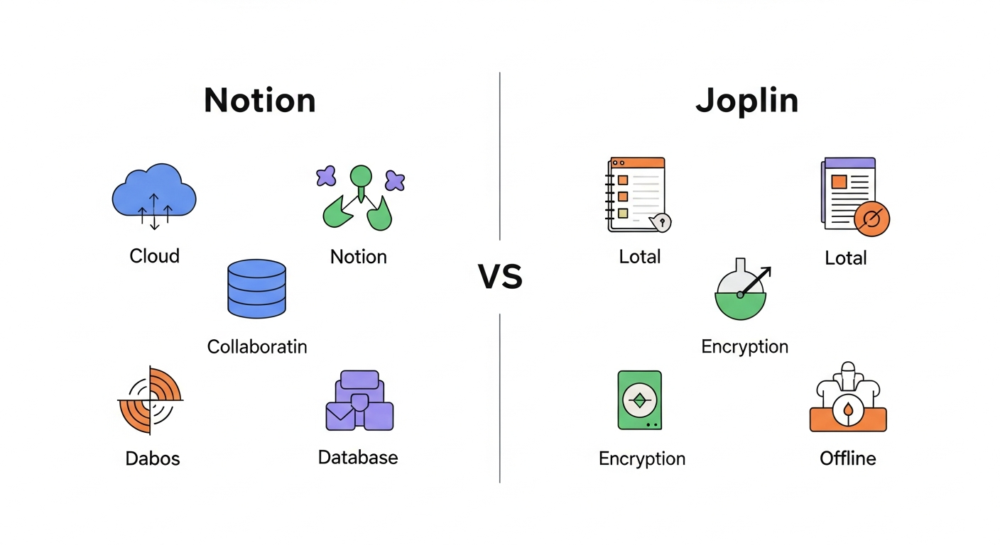
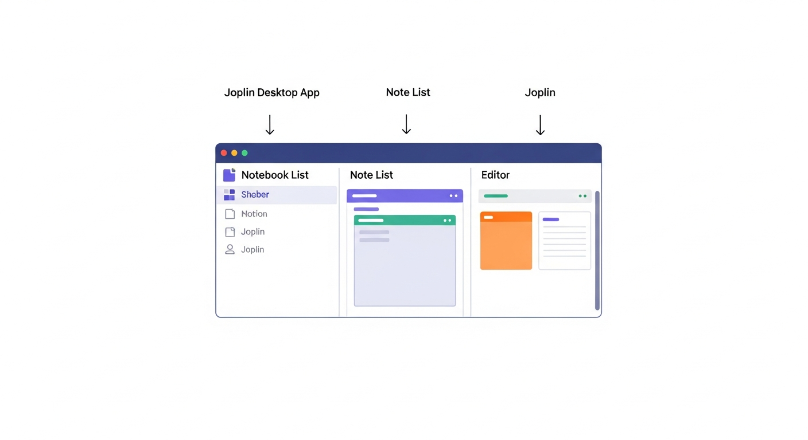
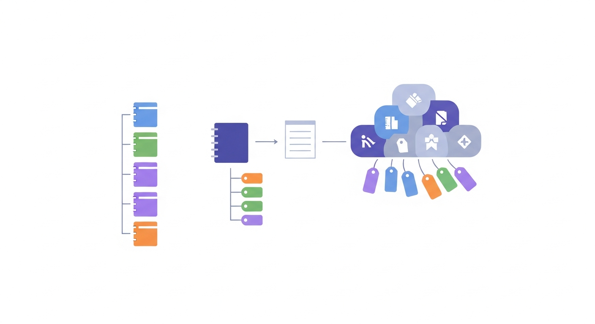
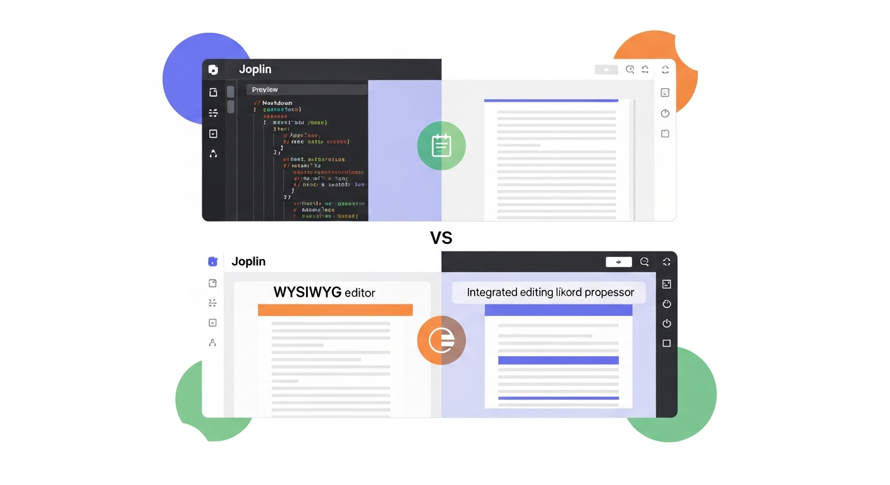
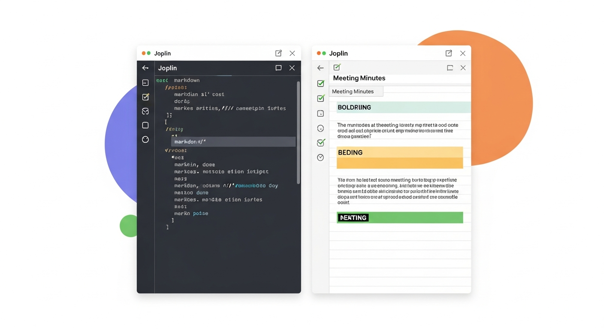
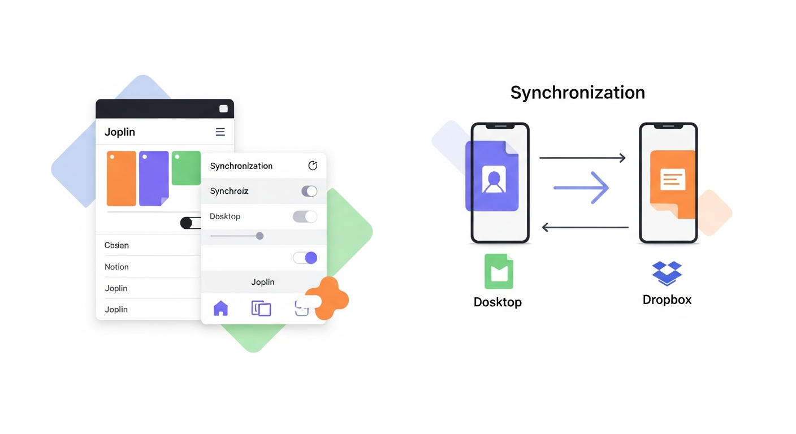
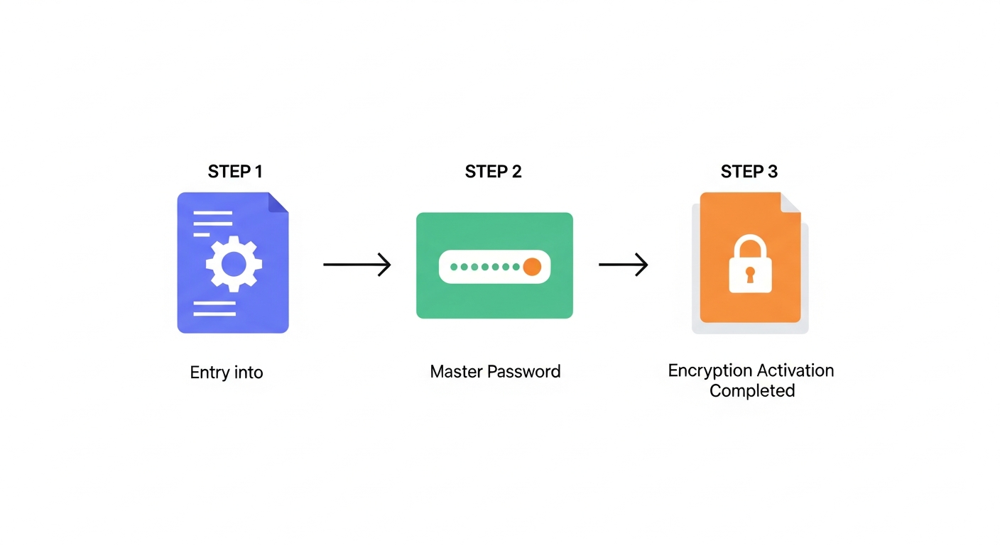
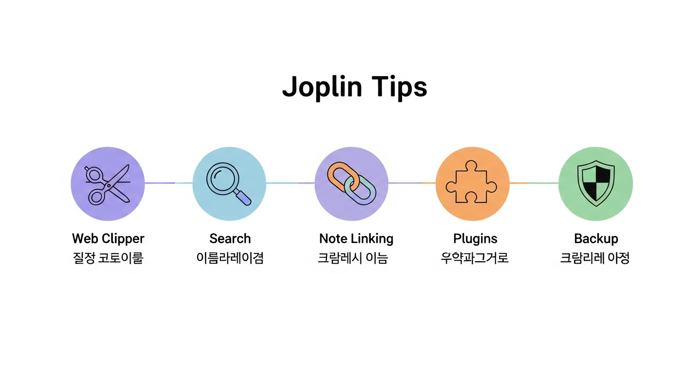

# 제7장: 조플린 시작하기 — 설치부터 노트 암호화까지

5장과 6장에서 노션의 세계를 탐험했습니다. 화려한 데이터베이스, 다양한 뷰, 템플릿까지. 노션이 "올인원 워크스페이스"라면, 이번 장에서 만날 **조플린(Joplin)**은 성격이 꽤 다릅니다. 조플린은 **오픈소스** 노트 앱입니다. 무료이고, 내 노트 데이터를 내가 직접 관리할 수 있고, 무엇보다 **End-to-End 암호화**를 지원합니다. "내 노트는 내 것이다"라는 철학을 가진 앱이라고 할 수 있습니다.

노션이 멋진 레스토랑이라면, 조플린은 내 집 부엌입니다. 레스토랑은 화려하고 편리하지만, 주방장이 내 데이터를 관리합니다. 내 집 부엌은 직접 재료를 사고 요리해야 하지만, 냉장고 안에 뭐가 있는지 정확히 알고 있고, 아무도 내 레시피를 훔쳐볼 수 없습니다. 어떤 사람에게는 레스토랑이, 어떤 사람에게는 내 집 부엌이 더 맞습니다. 중요한 건 **선택지를 아는 것**입니다.

이번 장에서는 조플린을 설치하고, 기본 사용법을 익히고, 암호화까지 설정하는 전 과정을 함께 걸어보겠습니다.

---

## 조플린이란? — 왜 이 앱을 알아야 하는가

### 오픈소스 노트 앱의 의미

조플린은 프랑스 개발자 로랑 쿠아뇌(Laurent Cozic)가 2017년에 만든 오픈소스 노트 앱입니다. "오픈소스"라는 말이 어렵게 느껴질 수 있는데, 쉽게 말하면 **설계도가 공개된 소프트웨어**입니다. 누구나 코드를 들여다볼 수 있고, 문제가 있으면 고칠 수 있고, 필요하면 자기만의 버전을 만들 수도 있습니다.

이게 왜 중요할까요? 노션이나 에버노트 같은 서비스는 회사가 운영합니다. 회사가 갑자기 가격을 올리거나, 서비스를 종료하거나, 약관을 바꿔서 내 데이터를 다르게 활용할 수도 있습니다. 실제로 에버노트는 2023년에 무료 요금제를 대폭 축소해서 많은 사용자가 당황했습니다.

조플린은 다릅니다. 소스 코드가 공개되어 있으니, 설령 원래 개발자가 프로젝트를 그만두더라도 커뮤니티가 이어갈 수 있습니다. 내 노트 파일은 내 컴퓨터에 저장되니, 서비스 종료 걱정도 없습니다. 이런 특성 때문에 IT 업계 종사자, 개인정보에 민감한 사람, 디지털 미니멀리스트들 사이에서 꾸준히 인기를 얻고 있습니다.

### 노션과 조플린, 뭐가 다를까

간단히 비교하면 이렇습니다.

| 항목 | 노션 | 조플린 |
|------|------|--------|
| 가격 | 무료 플랜 + 유료 플랜 | 완전 무료 (오픈소스) |
| 데이터 저장 | 노션 서버 (클라우드) | 내 컴퓨터 (로컬) |
| 동기화 | 자동 (노션 서버) | 직접 설정 (Dropbox, OneDrive 등) |
| 암호화 | 서버측 암호화 | End-to-End 암호화 |
| 오프라인 사용 | 제한적 | 완전 지원 |
| 에디터 | 블록 기반 WYSIWYG | 마크다운 기반 |
| 데이터베이스 | 강력한 내장 DB | 없음 (노트+태그 방식) |
| 협업 | 매우 강력 | 기본적 수준 |


*그림 7-1. 노션과 조플린의 특성 비교 인포그래픽 — 왼쪽에 노션(클라우드, 협업, 데이터베이스 강점), 오른쪽에 조플린(로컬 저장, 암호화, 오프라인 강점)을 시각적으로 대비하는 일러스트*

핵심 차이를 한 문장으로 정리하면: **노션은 '편리함과 협업'에 최적화되어 있고, 조플린은 '프라이버시와 소유권'에 최적화되어 있습니다.**

어떤 게 더 좋다는 게 아닙니다. 회사 팀 프로젝트 관리에는 노션이, 개인 일기나 민감한 메모에는 조플린이 더 적합할 수 있습니다. 둘 다 알아두면 상황에 따라 최적의 도구를 고를 수 있습니다.

---

## 조플린 설치하기 — 데스크톱, 모바일, 터미널

### 데스크톱 설치 (Windows / macOS / Linux)

조플린은 모든 주요 운영체제를 지원합니다. 설치 방법은 정말 간단합니다.

**1단계: 공식 사이트 방문**

웹 브라우저에서 [joplinapp.org](https://joplinapp.org)에 접속합니다. 메인 화면에 큰 다운로드 버튼이 보입니다.

**2단계: 운영체제에 맞는 버전 다운로드**

- **Windows**: `.exe` 설치 파일을 다운로드합니다. 더블클릭해서 "다음 → 다음 → 설치" 순서로 진행하면 됩니다.
- **macOS**: `.dmg` 파일을 다운로드합니다. 열고 나서 조플린 아이콘을 "Applications" 폴더로 드래그하면 끝입니다.
- **Linux**: AppImage, `.deb`, `.snap` 등 여러 형식을 지원합니다. 우분투 사용자라면 터미널에서 `snap install joplin-desktop`으로 간단히 설치할 수 있습니다.

**3단계: 첫 실행**

설치가 끝나면 조플린을 실행합니다. 처음 열면 비어 있는 화면이 나타납니다. 왼쪽에 노트북 목록, 중간에 노트 목록, 오른쪽에 노트 편집기 — 이 세 칸 구조가 조플린의 기본 레이아웃입니다.


*그림 7-2. 조플린 데스크톱 앱의 초기 화면 — 왼쪽 사이드바(노트북 목록), 중간 패널(노트 목록), 오른쪽 패널(편집기)의 세 칸 레이아웃을 화살표와 라벨로 설명하는 스크린샷 스타일 일러스트*

노션의 화려한 첫 화면에 비하면 좀 심심해 보일 수 있습니다. 하지만 이 단순함이 조플린의 장점입니다. 군더더기 없이 **쓰기에 집중**할 수 있거든요.

### 모바일 설치 (iOS / Android)

스마트폰에서도 조플린을 쓸 수 있습니다. 이동 중에 떠오른 아이디어를 빠르게 메모하거나, 데스크톱에서 작성한 노트를 확인할 때 유용합니다.

- **iOS**: App Store에서 "Joplin"을 검색하여 설치합니다.
- **Android**: Google Play Store에서 "Joplin"을 검색하여 설치합니다.

모바일 버전은 데스크톱보다 기능이 약간 줄어들지만, 노트 작성·편집·검색의 핵심 기능은 동일합니다. 동기화를 설정하면 데스크톱과 모바일에서 같은 노트를 볼 수 있습니다. (동기화 설정은 뒤에서 다루겠습니다.)

### 터미널 버전 — 개발자를 위한 선택지

조플린에는 **터미널(CLI) 버전**도 있습니다. 마우스 없이 키보드만으로 노트를 관리하는 방식입니다. 일반 사용자에게는 권장하지 않지만, 개발자이거나 터미널 작업을 좋아하는 분이라면 한번 시도해 볼 만합니다.

설치는 Node.js가 설치된 환경에서 다음 명령어 한 줄로 끝납니다:

```bash
npm install -g joplin
```

설치 후 `joplin` 명령어로 실행하면, 터미널 안에서 노트를 만들고, 편집하고, 검색할 수 있습니다. 노트 내용은 데스크톱/모바일 버전과 동일한 형식이므로, 동기화도 가능합니다.

> **팁**: 어떤 플랫폼에서 시작하든 상관없습니다. 일단 **데스크톱 버전**으로 시작하는 것을 추천합니다. 화면이 넓어서 조플린의 구조를 이해하기 가장 좋습니다.

---

## 노트북과 태그로 정리하기

### 노트북 — 서랍장의 서랍

조플린의 정리 체계는 **노트북(Notebook)**과 **태그(Tag)** 두 가지입니다. 노션의 페이지 안에 페이지를 넣는 구조와는 다릅니다. 조플린의 구조는 좀 더 전통적입니다.

**노트북**은 말 그대로 노트를 담는 공책입니다. 물리적인 서랍장을 떠올려 보세요. 서랍마다 "업무", "개인", "공부" 같은 라벨을 붙이듯, 조플린에서도 노트북을 만들어 분류합니다.

노트북을 만드는 방법:

1. 왼쪽 사이드바 하단의 **"새 노트북(New notebook)"** 버튼을 클릭합니다.
2. 노트북 이름을 입력합니다. (예: "업무", "독서 노트", "개인 메모")
3. Enter를 누르면 완성입니다.

조플린에서는 노트북 안에 **하위 노트북(Sub-notebook)**을 만들 수 있습니다. "업무" 노트북 안에 "프로젝트 A", "프로젝트 B" 하위 노트북을 두는 식입니다. 하위 노트북을 만들려면 상위 노트북을 마우스 오른쪽 버튼으로 클릭하고 "새 하위 노트북"을 선택합니다.

추천하는 기본 노트북 구조는 이렇습니다:

```
📓 업무
   ├── 📓 회의록
   ├── 📓 프로젝트
   └── 📓 참고자료
📓 개인
   ├── 📓 일기
   ├── 📓 아이디어
   └── 📓 읽을거리
📓 공부
   ├── 📓 강의 노트
   └── 📓 정리 노트
📓 임시 (Inbox)
```

맨 아래에 **"임시(Inbox)"** 노트북을 하나 만들어 두는 것을 강력히 추천합니다. 2장에서 이야기한 "모으기" 단계를 기억하시나요? 어떤 노트든 일단 여기에 던져 넣고, 나중에 적절한 노트북으로 옮기면 됩니다.

### 태그 — 또 하나의 분류 축

노트북이 "물리적 위치"라면, 태그는 **"투명 포스트잇"**입니다. 한 노트가 하나의 노트북에만 들어갈 수 있지만, 태그는 여러 개를 붙일 수 있습니다.

예를 들어, "마케팅 팀 회의록 — 3월 28일"이라는 노트가 있다고 합시다.
- **노트북**: `업무 > 회의록` (물리적 위치)
- **태그**: `#마케팅`, `#회의`, `#2026년3월` (속성 라벨)

이렇게 하면 나중에 "마케팅 관련 노트만 모아보기"나 "3월에 작성한 노트 전부 보기"가 가능합니다. 노트북만으로는 이런 횡단 검색이 어렵습니다.

태그를 추가하는 방법:

1. 노트를 열고, 하단의 태그 영역을 클릭합니다.
2. 태그 이름을 입력합니다. 기존에 있는 태그면 자동완성이 됩니다.
3. Enter를 누르면 태그가 추가됩니다.


*그림 7-3. 노트북과 태그의 이중 분류 체계를 보여주는 다이어그램 — 왼쪽에 노트북 트리(수직 분류), 오른쪽에 태그 클라우드(수평 분류)가 있고, 하나의 노트가 노트북에 속하면서 동시에 여러 태그와 연결된 모습*

> **실전 팁**: 태그는 너무 많이 만들면 오히려 혼란스러워집니다. 처음에는 5~10개의 핵심 태그만 정하고, 필요할 때 추가하세요. "이 태그를 나중에 정말 검색할까?"를 기준으로 판단하면 됩니다.

---

## 마크다운 에디터와 WYSIWYG 모드

### 마크다운, 두려워하지 마세요

조플린의 노트 작성은 **마크다운(Markdown)** 기반입니다. 마크다운이라는 단어를 처음 들으면 "프로그래머나 쓰는 거 아닌가?"라고 생각할 수 있는데, 전혀 그렇지 않습니다. 마크다운은 **간단한 기호로 서식을 표현하는 방법**일 뿐입니다.

예를 들어 볼까요?

| 원하는 것 | 마크다운 문법 | 결과 |
|-----------|-------------|------|
| 굵게 | `**굵은 글씨**` | **굵은 글씨** |
| 기울임 | `*기울인 글씨*` | *기울인 글씨* |
| 제목 (큰) | `# 제목` | 큰 제목 |
| 제목 (중간) | `## 제목` | 중간 제목 |
| 목록 | `- 항목` | 불릿 목록 |
| 체크박스 | `- [ ] 할 일` | 체크박스 |
| 링크 | `[텍스트](URL)` | 클릭 가능한 링크 |

이게 전부입니다. 물론 표, 코드 블록, 인용문 같은 추가 문법도 있지만, 위의 7가지만 알아도 일상적인 노트 작성에는 충분합니다.

마크다운의 좋은 점은 **어디서든 통한다**는 것입니다. 조플린에서 마크다운으로 쓴 노트를 깃허브(GitHub), 블로그, 다른 마크다운 에디터에 그대로 가져갈 수 있습니다. 특정 앱에 종속되지 않는 것이죠. 2장에서 이야기한 "도구에 갇히지 않는 정리법"의 핵심이 바로 이것입니다.

### 두 가지 편집 모드

조플린은 노트를 작성하는 두 가지 모드를 제공합니다.

**1. 마크다운 에디터 (기본)**

화면이 좌우로 나뉩니다. 왼쪽에 마크다운 문법으로 쓰고, 오른쪽에 미리보기가 실시간으로 표시됩니다. 처음에는 좀 낯설 수 있지만, 익숙해지면 마우스를 거의 쓰지 않고 빠르게 작성할 수 있습니다.

**2. WYSIWYG 에디터 (리치 텍스트)**

"What You See Is What You Get"의 약자입니다. 말 그대로, 보이는 그대로가 결과물입니다. 워드프로세서처럼 글을 쓰면 바로 서식이 적용됩니다. 마크다운 문법을 전혀 몰라도 사용할 수 있습니다.

모드를 전환하려면 노트 편집기 상단의 **"마크다운 에디터(Markdown editor)"** 또는 **"리치 텍스트 에디터(Rich Text editor)"** 버튼을 클릭합니다. 메뉴의 **보기(View) → 에디터 전환(Toggle editor)**으로도 가능합니다.


*그림 7-4. 조플린의 두 가지 편집 모드 비교 — 위쪽은 마크다운 에디터(왼쪽 코드 + 오른쪽 미리보기), 아래쪽은 WYSIWYG 에디터(워드프로세서처럼 통합 편집)를 나란히 보여주는 일러스트*

> **추천**: 마크다운이 처음이라면 WYSIWYG 모드로 시작하세요. 노트 작성에 익숙해지면 마크다운 모드로 전환해 보세요. 마크다운 문법은 한번 익히면 정말 편리합니다. 타이핑하는 속도 그대로 서식까지 넣을 수 있으니까요.

### 유용한 마크다운 단축키

조플린에서 자주 쓰는 단축키를 정리했습니다.

| 기능 | Windows/Linux | macOS |
|------|---------------|-------|
| 굵게 | `Ctrl + B` | `Cmd + B` |
| 기울임 | `Ctrl + I` | `Cmd + I` |
| 새 노트 | `Ctrl + N` | `Cmd + N` |
| 검색 | `Ctrl + F` | `Cmd + F` |
| 전체 노트 검색 | `Ctrl + Shift + F` | `Cmd + Shift + F` |
| 체크박스 토글 | `Ctrl + Shift + C` | `Cmd + Shift + C` |

전부 외울 필요 없습니다. `Ctrl + B`(굵게)와 `Ctrl + F`(검색) 두 개만 기억해도 충분합니다. 나머지는 쓰다 보면 자연스럽게 손에 익습니다.

---

## 첫 노트 작성 실습: 회의록 정리

이론은 충분합니다. 직접 해봐야 내 것이 됩니다. 회의록을 하나 만들어 보겠습니다. 회의록은 구조가 명확하고, 실무에서 가장 자주 쓰는 노트 유형이라 실습하기에 딱 좋습니다.

### 1단계: 노트북 준비

1. 왼쪽 사이드바에서 **"새 노트북"**을 클릭합니다.
2. 이름을 **"업무"**로 지정합니다.
3. "업무" 노트북을 마우스 오른쪽 버튼으로 클릭 → **"새 하위 노트북"** → 이름을 **"회의록"**으로 지정합니다.

### 2단계: 새 노트 만들기

1. "회의록" 노트북이 선택된 상태에서, 상단의 **"새 노트(New note)"** 버튼을 클릭합니다.
2. 노트 제목을 입력합니다: **"마케팅 팀 주간 회의 — 2026.03.28"**

### 3단계: 회의록 작성

마크다운 모드에서 아래 내용을 직접 타이핑해 보세요. (복사-붙여넣기하지 마세요! 직접 쳐야 마크다운 문법이 손에 익습니다.)

```markdown
# 마케팅 팀 주간 회의 — 2026.03.28

## 기본 정보
- **일시**: 2026년 3월 28일 (금) 14:00~15:00
- **장소**: 3층 회의실 B
- **참석자**: 김팀장, 박대리, 이사원, 최인턴
- **기록자**: 이사원

## 안건

### 1. SNS 캠페인 진행 현황
- 인스타그램 팔로워 전월 대비 15% 증가
- 릴스 콘텐츠 반응 좋음 → **다음 주 2개 추가 제작 예정**
- 예산 소진율: 60% (적정 수준)

### 2. 신제품 런칭 일정
- 4월 15일 런칭 확정
- [ ] 보도자료 초안 작성 (박대리, 4/1까지)
- [ ] 인플루언서 리스트 확정 (최인턴, 4/3까지)
- [ ] 런칭 이벤트 기획안 (김팀장, 4/5까지)

### 3. 기타 논의
- 분기 보고서 작성 일정: 4월 마지막 주
- 팀 워크숍 날짜 조율 필요 → *별도 투표 진행*

## 다음 회의
- **일시**: 2026년 4월 4일 (금) 14:00
- **안건 사전 등록**: 수요일까지 팀 채널에 공유
```

### 4단계: 태그 추가

노트 하단의 태그 영역에 다음 태그를 추가합니다:
- `#회의록`
- `#마케팅`
- `#2026년3월`

### 완성된 모습 확인

마크다운 에디터의 오른쪽 미리보기 창, 또는 WYSIWYG 모드로 전환하면 깔끔하게 서식이 적용된 회의록이 보입니다. 체크박스(`- [ ]`)는 실제로 클릭할 수 있는 체크리스트가 됩니다. 할 일이 완료되면 체크하세요.


*그림 7-5. 조플린에서 작성된 회의록 예시 — 마크다운 에디터 왼쪽에 코드가, 오른쪽 미리보기에 서식이 적용된 깔끔한 회의록이 표시된 모습. 체크박스, 굵은 글씨, 제목 계층이 잘 보이는 스크린샷 스타일*

> **한 걸음 더**: 이 회의록 구조가 마음에 들었다면, 조플린의 **템플릿(Template)** 기능을 활용하세요. `도구(Tools) → 템플릿(Templates)` 메뉴에서 방금 만든 구조를 템플릿으로 저장할 수 있습니다. 다음 회의록을 쓸 때 빈 노트에서 시작하지 않아도 됩니다.

---

## 동기화 설정 — 어디서든 같은 노트를

조플린은 기본적으로 노트를 **내 컴퓨터에만** 저장합니다. 이것이 장점이기도 하지만, 데스크톱과 모바일에서 같은 노트를 보려면 동기화 설정이 필요합니다.

### 동기화 옵션들

조플린이 지원하는 동기화 대상은 여러 가지입니다.

| 동기화 대상 | 무료 여부 | 난이도 | 특징 |
|------------|----------|--------|------|
| Joplin Cloud | 유료 (월 $2.99~) | 쉬움 | 공식 서비스, 가장 간편 |
| Dropbox | 무료 (2GB) | 쉬움 | 대중적, 설정 간단 |
| OneDrive | 무료 (5GB) | 쉬움 | 윈도우 사용자에게 편리 |
| Nextcloud | 무료 (자체 서버) | 어려움 | 완전한 데이터 소유권 |
| WebDAV | 무료~유료 | 보통 | 다양한 서버 연결 가능 |
| Amazon S3 | 종량제 | 어려움 | 대용량에 적합 |

가장 쉬운 방법은 **Dropbox**나 **OneDrive**입니다. 이미 계정이 있다면 몇 번의 클릭으로 설정할 수 있습니다.

### Dropbox로 동기화 설정하기

1. 조플린에서 **도구(Tools) → 옵션(Options)**을 엽니다. (macOS에서는 **Joplin → 설정(Preferences)**)
2. 왼쪽 메뉴에서 **"동기화(Synchronisation)"**를 선택합니다.
3. **"동기화 대상(Synchronisation target)"**을 **"Dropbox"**으로 변경합니다.
4. 아래에 나타나는 **"Dropbox 로그인"** 버튼을 클릭합니다.
5. 웹 브라우저가 열리면 Dropbox에 로그인하고, 조플린의 접근을 허용합니다.
6. 인증 코드가 표시되면 복사하여 조플린에 붙여넣습니다.
7. **"적용(Apply)"**을 클릭합니다.

설정이 끝나면, 왼쪽 하단의 **"동기화(Synchronise)"** 버튼을 클릭해 보세요. 첫 동기화가 시작됩니다. 이후에는 자동으로 주기적으로 동기화됩니다. (기본 5분 간격)

모바일 앱에서도 같은 Dropbox 계정으로 동기화를 설정하면, 데스크톱에서 쓴 노트가 스마트폰에서도 보입니다.


*그림 7-6. 조플린 동기화 설정 화면과 동기화 흐름 다이어그램 — 데스크톱 앱과 모바일 앱이 Dropbox를 통해 양방향 동기화되는 모습을 화살표로 연결한 그림*

> **주의**: 동기화 중에 같은 노트를 두 기기에서 동시에 수정하면 **충돌(Conflict)**이 발생할 수 있습니다. 이 경우 조플린은 양쪽 버전을 모두 보존하고, "충돌된 노트(Conflicts)" 노트북에 사본을 저장합니다. 당황하지 말고, 두 버전을 비교해서 원하는 내용을 합치면 됩니다.

---

## End-to-End 암호화 설정하기

이제 이번 장의 하이라이트입니다. 조플린을 선택하는 가장 큰 이유 중 하나인 **End-to-End 암호화(E2EE)**를 설정해 보겠습니다.

### 왜 암호화가 필요한가

동기화를 설정하면 내 노트가 Dropbox나 OneDrive 같은 클라우드 서버에 올라갑니다. 이 말은 곧, 해당 서비스 회사의 직원이나 해커가 내 노트를 열어볼 **가능성**이 있다는 뜻입니다. 물론 대부분의 클라우드 서비스는 서버 측 암호화를 하지만, 이건 **집 열쇠를 건물 관리인에게 맡기는 것**과 같습니다. 관리인이 선량하면 괜찮지만, 100% 안전하다고는 할 수 없습니다.

End-to-End 암호화는 다릅니다. **내 기기에서 암호화하고, 내 기기에서만 복호화합니다.** 클라우드 서버에는 암호화된 데이터만 저장됩니다. Dropbox 직원이 내 파일을 열어봐도 의미 없는 문자열만 보입니다. 집 열쇠를 내가 직접 들고 다니는 것이죠.

특히 다음과 같은 노트가 있다면 암호화를 강력히 권장합니다:
- 개인 일기나 감정 기록
- 금융 정보, 비밀번호 메모
- 건강 관련 기록
- 회사 기밀이 포함된 업무 노트
- 법적으로 민감한 내용

### 암호화 설정 방법

**1단계: 암호화 메뉴 열기**

1. **도구(Tools) → 옵션(Options)**을 엽니다.
2. 왼쪽 메뉴에서 **"암호화(Encryption)"**를 선택합니다.

**2단계: 암호화 활성화**

1. **"암호화 활성화(Enable encryption)"** 버튼을 클릭합니다.
2. **마스터 비밀번호(Master password)**를 설정합니다.

여기서 정말 중요한 주의사항이 있습니다.

> **경고**: 마스터 비밀번호를 잊어버리면 **노트를 영영 복구할 수 없습니다.** 조플린 개발팀도, 그 누구도 도와줄 수 없습니다. 이것이 End-to-End 암호화의 본질입니다. 비밀번호는 반드시 안전한 곳에 별도로 기록해 두세요.

**좋은 마스터 비밀번호 만드는 법**:
- 최소 12자 이상
- 대문자, 소문자, 숫자, 특수문자를 섞기
- 개인 정보(생일, 이름)는 피하기
- 예시: `J0pl!n_My_N0tes_2026!` (실제로는 이보다 더 고유한 것을 사용하세요)
- 비밀번호 관리 앱(1Password, Bitwarden 등)에 저장하는 것을 추천

**3단계: 암호화 확인**

비밀번호를 설정하고 "적용(Apply)"을 누르면, 기존 노트들이 순차적으로 암호화되기 시작합니다. 노트가 많으면 시간이 좀 걸릴 수 있습니다. 암호화 상태는 옵션의 암호화 탭에서 확인할 수 있습니다.


*그림 7-7. 조플린 암호화 설정 과정을 3단계로 보여주는 플로우차트 — 1단계 '설정 메뉴 진입', 2단계 '마스터 비밀번호 입력', 3단계 '암호화 활성화 완료(자물쇠 아이콘)'으로 연결되는 단계별 일러스트*

### 다른 기기에서 암호화 동기화

암호화를 설정한 후 다른 기기(예: 스마트폰)에서 동기화하면, 해당 기기에서도 마스터 비밀번호를 입력해야 노트를 읽을 수 있습니다.

1. 모바일 앱에서 동기화를 실행합니다.
2. "암호화된 노트가 감지되었습니다"라는 메시지가 나타납니다.
3. **설정 → 암호화**에서 마스터 비밀번호를 입력합니다.
4. 노트가 복호화되어 정상적으로 표시됩니다.

이 과정은 기기마다 **한 번만** 하면 됩니다. 한번 비밀번호를 입력하면 이후에는 자동으로 복호화됩니다.

---

## 조플린을 더 잘 쓰는 팁 다섯 가지

기본 설정을 마쳤으니, 실사용에서 도움이 되는 팁을 몇 가지 공유합니다.

### 1. 웹 클리퍼 활용하기

조플린에는 **웹 클리퍼(Web Clipper)**라는 브라우저 확장 프로그램이 있습니다. 크롬(Chrome)이나 파이어폭스(Firefox)에 설치하면, 웹 페이지를 통째로 또는 일부만 잘라서 조플린 노트로 저장할 수 있습니다. 에버노트의 웹 클리퍼와 같은 기능입니다.

설치 방법: `도구(Tools) → 옵션(Options) → 웹 클리퍼(Web Clipper)` 탭에서 "활성화(Enable)"를 누르고, 안내에 따라 브라우저 확장 프로그램을 설치합니다.

### 2. 검색을 적극 활용하세요

`Ctrl + Shift + F` (macOS: `Cmd + Shift + F`)로 모든 노트를 검색할 수 있습니다. 조플린의 검색은 꽤 강력합니다. 노트 제목뿐 아니라 본문 내용까지 검색하고, 태그 필터를 걸 수도 있습니다.

### 3. 노트 간 링크 만들기

노트를 마우스 오른쪽 버튼으로 클릭하고 **"마크다운 링크 복사"**를 선택하면, 해당 노트로 연결되는 링크가 클립보드에 복사됩니다. 다른 노트에 붙여넣으면 노트 간 연결이 됩니다. 프로젝트 개요 노트에서 개별 회의록으로 바로 이동하는 식으로 활용할 수 있습니다.

### 4. 플러그인으로 기능 확장하기

조플린은 **플러그인 시스템**을 지원합니다. `도구(Tools) → 옵션(Options) → 플러그인(Plugins)` 탭에서 다양한 플러그인을 설치할 수 있습니다. 인기 있는 플러그인:
- **Outline**: 노트의 제목 구조를 사이드바에 목차로 표시
- **Note Tabs**: 여러 노트를 탭으로 열어두기
- **Quick Links**: 노트 간 링크를 더 쉽게 만들기

### 5. 백업을 잊지 마세요

조플린의 노트 데이터는 기본적으로 내 컴퓨터의 특정 폴더에 저장됩니다. 동기화를 설정했더라도, 로컬 데이터 폴더를 주기적으로 백업하는 것을 권장합니다. 프로필 폴더 위치는 `도구(Tools) → 옵션(Options) → 일반(General)` 탭에서 확인할 수 있습니다.


*그림 7-8. 조플린 활용 팁 다섯 가지를 아이콘과 짧은 설명으로 정리한 인포그래픽 — 웹 클리퍼(가위 아이콘), 검색(돋보기), 노트 링크(체인), 플러그인(퍼즐 조각), 백업(방패)을 시각적으로 나열*

---

## 챕터 요약

이번 장에서 다룬 내용을 정리합니다.

**조플린의 정체성**
- 오픈소스 무료 노트 앱으로, 데이터 소유권과 프라이버시를 중시합니다.
- 노션과는 보완적 관계: 협업에는 노션, 개인 보안 메모에는 조플린이 적합합니다.

**설치와 기본 구조**
- 데스크톱(Windows/macOS/Linux), 모바일(iOS/Android), 터미널 버전을 지원합니다.
- 세 칸 레이아웃: 노트북 목록 → 노트 목록 → 편집기

**정리 체계**
- 노트북(수직 분류)과 태그(수평 분류)의 이중 구조로 노트를 관리합니다.
- "임시(Inbox)" 노트북을 만들어 우선 모으고, 나중에 분류합니다.

**편집 방식**
- 마크다운 에디터(코드+미리보기)와 WYSIWYG 에디터(통합) 두 가지 모드가 있습니다.
- 마크다운 기본 문법 7가지만 알면 일상 노트 작성에 충분합니다.

**동기화와 암호화**
- Dropbox, OneDrive 등을 통해 기기 간 동기화가 가능합니다.
- End-to-End 암호화로 클라우드에서도 노트를 안전하게 보호할 수 있습니다.
- 마스터 비밀번호는 반드시 별도로 안전하게 보관해야 합니다.

---

## 다음 장 예고

조플린의 기본기를 익혔으니, 다음 장에서는 지금까지 배운 도구들을 **하나의 정리 시스템으로 통합**하는 방법을 이야기합니다. 노션, 조플린, 그리고 다른 도구들을 어떻게 조합해서 나만의 디지털 정리 체계를 만들 수 있는지, 실전 워크플로우와 함께 살펴보겠습니다. 도구를 많이 아는 것보다 **잘 연결하는 것**이 더 중요합니다.
