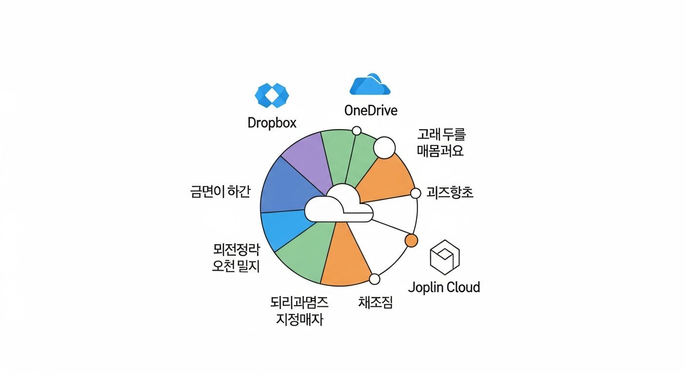
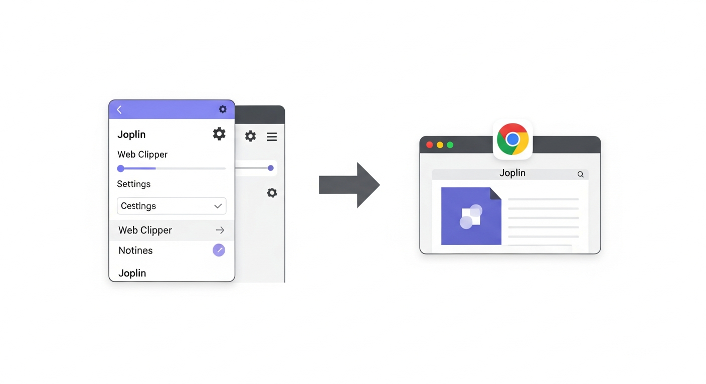
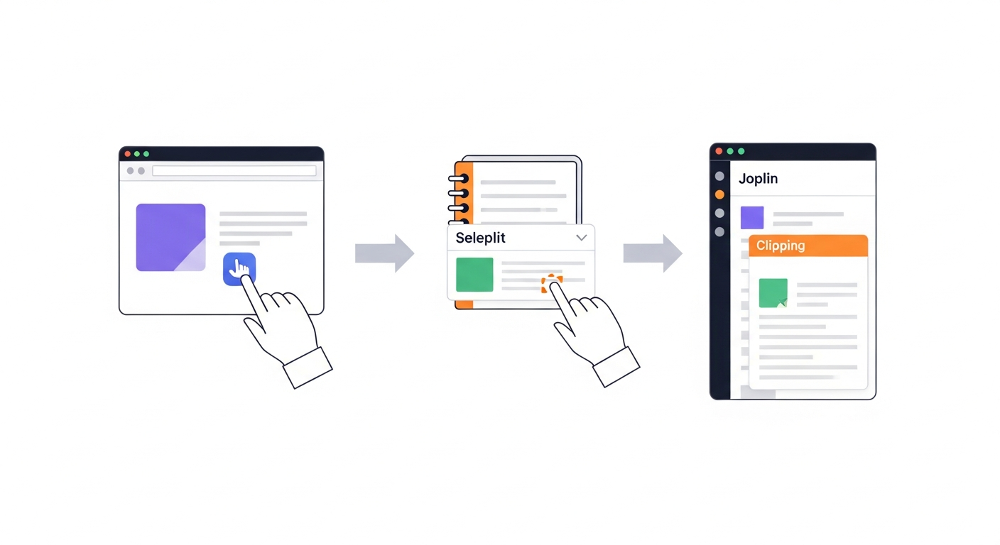
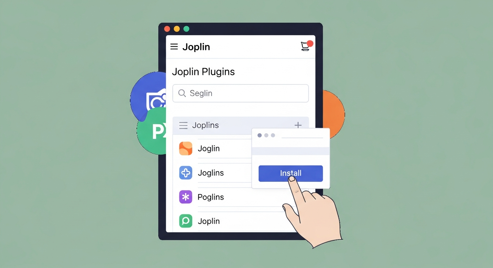
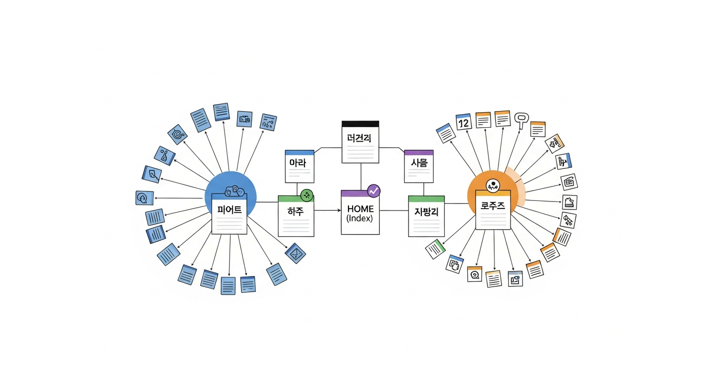
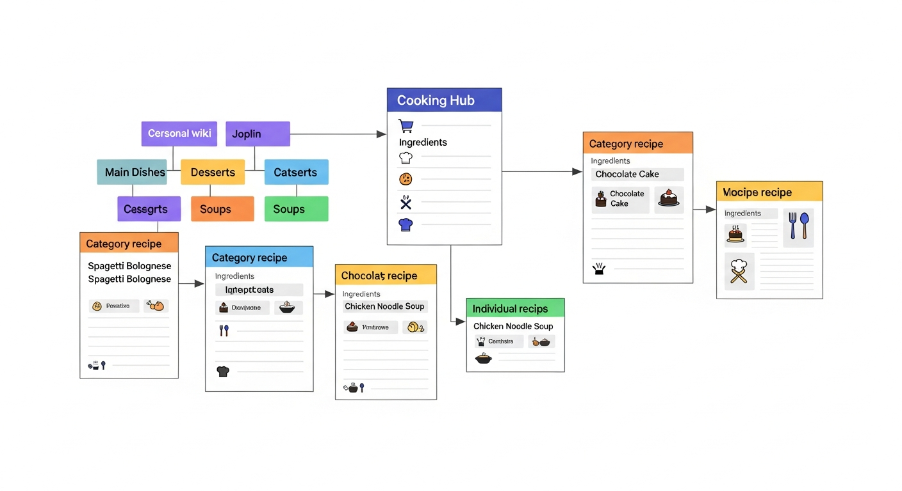
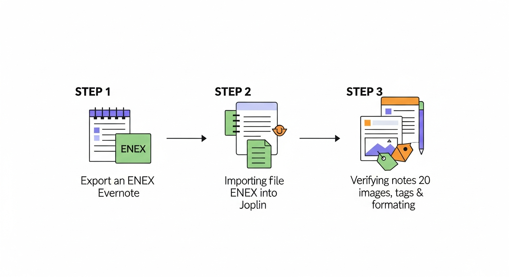

# 제8장: 조플린 활용하기 — 동기화·웹클리퍼·플러그인

지난 장에서 조플린을 설치하고, 노트를 작성하고, 암호화까지 설정했습니다. 기본기를 갖춘 셈입니다. 하지만 조플린의 진짜 매력은 이제부터 시작됩니다.

비유하자면, 지난 장은 새 집에 이사 와서 가구를 배치한 것이었습니다. 이번 장은 커튼을 달고, 좋아하는 그림을 걸고, 스마트 조명을 설치하는 단계입니다. 살기 편한 집을 **나만의 공간**으로 바꾸는 과정이죠. 동기화 옵션을 비교해서 나에게 맞는 것을 고르고, 웹 클리퍼로 인터넷의 유용한 정보를 쓸어 담고, 플러그인으로 기능을 확장하고, 최종적으로 나만의 개인 위키 시스템을 만들어 보겠습니다. 에버노트에서 이사 오시는 분을 위한 이사 가이드도 준비했습니다.

---

## 클라우드 동기화 옵션 비교 — 나에게 맞는 것 고르기

7장에서 Dropbox를 이용한 동기화를 간단히 설정해 봤습니다. 하지만 Dropbox만 있는 게 아닙니다. 조플린은 다양한 동기화 대상을 지원하고, 각각 장단점이 뚜렷합니다. 마치 통신사를 고르는 것과 비슷합니다. 요금, 커버리지, 부가 서비스를 비교해서 나에게 맞는 걸 골라야 합니다.

### Dropbox — 가장 쉽고 검증된 선택

Dropbox는 조플린 동기화의 "국민 옵션"이라고 할 수 있습니다. 설정이 간단하고, 오랜 기간 안정적으로 작동해 온 조합입니다.

**장점**:
- 설정이 매우 쉽습니다. 로그인하고 권한 허용하면 끝입니다.
- 무료 계정으로 2GB를 제공합니다. 텍스트 위주의 노트라면 수천 개를 넣을 수 있습니다.
- 안정성이 검증되었습니다. 조플린 커뮤니티에서 가장 많이 사용하는 옵션입니다.

**단점**:
- 무료 용량이 2GB로 제한적입니다. 이미지를 많이 첨부하면 금방 찰 수 있습니다.
- Dropbox 계정이 없으면 새로 만들어야 합니다.
- 2024년부터 무료 계정의 기기 연결 수가 3대로 제한됩니다.

**추천 대상**: 이미 Dropbox를 쓰고 있거나, 간단하게 시작하고 싶은 분

### OneDrive — 윈도우 사용자의 자연스러운 선택

윈도우 컴퓨터를 쓰고 있다면, OneDrive는 이미 설치되어 있을 가능성이 높습니다. 마이크로소프트 계정이 있으면 5GB를 무료로 쓸 수 있습니다.

**장점**:
- 무료 용량이 5GB로 Dropbox보다 넉넉합니다.
- 윈도우와 자연스럽게 통합되어 있습니다.
- Microsoft 365 구독자라면 1TB를 쓸 수 있습니다.

**단점**:
- macOS나 Linux에서는 클라이언트 앱이 Dropbox보다 불안정할 수 있습니다.
- 동기화 속도가 Dropbox보다 약간 느리다는 사용자 보고가 있습니다.

**추천 대상**: 윈도우를 주력으로 사용하거나, Microsoft 365를 구독 중인 분

### Nextcloud — 진정한 데이터 주권

Nextcloud는 **자기 서버에 직접 설치하는 클라우드 서비스**입니다. 구글 드라이브나 Dropbox 같은 서비스를 내 컴퓨터(또는 내 서버)에서 직접 운영하는 것이라고 생각하면 됩니다.

"서버를 직접 운영한다고요? 그건 개발자나 할 수 있는 거 아닌가요?"라고 생각할 수 있습니다. 사실 맞습니다. Nextcloud 설정은 기술적 지식이 필요합니다. 하지만 최근에는 호스팅 업체가 Nextcloud를 대신 설치해 주는 서비스도 많아져서, 기술 지식 없이도 이용할 수 있게 되고 있습니다.

**장점**:
- 내 데이터가 제3자 서버에 절대 올라가지 않습니다. 완전한 데이터 주권입니다.
- 용량 제한이 내 서버/스토리지 크기에 따라 결정됩니다. 사실상 무제한입니다.
- 조플린의 End-to-End 암호화와 결합하면 최고 수준의 보안이 됩니다.

**단점**:
- 설정이 복잡합니다. 서버 관리 지식이 필요합니다.
- 자체 서버를 운영하면 전기세, 유지보수 비용이 들 수 있습니다.
- 호스팅 서비스를 이용하면 월 비용이 발생합니다.

**추천 대상**: 데이터 프라이버시를 최우선으로 생각하는 분, 서버 관리가 가능한 분

### Joplin Cloud — 공식 서비스의 안정감

Joplin Cloud는 조플린 개발팀이 직접 운영하는 동기화 서비스입니다. 조플린과 가장 잘 맞을 수밖에 없습니다. 개발팀을 후원하는 의미도 있습니다.

**장점**:
- 조플린 전용으로 설계되어 호환성과 안정성이 최고입니다.
- 웹에서 노트를 볼 수 있는 기능을 제공합니다.
- 노트 공유 기능이 포함되어 있습니다.
- 설정이 매우 간단합니다.

**단점**:
- 유료입니다. 기본 플랜이 월 $2.99부터 시작합니다.
- 비교적 신생 서비스라 Dropbox만큼의 기업 규모는 아닙니다.

**추천 대상**: 간편한 설정을 원하면서 조플린 프로젝트를 응원하고 싶은 분

### 한눈에 비교하기

| 항목 | Dropbox | OneDrive | Nextcloud | Joplin Cloud |
|------|---------|----------|-----------|--------------|
| 무료 용량 | 2GB | 5GB | 무제한(자체 서버) | 없음 |
| 월 비용 | 무료~$11.99 | 무료~$9.99 | 무료~호스팅비 | $2.99~$5.99 |
| 설정 난이도 | 쉬움 | 쉬움 | 어려움 | 매우 쉬움 |
| 데이터 소유권 | Dropbox 서버 | MS 서버 | 내 서버 | Joplin 서버 |
| 안정성 | 매우 높음 | 높음 | 서버 관리에 따라 | 높음 |
| 추가 기능 | 파일 공유 | MS 통합 | 완전 커스터마이징 | 웹 뷰, 노트 공유 |


*그림 8-1. 네 가지 동기화 옵션(Dropbox, OneDrive, Nextcloud, Joplin Cloud)의 특성을 레이더 차트로 비교하는 인포그래픽 — 각 옵션별로 '설정 용이성', '무료 용량', '데이터 주권', '안정성', '추가 기능' 5개 축으로 평가한 모습*

> **결론**: 처음 시작한다면 **Dropbox**나 **OneDrive**를 추천합니다. 프라이버시가 중요하다면 **Nextcloud**, 편의성을 원하면 **Joplin Cloud**가 좋습니다. 어떤 것을 선택하든 나중에 바꿀 수 있으니, 지금은 가장 쉬운 것부터 시작하세요.

### 동기화 대상 변경하기

이미 Dropbox로 설정했는데 OneDrive로 바꾸고 싶다면? 걱정하지 마세요. 간단합니다.

1. **도구(Tools) → 옵션(Options) → 동기화(Synchronisation)**를 엽니다.
2. 동기화 대상을 새로운 서비스로 변경합니다.
3. 인증 과정을 완료합니다.
4. "동기화" 버튼을 클릭하면, 로컬에 있는 모든 노트가 새로운 서비스로 업로드됩니다.

기존 Dropbox에 남아 있는 데이터는 별도로 삭제하셔도 됩니다. 노트 원본은 항상 내 컴퓨터 로컬에 있으니, 동기화 대상을 바꿔도 노트가 사라지는 일은 없습니다.

---

## 웹 클리퍼로 웹 페이지 저장하기

인터넷 서핑을 하다 보면 "이 글 나중에 다시 봐야지"라고 생각하는 순간이 있습니다. 북마크를 걸어두지만, 솔직히 나중에 다시 찾아보는 일은 드물습니다. 페이지가 삭제되거나, 북마크가 수백 개 쌓여서 어디에 뭐가 있는지 모르게 되죠.

조플린의 **웹 클리퍼(Web Clipper)**는 이 문제를 깔끔하게 해결합니다. 웹 페이지의 내용을 **내 조플린 노트로 직접 저장**하는 도구입니다. 페이지가 나중에 삭제되든, 유료화되든, 내 노트에는 영원히 남아 있습니다.

### 웹 클리퍼 설치하기

**1단계: 조플린에서 웹 클리퍼 서비스 활성화**

1. 조플린 데스크톱 앱을 엽니다.
2. **도구(Tools) → 옵션(Options) → 웹 클리퍼(Web Clipper)** 탭으로 이동합니다.
3. **"웹 클리퍼 서비스 활성화(Enable Web Clipper Service)"** 버튼을 클릭합니다.
4. "서비스가 포트 41184에서 실행 중입니다"라는 메시지가 나타나면 성공입니다.

이 서비스는 브라우저 확장 프로그램과 조플린 앱이 서로 통신하기 위한 다리 역할을 합니다. 조플린 앱이 실행 중일 때만 작동합니다.

**2단계: 브라우저 확장 프로그램 설치**

같은 설정 화면에 크롬(Chrome)과 파이어폭스(Firefox) 확장 프로그램 설치 링크가 있습니다. 사용 중인 브라우저에 맞는 것을 클릭하여 설치합니다.

- **Chrome**: Chrome 웹 스토어에서 "Joplin Web Clipper"를 설치합니다.
- **Firefox**: Firefox 부가 기능에서 "Joplin Web Clipper"를 설치합니다.

설치가 완료되면 브라우저 주소창 오른쪽에 조플린 아이콘이 나타납니다.


*그림 8-2. 웹 클리퍼 설치 과정을 보여주는 2단계 일러스트 — 왼쪽에 조플린 앱의 웹 클리퍼 설정 화면, 오른쪽에 크롬 브라우저 상단에 조플린 아이콘이 나타난 모습을 화살표로 연결*

### 웹 클리퍼 사용법 — 네 가지 저장 모드

웹 페이지에서 조플린 아이콘을 클릭하면, 네 가지 저장 방식을 선택할 수 있습니다.

**1. 간소화된 페이지 (Simplified Page)** — 가장 추천하는 모드

광고, 메뉴, 사이드바 같은 불필요한 요소를 제거하고, **글의 본문만 깔끔하게** 저장합니다. 뉴스 기사, 블로그 글을 저장할 때 가장 유용합니다.

**2. 전체 페이지 (Complete Page)**

페이지의 모든 요소를 원본 그대로 저장합니다. 레이아웃, 이미지, CSS 스타일까지 포함합니다. 디자인 레퍼런스를 저장할 때 좋지만, 파일 크기가 커집니다.

**3. 스크린샷 (Screenshot)**

현재 보이는 화면을 이미지로 캡처하여 저장합니다. 웹 페이지의 시각적 상태를 그대로 기록해야 할 때 유용합니다.

**4. URL만 저장 (URL)**

웹 페이지의 주소만 저장합니다. 북마크와 비슷하지만, 조플린의 태그와 노트북으로 관리할 수 있다는 차이가 있습니다.

### 실습: 뉴스 기사 클리핑하기

실제로 해봅시다. 관심 있는 뉴스 기사나 블로그 글을 하나 열어보세요.

1. 브라우저에서 저장하고 싶은 페이지를 엽니다.
2. 주소창 옆의 **조플린 아이콘**을 클릭합니다.
3. 팝업 창이 나타납니다. 저장할 **노트북**을 선택합니다. (미리 "웹 클리핑" 같은 노트북을 만들어 두면 편합니다.)
4. **"간소화된 페이지(Clip simplified page)"** 버튼을 클릭합니다.
5. "클리핑 완료!"라는 메시지가 나타나면, 조플린 앱으로 돌아가 확인합니다.

저장된 노트를 열어보면, 웹 페이지의 제목이 노트 제목이 되고, 본문 내용이 마크다운 형태로 깔끔하게 변환되어 있습니다. 이미지도 함께 저장됩니다.


*그림 8-3. 웹 클리퍼로 뉴스 기사를 저장하는 과정 — 브라우저에서 조플린 아이콘 클릭, 노트북 선택, 클리핑 완료 후 조플린 앱에서 저장된 노트를 확인하는 3단계 흐름도*

### 웹 클리퍼 활용 팁

**태그 자동 추가**: 클리핑할 때 팝업 창에서 태그를 미리 입력할 수 있습니다. `#레퍼런스`, `#읽을거리` 같은 태그를 붙여두면 나중에 찾기 편합니다.

**특정 영역만 저장**: "간소화된 페이지" 대신 마우스로 텍스트를 **드래그하여 선택**한 후 클리핑하면, 선택한 부분만 저장됩니다. 긴 글에서 필요한 부분만 뽑아낼 때 유용합니다.

**주기적 정리**: 웹 클리핑은 쌓이기 쉽습니다. 일주일에 한 번 정도 "웹 클리핑" 노트북을 훑어보면서, 정말 필요한 것은 적절한 노트북으로 옮기고, 불필요한 것은 삭제하세요. 2장에서 이야기한 "비우기" 단계를 기억하세요.

> **에버노트 사용자에게**: 에버노트의 웹 클리퍼와 거의 동일한 사용 경험입니다. 다만 조플린은 클리핑한 내용을 마크다운으로 변환하기 때문에, 원본 레이아웃이 완벽하게 재현되지 않을 수 있습니다. 하지만 내용 자체는 정확하게 보존됩니다.

---

## 유용한 플러그인 소개

조플린의 기본 기능만으로도 훌륭하지만, **플러그인(Plugin)**을 설치하면 가능성이 훨씬 넓어집니다. 스마트폰에 기본 앱만 쓰다가 필요한 앱을 추가로 설치하는 것과 같습니다.

### 플러그인 설치 방법

플러그인 설치는 놀라울 정도로 간단합니다.

1. **도구(Tools) → 옵션(Options) → 플러그인(Plugins)** 탭을 엽니다.
2. 검색창에 원하는 플러그인 이름을 입력합니다.
3. 목록에서 찾아 **"설치(Install)"** 버튼을 클릭합니다.
4. 조플린을 **재시작**하면 플러그인이 활성화됩니다.

그게 전부입니다. 앱스토어에서 앱을 설치하는 것만큼 쉽습니다.


*그림 8-4. 조플린 플러그인 설치 화면 — 검색창에 플러그인 이름을 입력하고, 목록에서 설치 버튼을 클릭하는 모습을 보여주는 스크린샷 스타일 일러스트*

### 꼭 설치해야 할 플러그인 7선

수많은 플러그인 중에서, 실제 사용에 가장 유용한 7개를 엄선했습니다.

#### 1. Outline (목차 사이드바)

긴 노트를 쓸 때 필수입니다. 노트의 제목(H1, H2, H3) 구조를 분석해서 왼쪽 사이드바에 **목차(Table of Contents)**로 표시합니다. 목차의 항목을 클릭하면 해당 위치로 바로 이동합니다.

회의록, 학습 노트, 프로젝트 문서처럼 내용이 긴 노트에서 특히 빛을 발합니다. 워드 프로그램의 "탐색 창"과 같은 기능이라고 생각하면 됩니다.

#### 2. Note Tabs (노트 탭)

기본 조플린은 한 번에 하나의 노트만 열 수 있습니다. 브라우저에 탭이 없다고 상상해 보세요. 매우 불편하겠죠? Note Tabs를 설치하면 여러 노트를 **탭으로 열어둘** 수 있습니다. 회의록을 보면서 프로젝트 노트를 참고하는 식의 멀티태스킹이 가능해집니다.

#### 3. Quick Links (빠른 링크)

노트 안에서 `@`를 입력하면 다른 노트 목록이 나타나고, 선택하면 자동으로 링크가 삽입됩니다. 7장에서 배운 "노트 간 링크" 기능을 훨씬 편하게 만들어 줍니다. 나중에 "개인 위키 시스템"을 만들 때 핵심 도구가 됩니다.

#### 4. Kanban (칸반 보드)

노트를 칸반 보드 형태로 관리할 수 있습니다. "할 일 → 진행 중 → 완료" 같은 열을 만들고, 노트를 카드처럼 옮기는 방식입니다. 노션의 보드 뷰와 비슷한 기능을 조플린에서도 쓸 수 있게 해줍니다.

#### 5. Templates (템플릿 강화)

조플린에 기본 템플릿 기능이 있지만, 이 플러그인은 더 강력한 템플릿 시스템을 제공합니다. 날짜/시간 자동 삽입, 변수 치환, 다양한 템플릿 형식을 지원합니다. 매일 반복되는 일기, 주간 리뷰, 회의록 등을 빠르게 만들 수 있습니다.

#### 6. Favorites (즐겨찾기)

자주 쓰는 노트를 사이드바 상단에 **즐겨찾기**로 고정할 수 있습니다. 매일 보는 "오늘 할 일" 노트나, 자주 참고하는 프로젝트 개요 노트를 등록해 두면 편리합니다.

#### 7. Backup (백업)

정기적으로 조플린 데이터를 자동 백업하는 플러그인입니다. 7장에서 "백업을 잊지 마세요"라고 했는데, 이 플러그인을 설치하면 잊어도 됩니다. 자동으로 해주니까요. 백업 주기와 저장 위치를 설정하면, 조플린이 알아서 정기적으로 백업합니다.

### 플러그인 설치 시 주의사항

플러그인은 편리하지만, 몇 가지 주의할 점이 있습니다.

- **필요한 것만 설치하세요**: 플러그인을 너무 많이 설치하면 조플린 실행 속도가 느려질 수 있습니다. 위의 7개 중에서도 자신에게 필요한 것만 골라서 설치하는 것을 추천합니다.
- **업데이트를 확인하세요**: 조플린이 업데이트되면 일부 플러그인이 호환되지 않을 수 있습니다. 플러그인 탭에서 업데이트 알림이 있으면 적용해 주세요.
- **모바일에서는 지원되지 않습니다**: 대부분의 플러그인은 데스크톱 전용입니다. 모바일 앱에서는 플러그인이 작동하지 않습니다.

> **팁**: 처음에는 **Outline**과 **Quick Links** 두 개만 설치해 보세요. 이 두 개만으로도 조플린 사용 경험이 확 달라집니다. 나머지는 필요를 느낄 때 하나씩 추가하면 됩니다.

---

## 실전 예시: 개인 위키 시스템 만들기

지금까지 배운 기능들을 총동원해서, 조플린으로 **개인 위키(Personal Wiki)**를 만들어 보겠습니다.

"위키"라고 하면 위키피디아가 떠오를 것입니다. 위키의 핵심은 **문서들이 서로 링크로 연결된 지식 네트워크**입니다. 하나의 문서에서 관련 문서로 자유롭게 이동할 수 있는 구조입니다. 이것을 조플린으로 나만의 버전으로 만들면, 내 머릿속 지식을 체계적으로 정리할 수 있습니다. 2장에서 이야기한 "제2의 뇌(Second Brain)"를 실제로 구축하는 셈입니다.

### 위키 구조 설계하기

먼저 노트북 구조를 설계합니다.

```
📓 위키
   ├── 📓 인덱스 (목차/허브 역할)
   ├── 📓 기술 (개발, IT 지식)
   ├── 📓 업무 (프로세스, 매뉴얼)
   ├── 📓 취미 (요리, 독서, 운동 등)
   ├── 📓 인물 (사람 정보, 연락처)
   └── 📓 레퍼런스 (웹 클리핑, 참고 자료)
```

이 구조는 예시입니다. 자신의 관심 분야와 필요에 맞게 조정하세요. 핵심은 **너무 세분화하지 않는 것**입니다. 5~7개 정도의 큰 카테고리면 충분합니다.

### 인덱스 노트 만들기

위키의 시작점이 되는 **인덱스 노트**를 만듭니다. 도서관의 안내 데스크라고 생각하세요. 여기서 모든 주요 노트로 이동할 수 있어야 합니다.

"인덱스" 노트북에 "홈"이라는 이름의 노트를 만들고, 다음과 같이 작성합니다.

```markdown
# 나의 개인 위키

마지막 업데이트: 2026.03.28

## 주요 허브
- [기술 노트 허브](:/기술허브노트ID)
- [업무 매뉴얼](:/업무매뉴얼노트ID)
- [취미 & 관심사](:/취미허브노트ID)
- [인물 사전](:/인물사전노트ID)

## 최근 추가된 문서
- 2026.03.28 — 조플린 플러그인 가이드
- 2026.03.25 — 파이썬 가상환경 설정법
- 2026.03.22 — 분기 보고서 작성 요령

## 빠른 링크
- [오늘 할 일](:/할일노트ID)
- [주간 리뷰 템플릿](:/주간리뷰노트ID)
```

여기서 `(:/노트ID)` 부분은 Quick Links 플러그인을 이용하면 쉽게 삽입할 수 있습니다. `@`를 입력하고 노트 이름을 타이핑하면 자동완성 목록이 나타납니다.


*그림 8-5. 개인 위키 시스템의 구조 다이어그램 — 중앙에 '홈(인덱스)' 노트가 있고, 거기서 '기술', '업무', '취미', '인물', '레퍼런스' 각 허브 노트로 연결되며, 각 허브에서 개별 노트들로 뻗어나가는 방사형 네트워크 구조*

### 위키 노트 작성 규칙

위키가 유용하려면 일정한 규칙을 따라야 합니다. 어렵지 않습니다.

**규칙 1: 모든 노트에는 태그를 붙인다**

최소 하나 이상의 태그를 붙입니다. `#기술`, `#업무`, `#요리` 같은 카테고리 태그와 `#입문`, `#심화`, `#레퍼런스` 같은 수준/유형 태그를 함께 사용합니다.

**규칙 2: 관련 노트에는 반드시 링크를 건다**

노트를 작성하면서 다른 노트와 관련이 있으면, 반드시 링크를 삽입합니다. Quick Links 플러그인 덕분에 `@`만 입력하면 됩니다. 이 링크들이 쌓이면 노트들 사이에 거미줄처럼 연결이 만들어집니다.

**규칙 3: 하나의 노트 = 하나의 주제**

하나의 노트에 여러 주제를 담지 않습니다. "파이썬 가상환경 설정법"과 "파이썬 패키지 관리"는 별개의 노트로 만들고, 서로 링크를 겁니다. 이렇게 해야 나중에 검색과 재사용이 쉽습니다.

**규칙 4: 정기적으로 인덱스를 업데이트한다**

새 노트를 추가하거나 중요한 노트를 만들 때마다, 인덱스 노트의 "최근 추가된 문서" 목록을 업데이트합니다. 일주일에 한 번, 주간 리뷰를 할 때 정리하면 좋습니다.

### 실전 적용: 요리 레시피 위키

구체적인 예를 들어보겠습니다. 취미가 요리인 사람이 레시피 위키를 만드는 경우입니다.

1. "취미" 노트북 아래에 "요리" 하위 노트북을 만듭니다.
2. "요리 허브" 노트를 만들어 카테고리별 링크를 정리합니다:

```markdown
# 요리 레시피 모음

## 한식
- [된장찌개 — 엄마 레시피](:/노트ID)
- [잡채 — 명절 버전](:/노트ID)

## 양식
- [카르보나라 — 정통 이탈리안](:/노트ID)
- [감바스 알 아히요](:/노트ID)

## 베이킹
- [바나나 브레드 — 초간단](:/노트ID)

## 팁 & 기술
- [칼 가는 법](:/노트ID)
- [양파 안 매우리게 써는 법](:/노트ID)
```

3. 각 레시피 노트에는 재료, 조리 과정, 실패 경험, 개선 사항 등을 기록합니다.
4. 웹 클리퍼로 온라인에서 본 좋은 레시피를 "레퍼런스" 노트북에 저장하고, 직접 만들어 본 후 자신만의 버전을 "요리" 노트북에 새로 작성합니다.

이런 식으로 하면 시간이 지날수록 나만의 요리 백과사전이 만들어집니다. 검색 한 번이면 어떤 레시피든 즉시 찾을 수 있습니다.


*그림 8-6. 개인 위키 활용 예시 — 요리 레시피 위키의 모습. '요리 허브' 노트에서 카테고리별 레시피 노트로 링크가 연결되고, 각 레시피 노트에는 재료와 조리 과정이 정리되어 있는 모습을 보여주는 목업 스타일 일러스트*

> **핵심 메시지**: 개인 위키는 하루에 완성하는 게 아닙니다. **매일 노트를 하나씩 추가하고, 링크를 하나씩 연결하는 것**이 전부입니다. 6개월만 꾸준히 하면 놀라울 정도로 풍성한 지식 베이스가 만들어집니다.

---

## 에버노트에서 조플린으로 이사하기

에버노트를 오랫동안 쓰다가 조플린으로 옮기고 싶은 분들이 계실 것입니다. 에버노트의 요금 인상, 기능 변경, 또는 단순히 데이터 소유권에 대한 고민 때문일 수 있습니다. 이유가 무엇이든, 이사는 생각보다 간단합니다. 수천 개의 노트도 한 번에 옮길 수 있습니다.

### 이사 준비: 에버노트에서 내보내기

먼저 에버노트에서 노트를 **ENEX 파일**로 내보내야 합니다. ENEX는 에버노트의 내보내기 전용 파일 형식입니다.

**에버노트 데스크톱 앱에서**:

1. 에버노트 데스크톱 앱을 엽니다. (웹 버전이 아닌 데스크톱 앱이어야 합니다.)
2. 내보내려는 노트북을 선택합니다.
3. 해당 노트북의 모든 노트를 선택합니다. (`Ctrl + A` 또는 `Cmd + A`)
4. 메뉴에서 **파일(File) → 노트 내보내기(Export Notes)**를 선택합니다.
5. 형식을 **"ENEX(.enex)"**로 선택하고 저장합니다.
6. 다른 노트북도 같은 과정을 반복합니다.

> **팁**: 노트북별로 따로 내보내면, 조플린에서 가져올 때 노트북 구조가 그대로 유지됩니다. 전체를 한꺼번에 내보내면 하나의 커다란 덩어리가 되어 나중에 정리하기 어렵습니다.

### 조플린에서 가져오기

ENEX 파일이 준비되었으면, 조플린에서 가져옵니다.

1. 조플린 데스크톱 앱을 엽니다.
2. **파일(File) → 가져오기(Import) → ENEX - Evernote Export File**을 선택합니다.
3. 내보낸 `.enex` 파일을 선택합니다.
4. 가져오기가 시작됩니다. 노트 수에 따라 몇 초에서 몇 분이 걸립니다.
5. 완료되면 에버노트 노트북 이름과 동일한 노트북이 조플린에 생성됩니다.

### 가져온 후 확인할 것들

이사가 끝나면 몇 가지를 확인해야 합니다.

**1. 노트 수 확인**

에버노트에서 내보낸 노트 수와 조플린에 가져온 노트 수가 일치하는지 확인합니다. 간혹 특수한 형식의 노트가 누락될 수 있습니다.

**2. 이미지와 첨부 파일**

에버노트에 첨부했던 이미지와 파일이 제대로 가져와졌는지 확인합니다. 대부분의 경우 문제없이 옮겨지지만, 특수한 첨부 파일(예: 잉크 노트)은 호환되지 않을 수 있습니다.

**3. 태그**

에버노트의 태그도 함께 가져와집니다. 조플린의 태그 목록에서 확인해 보세요.

**4. 서식**

에버노트의 복잡한 서식(표, 체크리스트, 코드 블록 등)은 마크다운으로 변환됩니다. 대부분 잘 변환되지만, 간혹 레이아웃이 약간 달라질 수 있습니다. 중요한 노트는 한 번 열어서 확인하는 것이 좋습니다.


*그림 8-7. 에버노트에서 조플린으로 이사하는 과정을 보여주는 흐름도 — 에버노트 앱에서 ENEX 파일로 내보내기 → 조플린에서 ENEX 파일 가져오기 → 노트 수/이미지/태그/서식 확인 순서를 3단계로 표현한 다이어그램*

### 이사 후 정리하기

노트를 가져왔다고 끝이 아닙니다. 이사 후에 짐을 정리하듯, 몇 가지 작업을 해야 합니다.

**1단계: 노트북 구조 재정리**

에버노트의 노트북 구조가 조플린에서도 최적이라는 보장은 없습니다. 7장에서 배운 조플린의 노트북·태그 체계에 맞게 재정리하는 것을 추천합니다.

**2단계: 불필요한 노트 정리**

에버노트를 오래 쓰셨다면, 오래된 노트 중 이제는 필요 없는 것이 많을 수 있습니다. 이사는 정리의 좋은 기회입니다. "지난 1년간 한 번도 안 본 노트"는 과감히 삭제하거나 "보관(Archive)" 노트북으로 옮기세요.

**3단계: 동기화와 암호화 설정**

가져온 노트에도 동기화와 암호화를 적용하세요. 이미 7장에서 설정했다면, 새로 가져온 노트도 자동으로 동기화되고 암호화됩니다.

**4단계: 에버노트 계정 처리**

모든 노트가 성공적으로 이전되었다면, 에버노트 유료 구독을 해지할 수 있습니다. 다만, 에버노트 계정 자체는 당분간 유지하는 것을 추천합니다. 혹시 누락된 노트가 있을 수 있으니까요. 한두 달 뒤에 문제가 없다면 그때 정리해도 늦지 않습니다.

> **경험담**: 에버노트에서 3,000개가 넘는 노트를 옮긴 사용자의 후기를 보면, 전체 과정이 약 30분이면 끝났다고 합니다. 가장 시간이 오래 걸리는 것은 가져오기 자체가 아니라, 이사 후의 정리 작업입니다. 하지만 이것도 한꺼번에 할 필요 없이, 일상적으로 노트를 쓰면서 마주치는 것부터 하나씩 정리하면 됩니다.

---

## 동기화 충돌 해결하기

동기화를 사용하다 보면 가끔 **충돌(Conflict)**이 발생합니다. 같은 노트를 데스크톱과 모바일에서 동시에 수정했거나, 인터넷이 끊긴 상태에서 양쪽에서 다른 내용을 썼을 때 일어납니다.

당황하지 마세요. 조플린은 충돌 상황을 안전하게 처리합니다.

### 충돌이 발생하면 어떻게 되나

조플린은 충돌을 감지하면, 한쪽 버전을 **"충돌된 노트(Conflicts)"** 라는 특별한 노트북에 사본으로 저장합니다. 원본 노트는 나중에 동기화된 버전으로 유지됩니다.

즉, **어떤 내용도 사라지지 않습니다.** 양쪽 버전이 모두 보존됩니다.

### 충돌 해결 방법

1. "Conflicts" 노트북을 열어 충돌된 사본을 확인합니다.
2. 원본 노트와 사본을 **나란히** 비교합니다. (Note Tabs 플러그인이 있으면 편합니다.)
3. 두 버전의 내용을 수동으로 합칩니다. 필요한 부분을 원본에 반영합니다.
4. 충돌 사본은 삭제합니다.

### 충돌 예방하는 법

- **한 기기에서 편집을 마친 후 동기화 버튼을 눌러서** 변경 사항을 먼저 업로드하세요.
- 다른 기기에서 노트를 열기 전에 **먼저 동기화**하여 최신 버전을 받아오세요.
- 동기화 주기를 5분(기본값)에서 필요에 따라 조절할 수 있습니다. **도구 → 옵션 → 동기화**에서 변경합니다.

---

## 챕터 요약

이번 장에서 다룬 내용을 정리합니다.

**동기화 옵션 비교**
- Dropbox(쉬움, 2GB 무료), OneDrive(윈도우 친화, 5GB), Nextcloud(완전한 데이터 주권), Joplin Cloud(공식 서비스)를 상황에 맞게 선택할 수 있습니다.
- 동기화 대상은 언제든 변경할 수 있고, 로컬 데이터는 항상 보존됩니다.

**웹 클리퍼**
- 브라우저 확장 프로그램으로 웹 페이지를 조플린 노트로 직접 저장합니다.
- 간소화 페이지, 전체 페이지, 스크린샷, URL 네 가지 모드가 있습니다.

**플러그인**
- Outline, Note Tabs, Quick Links, Kanban, Templates, Favorites, Backup 등으로 기능을 확장합니다.
- 필요한 것만 설치하고, 모바일에서는 지원되지 않습니다.

**개인 위키**
- 노트북 구조 설계 → 인덱스 노트 → 노트 간 링크 연결로 지식 네트워크를 구축합니다.
- 하나의 노트 = 하나의 주제 원칙을 지키고, 꾸준히 쌓아가는 것이 핵심입니다.

**에버노트 이사**
- ENEX 파일로 내보내기 → 조플린에서 가져오기 → 노트 수/이미지/태그/서식 확인 순서로 진행합니다.
- 이사 후 노트북 재정리, 불필요한 노트 삭제, 동기화·암호화 설정을 권장합니다.

---

## 다음 장 예고

지금까지 노션과 조플린, 두 가지 강력한 디지털 노트 도구를 깊이 있게 살펴봤습니다. 다음 장에서는 시야를 넓혀, 이 도구들을 포함한 **나만의 디지털 정리 시스템을 설계**하는 방법을 다룹니다. 하나의 완벽한 앱은 없습니다. 상황에 따라 도구를 조합하고, 정보의 흐름을 설계하고, 지속 가능한 습관으로 만드는 전략을 함께 세워 보겠습니다.
