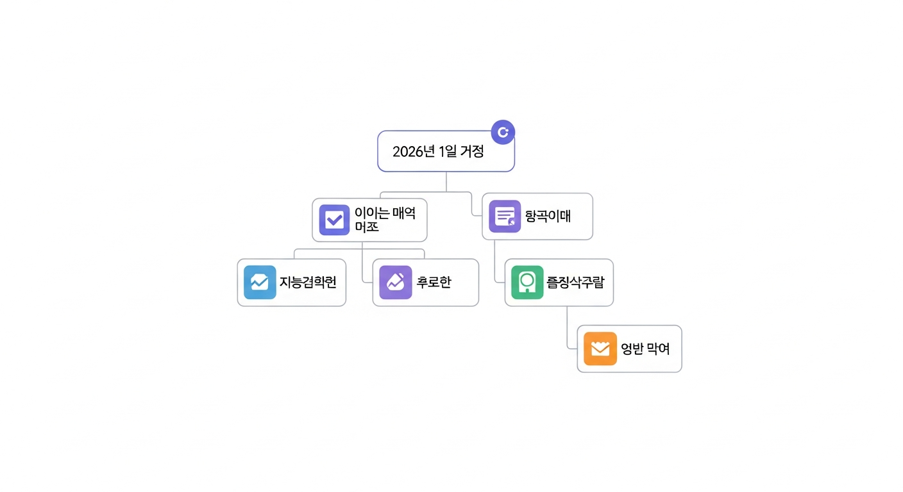
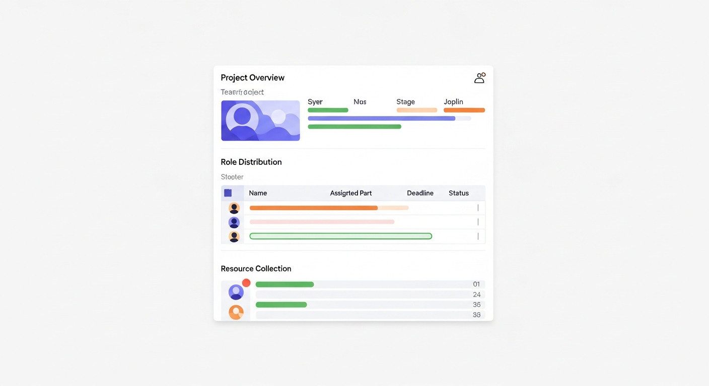
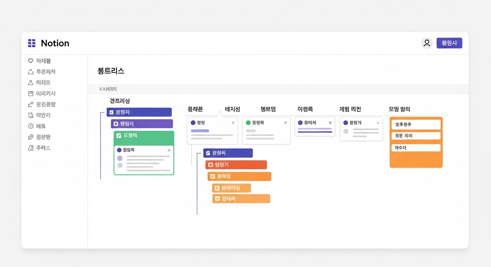
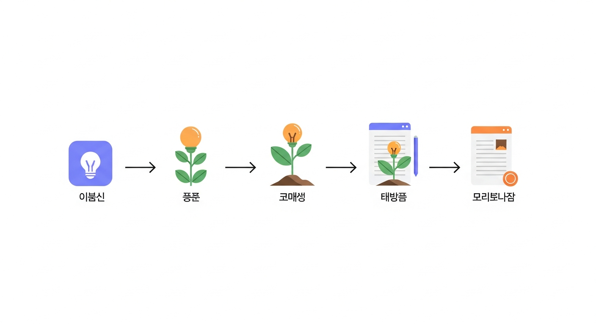
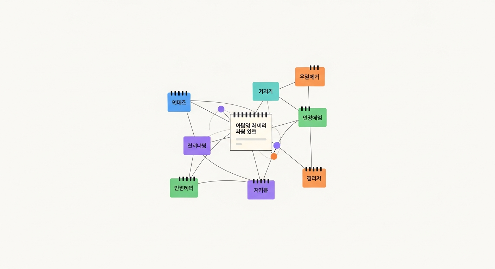
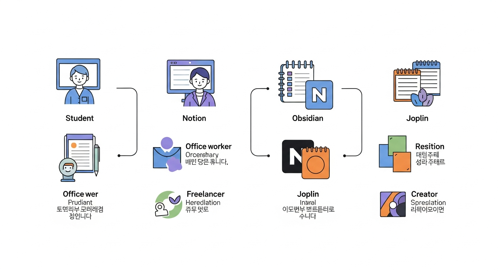
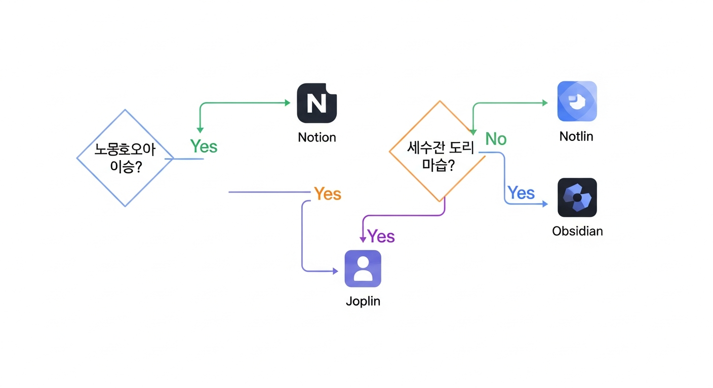

# 제9장: 실전 시나리오 — 상황별 노트 앱 활용법

지금까지 여덟 개의 장을 거치며 노션, 옵시디언, 조플린이라는 세 가지 디지털 노트 도구를 깊이 있게 살펴봤습니다. 기능도 배웠고, 설정도 해봤고, 플러그인도 설치했습니다. 그런데 한 가지 빠진 것이 있습니다. "그래서 나는 이걸 어떻게 쓰면 되는데?"라는 질문입니다.

도구를 배우는 것과 도구를 활용하는 것은 전혀 다른 이야기입니다. 비유하자면, 지금까지는 요리 도구의 사용법을 배운 것이고, 이번 장에서는 실제로 요리를 해 볼 차례입니다. 같은 칼과 도마라도 학생 식당의 요리사와 프렌치 레스토랑의 셰프는 다른 방식으로 사용합니다. 디지털 노트 앱도 마찬가지입니다. 학생, 직장인, 프리랜서, 창작자 — 각자의 상황에 맞는 활용법이 따로 있습니다.

이번 장에서는 네 명의 가상 인물을 등장시켜, 각각의 상황에서 디지털 노트 앱을 어떻게 활용하는지를 구체적으로 보여 드리겠습니다. 자신과 비슷한 상황을 찾아서 참고해도 좋고, 여러 시나리오를 조합해서 나만의 방식을 만들어도 좋습니다.

---

## 시나리오 1: 대학생 수연 — 수업 노트와 시험 준비 시스템

### 수연이를 소개합니다

수연이는 대학교 3학년 경영학과 학생입니다. 한 학기에 6과목을 듣고, 중간고사와 기말고사를 치르며, 팀 프로젝트도 두세 개를 동시에 진행합니다. 지금까지는 노트북에 필기하고, 카카오톡으로 자료를 주고받고, 시험 기간에는 프린트한 강의 자료 위에 형광펜을 칠하는 방식으로 버텨 왔습니다.

문제는 학년이 올라갈수록 공부량이 늘어나면서, 이 방식이 한계에 부딪혔다는 것입니다. "분명히 어딘가에 적어뒀는데" 하면서 노트를 뒤적거리는 시간이 점점 길어졌습니다. 팀 프로젝트 자료는 카카오톡 대화방 어딘가에 파묻혀 있고, 지난 학기 수업 내용을 복습하려면 종이 노트를 한 장씩 넘겨야 했습니다.

### 수연이의 노트 앱 선택: 노션

수연이에게는 **노션**이 가장 잘 맞습니다. 이유는 세 가지입니다.

첫째, **팀 프로젝트**에 강합니다. 팀원들과 같은 페이지를 실시간으로 편집하고, 할 일을 나누고, 진행 상황을 추적할 수 있습니다. 카카오톡에서 "야, 그 자료 어디 있어?"라고 묻는 일이 사라집니다.

둘째, **데이터베이스 기능**이 강력합니다. 과목별 강의 노트를 데이터베이스로 만들면, 날짜별·주제별·시험 범위별로 정렬하고 필터링할 수 있습니다. 종이 노트에서는 상상도 할 수 없는 일입니다.

셋째, **템플릿**을 활용하면 반복되는 구조를 자동화할 수 있습니다. 매 수업마다 같은 형식으로 노트를 작성하면, 나중에 복습할 때 훨씬 효율적입니다.

### 수연이의 노션 구조

수연이의 노션 워크스페이스는 이렇게 구성됩니다.

**최상위 페이지**: 📚 2026년 1학기

그 아래에 다음과 같은 페이지들이 있습니다.

- **강의 노트 데이터베이스**: 모든 과목의 수업 노트를 한곳에 모으는 데이터베이스입니다. 속성(Property)으로 `과목명`, `날짜`, `주차`, `시험 범위 여부`, `복습 횟수`를 설정합니다.
- **시험 준비**: 과목별로 시험 범위를 정리하고, 핵심 개념을 정리하는 공간입니다.
- **팀 프로젝트**: 프로젝트별로 페이지를 만들어, 역할 분담, 일정, 자료를 한곳에 모읍니다.
- **주간 플래너**: 이번 주에 해야 할 일과 할당 시간을 정리하는 페이지입니다.


*그림 9-1. 수연이의 노션 워크스페이스 구조를 보여주는 트리 다이어그램 — 최상위에 '2026년 1학기' 페이지가 있고, 그 아래 '강의 노트 데이터베이스', '시험 준비', '팀 프로젝트', '주간 플래너'가 분기되는 구조*

### 수업 노트 작성법

수연이는 매 수업 전에 **노트 템플릿**을 하나 불러옵니다. 템플릿에는 이런 항목이 미리 적혀 있습니다.

```
📅 날짜:
📖 과목:
📝 주제:
🎯 오늘의 핵심 포인트:
---
[수업 내용]
---
❓ 질문 / 이해 안 되는 부분:
📌 시험에 나올 것 같은 내용:
🔗 관련 자료 링크:
```

수업이 끝나면 5분만 투자해서 "오늘의 핵심 포인트"와 "시험에 나올 것 같은 내용"을 채웁니다. 이 5분이 나중에 시험 기간에 몇 시간을 절약해 줍니다. 시험 준비를 할 때, 강의 노트 데이터베이스에서 `시험 범위 여부` 필터를 켜면 시험에 나올 내용만 쏙 뽑아볼 수 있기 때문입니다.

### 시험 준비 시스템

시험 2주 전, 수연이는 이런 과정을 밟습니다.

**1단계: 핵심 개념 추출 (1주차)**

강의 노트 데이터베이스에서 시험 범위에 해당하는 노트를 필터링합니다. 각 노트의 "핵심 포인트"와 "시험에 나올 것 같은 내용"을 한 페이지에 모읍니다. 이것이 수연이의 **핵심 정리 노트**가 됩니다.

**2단계: 자기 테스트 (2주차)**

핵심 정리 노트를 바탕으로 **토글 블록**을 활용한 자기 테스트를 만듭니다. 질문은 보이되, 답은 토글을 열어야 보이도록 하는 것입니다.

예를 들어:

> ▶ SWOT 분석의 네 가지 요소는?
> (토글을 열면) Strengths(강점), Weaknesses(약점), Opportunities(기회), Threats(위협)

이 방법은 단순히 읽는 것보다 기억에 훨씬 오래 남습니다. 교육심리학에서 말하는 **능동적 회상(Active Recall)** 원리를 활용한 것입니다.

**3단계: 반복 복습**

노션의 강의 노트 데이터베이스에 `복습 횟수` 속성이 있습니다. 복습할 때마다 숫자를 하나씩 올립니다. 복습 횟수가 0인 노트는 아직 한 번도 안 본 것이니 우선적으로 봐야 하고, 2~3회 복습한 노트는 이미 어느 정도 익힌 것이니 가볍게 훑으면 됩니다.

### 팀 프로젝트 관리

팀 프로젝트 페이지에는 이런 요소가 들어갑니다.

- **프로젝트 개요**: 주제, 마감일, 제출 형식
- **역할 분담 테이블**: 이름, 담당 파트, 마감일, 상태(진행 중/완료/지연)
- **자료 모음**: 참고 논문, 데이터, 이미지를 한곳에
- **회의록**: 매 회의의 논의 내용, 결정 사항, 다음 할 일

팀원들에게 노션 페이지를 공유하면, 누가 무엇을 하고 있는지 한눈에 보입니다. "내 파트는 다 했는데 다른 사람이 안 해서..." 같은 갈등도 줄어듭니다. 모든 것이 투명하게 공개되어 있으니까요.


*그림 9-2. 노션에서 팀 프로젝트를 관리하는 화면 예시 — 상단에 프로젝트 개요, 중간에 역할 분담 테이블(이름/담당 파트/마감일/상태 열), 하단에 자료 모음 섹션이 있는 레이아웃*

> **수연이의 팁**: "수업 끝나고 5분만 투자하세요. 핵심 포인트를 적는 그 5분이, 시험 기간에 '이게 뭐였더라?' 하면서 처음부터 다시 읽는 2시간을 절약해 줍니다."

---

## 시나리오 2: 직장인 재원 — 업무 일지와 프로젝트 관리

### 재원씨를 소개합니다

재원씨는 IT 기업의 마케팅 팀에서 일하는 5년차 직장인입니다. 동시에 서너 개의 캠페인을 진행하고, 주간 회의에 참석하며, 상사에게 업무 보고를 합니다. 최근에는 팀 리더로 승진하면서, 팀원들의 업무까지 관리해야 하는 상황입니다.

재원씨의 고민은 이렇습니다. 아침에 출근하면 이메일이 50개, 슬랙 메시지가 100개 쌓여 있습니다. 급한 일을 처리하다 보면 점심시간이 지나고, 오후에는 회의가 줄줄이 있고, 퇴근할 때쯤 "오늘 뭐 했지?" 싶을 때가 많습니다. 분명히 바빴는데, 정작 중요한 일은 못 한 느낌입니다.

### 재원씨의 노트 앱 선택: 노션 + 옵시디언 조합

재원씨에게는 **노션과 옵시디언을 함께 쓰는 전략**을 추천합니다.

**노션**은 **팀과 공유하는 공간**입니다. 프로젝트 관리, 팀 회의록, 업무 일정 등 다른 사람과 함께 보고 편집하는 자료를 담습니다.

**옵시디언**은 **재원씨만의 개인 공간**입니다. 업무 일지, 아이디어 메모, 커리어 계획, 업무 중 배운 것들을 기록합니다. 팀에게 공유할 필요 없는, 오직 자신을 위한 기록입니다.

왜 두 가지를 함께 쓸까요? 직장에서의 노트에는 두 가지 성격이 있기 때문입니다. 하나는 "남에게 보여주는 노트"이고, 다른 하나는 "나만 보는 노트"입니다. 이 두 가지를 한 앱에 섞어 놓으면 혼란스럽습니다. 아무도 보지 않을 개인 메모가 팀 페이지 옆에 있으면 불안하고, 팀 자료가 개인 노트 사이에 끼어 있으면 찾기 어렵습니다.

### 재원씨의 노션 구조 (팀용)

- **프로젝트 대시보드**: 진행 중인 캠페인을 보드(Board) 뷰로 관리합니다. 각 캠페인 카드에는 목표, 예산, 일정, 담당자가 기록됩니다.
- **주간 회의록**: 매주 회의 내용을 기록하는 데이터베이스입니다. 날짜, 참석자, 논의 사항, 결정 사항, 액션 아이템을 기록합니다.
- **캠페인 자료 라이브러리**: 디자인 시안, 카피 초안, 데이터 리포트 등을 한곳에 모읍니다.
- **팀 위키**: 자주 쓰는 프로세스(예: 광고 집행 절차, 보고서 작성 가이드)를 문서화합니다.

### 재원씨의 옵시디언 구조 (개인용)

옵시디언에서는 이렇게 관리합니다.

**일일 노트(Daily Note)** 가 핵심입니다. 매일 아침 새 일일 노트를 만들고, 하루 동안의 업무를 기록합니다.

```markdown
# 2026-03-28 업무 일지

## 오늘의 우선순위 (아침에 작성)
1. [ ] 신규 캠페인 기획서 초안 완성
2. [ ] 팀 리뷰 미팅 준비
3. [ ] 클라이언트 피드백 반영

## 업무 기록 (하루 동안 수시로)
- 09:30 팀 스탠드업 → 김대리 일정 지연, 수요일까지 조정
- 11:00 기획서 작업 → [[신규_캠페인_2026Q2]] 타겟 분석 완료
- 14:00 클라이언트 미팅 → 예산 10% 삭감 요청, 대안 필요

## 배운 것 / 인사이트
- 타겟 분석 시 연령대보다 관심사 기반 세그먼트가 효과적
- 클라이언트 미팅 전에 "예상 질문 리스트"를 만들면 대응이 빠름

## 내일 할 일
1. [ ] 예산 삭감 대안 3개 준비
2. [ ] 주간 보고서 작성
```

![옵시디언의 일일 노트 화면 예시 — 날짜가 제목인 노트 안에 '오늘의 우선순위', '업무 기록', '배운 것', '내일 할 일' 섹션이 있고, 이중 대괄호 링크([[]])로 다른 노트와 연결되어 있는 모습](img/ch09_fig03_illustration.png)
*그림 9-3. 옵시디언의 일일 노트 화면 예시 — 날짜가 제목인 노트 안에 '오늘의 우선순위', '업무 기록', '배운 것', '내일 할 일' 섹션이 있고, 이중 대괄호 링크([[]])로 다른 노트와 연결되어 있는 모습*

주목할 점은 `[[신규_캠페인_2026Q2]]`처럼 이중 대괄호 링크를 사용한다는 것입니다. 이 링크는 해당 캠페인에 대한 별도의 노트로 연결됩니다. 시간이 지나면 일일 노트들 사이에 링크 네트워크가 형성되고, 옵시디언의 그래프 뷰에서 어떤 프로젝트에 가장 많은 시간을 쓰고 있는지가 시각적으로 보입니다.

### 업무 보고서 자동화

재원씨가 특히 좋아하는 기능은 **데이터뷰(Dataview) 플러그인**을 활용한 주간 보고서 자동화입니다.

일일 노트에 매일 업무를 기록하면, 데이터뷰 쿼리 하나로 이번 주의 모든 완료 항목을 자동으로 모아볼 수 있습니다. 금요일 오후에 주간 보고서를 쓸 때, 한 주간의 일일 노트를 뒤적거릴 필요 없이 한 페이지에서 전부 확인할 수 있습니다.

"이번 주에 뭐 했지?"라는 질문에 5분 만에 대답할 수 있게 되는 것입니다.

### 커리어 성장 기록

옵시디언의 개인 볼트에는 **성장 기록** 폴더도 있습니다. 업무 중 배운 것, 성과, 실패에서 얻은 교훈을 기록합니다. 이 기록은 연말 자기 평가서를 쓸 때 결정적으로 도움이 됩니다. "올해 뭐 했지?" 하면서 기억을 짜내는 대신, 1년 치의 기록을 죽 훑어보며 사실에 기반한 평가서를 쓸 수 있습니다.

> **재원씨의 팁**: "퇴근 전 5분이 핵심입니다. 오늘 한 일과 배운 것을 적는 5분이, 금요일 주간 보고서 작성 시간을 1시간에서 15분으로 줄여줍니다. 그리고 1년 뒤 연말 평가서를 쓸 때 과거의 나에게 진심으로 감사하게 됩니다."

---

## 시나리오 3: 프리랜서 지혜 — 클라이언트 관리와 인보이스 추적

### 지혜씨를 소개합니다

지혜씨는 프리랜서 그래픽 디자이너입니다. 동시에 4~5개의 클라이언트 프로젝트를 진행하고, 견적서와 인보이스를 직접 관리하며, 세금 신고를 위한 수입 기록도 스스로 해야 합니다. 프리랜서의 삶은 자유롭지만, 그 자유에는 "모든 것을 내가 관리해야 한다"는 책임이 따릅니다.

지혜씨의 가장 큰 고민은 **여러 프로젝트의 진행 상황을 동시에 추적하는 것**입니다. A 클라이언트의 로고 디자인은 2차 수정 중이고, B 클라이언트의 웹 디자인은 초안 발송 대기 중이며, C 클라이언트는 계약서 서명을 기다리고 있습니다. 머릿속에만 담아두면 반드시 빠뜨리는 것이 생깁니다.

그리고 돈 문제도 있습니다. 인보이스를 발송했는데 입금이 안 되면 재촉해야 하고, 연말에 세금 신고를 할 때 올해 총수입을 계산해야 합니다. 이런 것들이 이메일과 엑셀 파일에 흩어져 있으면 정리하는 데만 며칠이 걸립니다.

### 지혜씨의 노트 앱 선택: 노션

프리랜서에게는 **노션**의 데이터베이스 기능이 압도적으로 유용합니다. 클라이언트 관리, 프로젝트 추적, 인보이스 기록을 모두 하나의 시스템으로 통합할 수 있기 때문입니다.

옵시디언이나 조플린도 좋은 도구이지만, "여러 종류의 데이터를 연결하고 다양한 시각(뷰)으로 보는 것"에서는 노션이 월등합니다. 프리랜서의 관리 업무는 본질적으로 데이터 관리이기 때문에, 데이터베이스가 강한 도구를 쓰는 것이 합리적입니다.

### 지혜씨의 노션 시스템

지혜씨의 노션에는 세 개의 핵심 데이터베이스가 서로 연결되어 있습니다.

**1. 클라이언트 데이터베이스**

| 클라이언트명 | 연락처 | 선호 소통 방식 | 메모 |
|:---:|:---:|:---:|:---:|
| A 에이전시 | kim@aagency.com | 이메일 | 수정 요청 꼼꼼한 편 |
| B 스타트업 | lee@bstartup.com | 슬랙 | 의사결정 빠름 |
| C 개인 사업자 | park@cshop.com | 카카오톡 | 주말에도 연락 올 수 있음 |

각 클라이언트 페이지 안에는 해당 클라이언트와의 소통 이력, 선호 스타일, 주의 사항이 기록됩니다. 새 프로젝트를 시작할 때 이 페이지를 먼저 열면, "이 클라이언트는 수정 요청이 꼼꼼한 편이니까 초안을 꼼꼼히 다듬어서 보내자"라는 판단이 가능합니다.

**2. 프로젝트 데이터베이스**

속성으로 `프로젝트명`, `클라이언트(관계형)`, `시작일`, `마감일`, `상태`, `금액`, `인보이스 상태`를 설정합니다.

**상태** 속성에는 이런 옵션이 있습니다: 제안 중 → 계약 완료 → 작업 중 → 수정 중 → 납품 완료 → 인보이스 발송 → 입금 완료

이 데이터베이스를 **보드 뷰**로 보면, 각 프로젝트가 어떤 단계에 있는지 한눈에 들어옵니다. 칸반 보드처럼 카드를 드래그해서 상태를 바꿀 수 있어서 관리가 직관적입니다.


*그림 9-4. 노션 보드 뷰로 표현된 프리랜서 프로젝트 관리 화면 — '제안 중', '작업 중', '수정 중', '납품 완료', '입금 완료' 등의 열(Column)에 프로젝트 카드들이 배치된 칸반 보드 형태*

**3. 인보이스 데이터베이스**

속성으로 `인보이스 번호`, `프로젝트(관계형)`, `금액`, `발송일`, `입금 예정일`, `입금 상태`, `비고`를 설정합니다.

이 세 데이터베이스는 **관계형(Relation)** 속성으로 연결되어 있습니다. 클라이언트 페이지를 열면 해당 클라이언트의 모든 프로젝트가 보이고, 프로젝트 페이지를 열면 관련 인보이스가 보입니다. 마치 조각들이 퍼즐처럼 맞물려 있는 구조입니다.

### 인보이스 추적과 수입 관리

지혜씨는 매달 말에 인보이스 데이터베이스를 열어봅니다. `입금 상태`가 "대기 중"인데 `입금 예정일`이 지난 항목이 있으면, 바로 정중한 재촉 이메일을 보냅니다.

연말에는 인보이스 데이터베이스를 **갤러리 뷰**나 **테이블 뷰**로 보면서 올해의 총수입을 계산합니다. 세무사에게 제출할 자료를 정리하는 데 이전에는 이틀이 걸렸는데, 이제는 30분이면 됩니다.

### 포트폴리오 관리

프로젝트 데이터베이스에는 `포트폴리오 공개 여부`라는 체크박스 속성도 있습니다. 납품이 완료된 프로젝트 중 포트폴리오에 싣고 싶은 것에 체크하면, 필터 하나로 포트폴리오 목록을 바로 뽑을 수 있습니다. 각 프로젝트 페이지에 결과물 이미지와 클라이언트 후기를 기록해 두면, 새 클라이언트에게 보여줄 포트폴리오가 항상 최신 상태로 유지됩니다.

> **지혜씨의 팁**: "프리랜서에게 가장 중요한 것은 '돈이 어디서 들어오고, 지금 어디까지 왔는지'를 항상 파악하는 것입니다. 노션의 데이터베이스 세 개만 잘 연결해 두면, 이 질문에 언제든 10초 만에 대답할 수 있습니다."

---

## 시나리오 4: 창작자 민호 — 아이디어 수집과 글쓰기 워크플로우

### 민호씨를 소개합니다

민호씨는 낮에는 회사를 다니고, 저녁과 주말에는 블로그 글과 뉴스레터를 쓰는 사이드 프로젝트 창작자입니다. 출퇴근 지하철에서 떠오른 아이디어, 점심시간에 읽은 기사에서 받은 영감, 샤워 중에 번뜩인 문장 — 이런 것들이 하루에도 수십 개씩 떠올랐다가 사라집니다.

민호씨의 가장 큰 고민은 **아이디어의 휘발성**입니다. 좋은 아이디어가 떠올라도 바로 적지 않으면 몇 시간 안에 잊어버립니다. 그리고 적어 놓더라도 여기저기 흩어져 있으면 나중에 글을 쓸 때 활용하기 어렵습니다. 카카오톡 '나에게 보내기'에 적어 둔 메모, 아이폰 기본 메모 앱에 적은 한 줄, 종이 냅킨에 끄적인 문장 — 이것들이 하나의 글로 연결되지 못하고 각각 고아처럼 떠돌고 있는 상황입니다.

### 민호씨의 노트 앱 선택: 옵시디언

창작자에게는 **옵시디언**이 가장 빛을 발합니다. 이유는 분명합니다.

첫째, **아이디어 연결**에 탁월합니다. 옵시디언의 이중 대괄호 링크와 그래프 뷰는 아이디어들 사이의 연결고리를 만들어 줍니다. 겉보기에 관련 없어 보이는 두 가지 아이디어가 의외의 연결점을 갖고 있다는 것을, 그래프 뷰를 보면서 발견할 수 있습니다. 이것이 창작의 핵심입니다.

둘째, **마크다운 네이티브**입니다. 글을 쓰는 사람에게 마크다운은 최고의 포맷입니다. 서식에 신경 쓸 필요 없이 내용에만 집중할 수 있고, 나중에 블로그나 뉴스레터로 옮기기도 쉽습니다.

셋째, **방해 요소가 없습니다**. 노션처럼 인터넷 연결이 필요하지 않고, 화려한 UI에 시간을 뺏기지 않습니다. 옵시디언은 글쓰기에 집중하기 좋은 환경입니다. 마치 조용한 카페에서 글을 쓰는 느낌입니다.

### 민호씨의 옵시디언 구조

민호씨의 볼트(Vault)는 이렇게 구성됩니다.

```
📁 00_Inbox (아이디어 수집함)
📁 10_Seeds (씨앗 아이디어)
📁 20_Growing (자라나는 글)
📁 30_Drafts (초안)
📁 40_Published (발행 완료)
📁 50_Archive (보관함)
📁 Templates (템플릿)
```

이 구조는 아이디어가 **씨앗에서 나무로 자라나는 과정**을 반영한 것입니다. 모든 아이디어는 Inbox에 들어와서, Seeds → Growing → Drafts → Published로 성장합니다.


*그림 9-5. 민호씨의 아이디어 성장 과정을 보여주는 흐름도 — 왼쪽의 'Inbox(수집)'에서 시작하여 'Seeds(씨앗)', 'Growing(성장)', 'Drafts(초안)', 'Published(발행)'로 이어지는 파이프라인, 각 단계에 식물이 자라나는 비유적 아이콘이 포함된 다이어그램*

### 아이디어 수집 워크플로우

**1단계: 일단 던져 넣기 (Inbox)**

아이디어가 떠오르면, 형식 따지지 말고 Inbox에 던져 넣습니다. 한 줄이어도 괜찮고, 문장이 안 되어도 괜찮습니다. 중요한 것은 **떠오른 순간에 바로 기록하는 것**입니다.

출퇴근 시에는 모바일 앱(Obsidian Mobile)으로 빠르게 적습니다. "데스크톱에 앉아서 제대로 적어야지" 하면, 집에 도착했을 때는 이미 잊어버린 뒤입니다.

```markdown
# 빠른 메모 2026-03-28

- 구독 경제의 피로감에 대해 쓰면 재밌겠다
- "선택의 역설" 책 내용과 연결?
- 넷플릭스 해지 고민하는 사람들 인터뷰하면?
```

**2단계: 씨앗 심기 (Seeds)**

일주일에 한 번, Inbox를 훑으면서 쓸 만한 아이디어를 Seeds 폴더로 옮깁니다. 이때 간단한 구조를 잡아줍니다.

```markdown
# 구독 경제의 피로감

## 핵심 아이디어
구독 서비스가 너무 많아지면서 오히려 스트레스를 받는 현상

## 연결되는 개념
- [[선택의_역설]] — 선택지가 많을수록 만족도가 낮아진다
- [[미니멀리즘]] — 적을수록 풍요롭다는 역설
- [[디지털_정리]] — 물리적 정리에서 디지털 정리로

## 떠오르는 소재
- 내가 구독 중인 서비스 목록 공개
- 친구들에게 물어본 "쓰는데 안 쓰는 구독"
- 해외 사례: 구독 관리 앱의 등장

## 예상 형태
블로그 글 (2000자 내외)
```

이중 대괄호 링크로 다른 아이디어와 연결하는 것이 핵심입니다. "구독 경제의 피로감"이라는 아이디어가 "선택의 역설", "미니멀리즘", "디지털 정리"라는 다른 아이디어들과 연결됩니다. 나중에 그래프 뷰를 보면, 이 아이디어들이 하나의 별자리(Constellation)처럼 묶여 있는 것이 보입니다.

**3단계: 키우기 (Growing)**

씨앗 아이디어 중에서 "이건 진짜 써야겠다" 싶은 것을 Growing 폴더로 옮깁니다. 이 단계에서는 소재를 조사하고, 개요를 잡고, 핵심 문장을 써봅니다. 한 번에 완성하려 하지 않고, 시간이 날 때마다 조금씩 살을 붙입니다. 옥수수가 자라듯이, 글도 시간이 걸립니다.

**4단계: 초안 작성 (Drafts)**

충분히 자란 글을 Drafts 폴더로 옮기고, 처음부터 끝까지 하나의 글로 완성합니다. 이 단계에서는 옵시디언의 **포커스 모드** 플러그인을 사용합니다. 사이드바와 상태 바를 모두 숨기고, 글쓰기에만 집중합니다.

**5단계: 발행 (Published)**

편집과 교정을 거쳐 블로그나 뉴스레터로 발행하면, Published 폴더로 옮깁니다. 발행일과 링크를 프론트매터(Front matter)에 기록합니다.

### 글쓰기 습관 추적

민호씨는 옵시디언의 일일 노트에 매일 글쓰기 기록을 남깁니다.

```markdown
## 글쓰기 기록
- 작업한 글: [[구독_경제의_피로감]]
- 작업 시간: 45분
- 진행 상태: Growing → Drafts로 이동
- 오늘 쓴 단어 수: 약 800자
```

한 달 뒤에 이 기록을 모아보면, 자신의 글쓰기 패턴이 보입니다. "나는 화요일 저녁에 가장 글이 잘 써지는구나", "한 편의 글을 완성하는 데 평균 3주가 걸리는구나" 같은 인사이트를 얻을 수 있습니다.


*그림 9-6. 옵시디언의 그래프 뷰에서 민호씨의 아이디어 네트워크가 보이는 모습 — 중앙에 '구독 경제의 피로감' 노트가 있고, 그 주변으로 '선택의 역설', '미니멀리즘', '디지털 정리' 등의 노트가 선으로 연결되어 별자리처럼 묶여 있는 시각화*

> **민호씨의 팁**: "아이디어를 '적는 것'과 아이디어를 '연결하는 것'은 다릅니다. 적기만 하면 메모장이고, 연결하면 지식입니다. 옵시디언의 링크 기능 덕분에, 저는 6개월 전에 적어둔 한 줄 메모가 오늘 쓰는 글의 핵심 소재가 되는 경험을 여러 번 했습니다."

---

## 각 시나리오에 가장 적합한 앱 — 한눈에 비교

지금까지 네 가지 시나리오를 살펴봤습니다. 각각에 어떤 앱을 추천했는지 정리해 보겠습니다.

| 시나리오 | 추천 앱 | 핵심 이유 |
|:---:|:---:|:---|
| 학생 수연 | **노션** | 팀 프로젝트 협업, 데이터베이스로 체계적 관리, 템플릿 활용 |
| 직장인 재원 | **노션 + 옵시디언** | 팀 공유(노션) + 개인 기록(옵시디언) 분리 |
| 프리랜서 지혜 | **노션** | 관계형 데이터베이스로 클라이언트·프로젝트·인보이스 통합 관리 |
| 창작자 민호 | **옵시디언** | 아이디어 연결, 마크다운 네이티브, 방해 없는 글쓰기 |


*그림 9-7. 네 가지 시나리오(학생/직장인/프리랜서/창작자)와 추천 앱(노션/옵시디언/조플린)을 연결하는 매칭 다이어그램 — 각 시나리오 아이콘 옆에 추천 앱이 연결되어 있고, 핵심 이유가 간결하게 표시된 인포그래픽*

### "그런데 조플린은요?"

눈치 빠른 독자라면 알아챘을 것입니다. 위의 네 시나리오에서 조플린이 주인공으로 등장하지 않았습니다. 조플린이 나쁜 앱이라서가 아닙니다. 조플린은 특정 **조건**에서 최고의 선택이 됩니다.

**조플린이 빛나는 상황**:

- **개인 정보 보호가 최우선**인 경우: 의료 기록, 법률 문서, 금융 정보 등 민감한 내용을 기록해야 하는 전문가. 조플린의 End-to-End 암호화와 자체 서버 동기화(Nextcloud)를 결합하면, 가장 높은 수준의 데이터 보안을 확보할 수 있습니다.
- **오프라인 환경이 많은** 경우: 현장 근무가 많은 엔지니어, 여행 중에 기록하는 여행 작가 등. 조플린은 로컬 우선 앱이라 인터넷 없이도 완벽하게 작동합니다.
- **완전한 데이터 소유권**을 원하는 경우: 내 데이터가 어떤 기업의 서버에도 올라가지 않기를 원한다면, 조플린 + Nextcloud 조합이 정답입니다.
- **에버노트에서 이주**하려는 경우: 에버노트의 ENEX 파일을 가장 깔끔하게 가져올 수 있는 앱이 조플린입니다.

### 앱 선택의 핵심 원칙

네 가지 시나리오를 통해 드러난 앱 선택의 핵심 원칙은 이렇습니다.

**1. "무엇을 하느냐"가 아니라 "어떻게 하느냐"로 고르세요**

같은 "프로젝트 관리"라도, 팀과 함께 하면 노션이 낫고, 혼자 하면 옵시디언이나 조플린이 나을 수 있습니다.

**2. 하나의 앱이 모든 것을 해결해야 한다는 강박을 버리세요**

재원씨처럼 두 가지 앱을 조합하는 것도 훌륭한 전략입니다. 핵심은 각 앱의 역할을 명확히 나누는 것입니다.

**3. 도구에 맞추지 말고, 도구를 나에게 맞추세요**

수연이의 노션 구조와 지혜씨의 노션 구조는 같은 앱을 쓰더라도 전혀 다릅니다. 중요한 것은 앱 자체가 아니라, 자신의 워크플로우에 맞게 구조를 설계하는 것입니다.

**4. 처음부터 완벽한 시스템을 만들려 하지 마세요**

네 명의 가상 인물 모두, 처음부터 이런 시스템을 갖고 있었던 것은 아닙니다. 가장 필요한 한 가지부터 시작해서, 사용하면서 점점 다듬어 나간 결과입니다. 시작은 가볍게, 발전은 점진적으로.

---

## 나만의 시나리오 만들기 — 실습 가이드

지금까지의 시나리오가 자신과 정확히 일치하지 않을 수 있습니다. 그래서 나만의 시나리오를 설계하는 방법을 안내합니다.

**질문 1: 나는 주로 어떤 종류의 정보를 다루나요?**

- 수업/학습 자료 → 수연이 시나리오 참고
- 업무 기록/보고서 → 재원씨 시나리오 참고
- 클라이언트/프로젝트/재무 → 지혜씨 시나리오 참고
- 아이디어/글/창작물 → 민호씨 시나리오 참고

**질문 2: 다른 사람과 공유할 필요가 있나요?**

- 예 → 노션 (협업 기능이 강력)
- 아니요 → 옵시디언 또는 조플린

**질문 3: 가장 중요한 가치는 무엇인가요?**

- 협업과 시각적 관리 → 노션
- 아이디어 연결과 자유도 → 옵시디언
- 보안과 데이터 소유권 → 조플린

이 세 가지 질문에 답하면, 자신에게 맞는 시작점이 보일 것입니다.


*그림 9-8. 앱 선택 의사결정 플로차트 — '공유 필요?' 질문에서 시작하여, '예'이면 노션으로, '아니요'이면 '보안 최우선?' 질문으로 분기, '예'이면 조플린, '아니요'이면 옵시디언으로 안내하는 간단한 플로차트*

---

## 챕터 요약

이번 장에서는 네 가지 실전 시나리오를 통해 디지털 노트 앱의 구체적인 활용법을 살펴봤습니다.

**학생(수연)**: 노션의 데이터베이스와 템플릿으로 강의 노트를 체계화하고, 토글 블록을 활용한 능동적 회상(Active Recall) 기반 시험 준비 시스템을 구축했습니다. 팀 프로젝트는 공유 페이지로 투명하게 관리합니다.

**직장인(재원)**: 노션(팀 공유)과 옵시디언(개인 기록)을 분리하여 사용합니다. 옵시디언의 일일 노트로 업무를 기록하고, 데이터뷰 플러그인으로 주간 보고서를 자동화합니다.

**프리랜서(지혜)**: 노션의 관계형 데이터베이스 세 개(클라이언트·프로젝트·인보이스)를 연결하여 프리랜서 업무를 통합 관리합니다. 인보이스 추적과 연말 수입 정산이 30분 이내로 가능해졌습니다.

**창작자(민호)**: 옵시디언의 링크 기능과 그래프 뷰로 아이디어를 수집하고 연결합니다. Inbox → Seeds → Growing → Drafts → Published의 단계별 성장 워크플로우로 글쓰기 파이프라인을 구축했습니다.

**앱 선택 원칙**: 하는 일이 아닌 방식으로 선택, 하나의 앱에 집착하지 않기, 도구를 나에게 맞추기, 완벽보다 시작이 중요합니다.

---

## 다음 장 예고

이번 장에서 각 상황에 맞는 앱 활용법을 배웠습니다. 그런데 현실에서는 하나의 앱만 쓰는 경우가 드뭅니다. 재원씨처럼 두 가지 앱을 조합하는 사람도 있고, 시간이 지나면서 앱을 바꾸고 싶어지는 경우도 있습니다. 다음 장에서는 **앱 사이의 다리 놓기**를 다룹니다. 노션에서 옵시디언으로, 조플린에서 옵시디언으로 데이터를 이동하는 방법, 두 앱을 동시에 사용하는 멀티 앱 전략, 그리고 앱이 사라져도 내 데이터는 안전하게 보존하는 백업 전략까지 알아보겠습니다.
