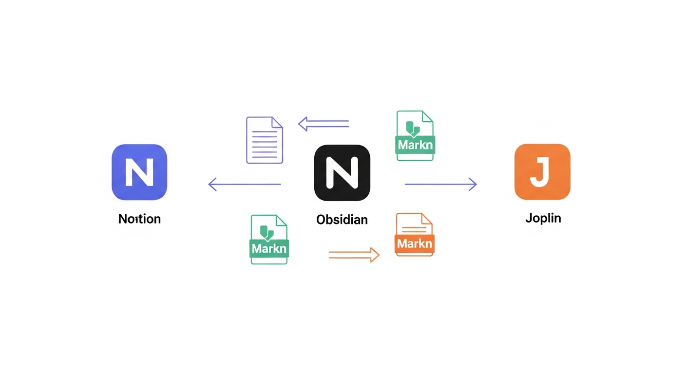
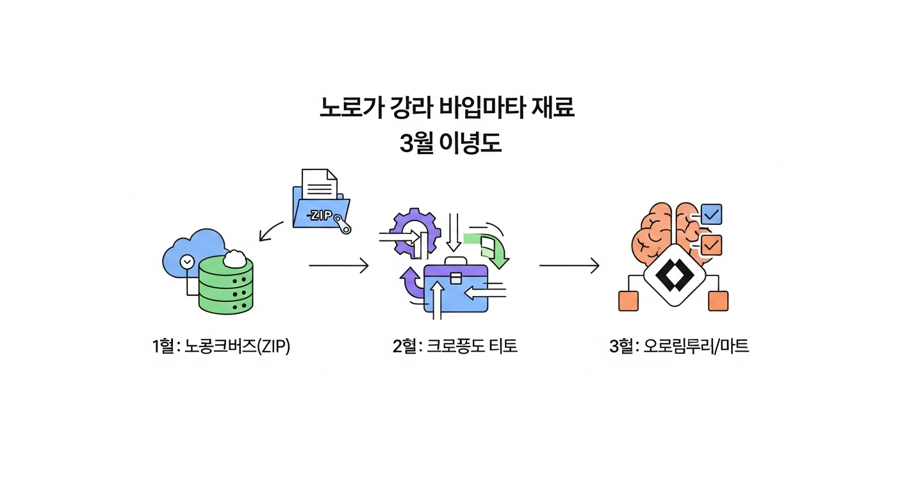
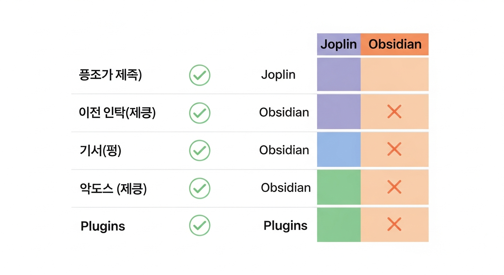
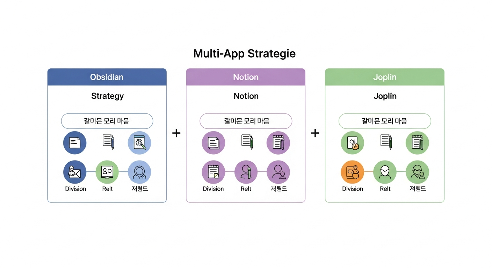
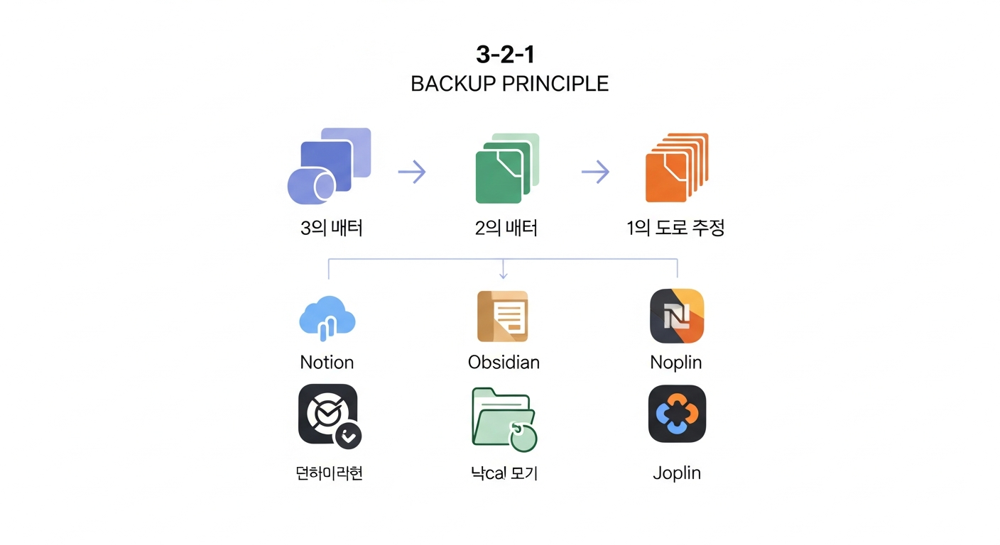
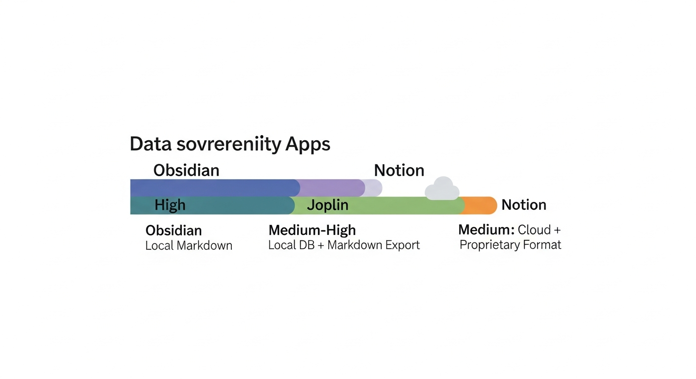

# 제10장: 앱 사이의 다리 놓기 — 데이터 이동과 멀티 앱 전략

지난 장에서 네 명의 가상 인물이 각자의 상황에 맞는 노트 앱 활용법을 보여줬습니다. 그런데 한 가지 눈치채셨을 겁니다. 직장인 재원씨는 노션과 옵시디언을 **함께** 쓰고 있었다는 것을요. 이것은 우연이 아닙니다. 현실에서 디지털 노트를 진지하게 사용하는 사람들 중 상당수가 두 개 이상의 앱을 병행합니다.

그런데 여기서 질문이 생깁니다. "앱을 여러 개 쓰면 데이터가 각각 흩어지지 않나요?" "노션에서 옵시디언으로 갈아타고 싶은데, 그동안 쓴 노트는 어떻게 옮기나요?" "만약 지금 쓰는 앱이 서비스를 종료하면요?"

이번 장은 바로 이 질문들에 대한 답입니다. 앱 사이에 다리를 놓는 법, 데이터를 안전하게 이동하는 법, 그리고 어떤 앱이 사라져도 내 데이터는 살아남게 만드는 전략을 이야기하겠습니다. 디지털 노트의 세계에서 가장 실용적이면서도 가장 간과되는 주제입니다.

---

## 왜 데이터 이동을 알아야 할까?

"지금 쓰는 앱이 마음에 드는데, 왜 이동을 미리 생각해야 하죠?"

이 질문에 비유로 답해 보겠습니다. 집을 구할 때를 떠올려 보세요. 아무리 좋은 집이라도 전세 계약서에 "이 집에서 이사 나갈 때 짐을 가져갈 수 없습니다"라고 적혀 있다면, 계약하시겠습니까? 아마 안 하실 겁니다. 디지털 노트 앱도 마찬가지입니다. 내가 쓴 글, 정리한 자료, 연결해 둔 생각들 — 이것들은 앱의 소유물이 아니라 **나의 자산**입니다.

실제로 데이터 이동이 필요한 상황은 생각보다 자주 옵니다.

- **앱 갈아타기**: 더 좋은 도구를 발견했을 때. 예를 들어, 노션을 쓰다가 옵시디언의 양방향 링크에 반했을 때.
- **병행 사용 시작**: 협업에는 노션, 개인 사고에는 옵시디언을 동시에 쓰기로 했을 때.
- **서비스 종료**: 사용하던 앱이 서비스를 중단했을 때. 에버노트, 구글 킵, 원노트 — 어떤 서비스든 영원하지 않습니다.
- **백업**: 만약을 대비해서 내 데이터를 다른 형태로 보관하고 싶을 때.

이 모든 상황에서 데이터 이동 방법을 미리 알아두면, 당황하지 않고 침착하게 대응할 수 있습니다.

*그림 10-1. 디지털 노트 앱 간 데이터 이동의 필요성을 보여주는 일러스트 — 왼쪽에 노션, 중앙에 옵시디언, 오른쪽에 조플린 아이콘이 있고, 그 사이를 양방향 화살표와 마크다운 파일 아이콘이 연결하는 구조*

---

## 노션에서 옵시디언으로: 대이동 가이드

노션에서 옵시디언으로의 이동은 디지털 노트 세계에서 가장 흔한 이사 경로 중 하나입니다. 노션의 편리한 블록 에디터에서 시작했다가, 시간이 지나면서 옵시디언의 로컬 저장, 양방향 링크, 강력한 플러그인 생태계에 끌리는 분들이 많기 때문입니다.

### 1단계: 노션에서 내보내기

노션에는 기본적으로 **내보내기(Export)** 기능이 있습니다. 방법은 이렇습니다.

1. 노션 왼쪽 사이드바에서 **설정과 멤버(Settings & Members)**를 클릭합니다.
2. **설정(Settings)** 탭에서 아래로 스크롤하면 **콘텐츠 내보내기(Export all workspace content)** 버튼이 있습니다.
3. 내보내기 형식으로 **Markdown & CSV**를 선택합니다.
4. **내보내기(Export)** 버튼을 클릭하면, 잠시 후 ZIP 파일 다운로드 링크가 이메일로 옵니다.

여기까지는 간단합니다. 하지만 ZIP 파일을 풀어보면 "이게 내 노트 맞나?" 싶은 순간이 올 겁니다. 파일명에 알 수 없는 영문 코드가 붙어 있고, 폴더 구조가 복잡하고, 이미지 경로가 깨져 있을 수 있습니다. 이것은 노션이 내부적으로 데이터를 관리하는 방식 때문입니다.

### 2단계: 변환 도구 활용

노션에서 내보낸 파일을 옵시디언에서 바로 열면 깔끔하지 않습니다. 이때 도움이 되는 것이 변환 도구입니다.

가장 널리 쓰이는 도구는 **notion-to-obsidian** 같은 오픈소스 컨버터입니다. 이 도구가 해주는 일은 다음과 같습니다.

- 파일명에서 노션의 고유 ID(예: `ae1234bf5678`)를 제거합니다.
- 노션의 링크 형식을 옵시디언의 `[[위키링크]]` 형식으로 변환합니다.
- 이미지 파일의 경로를 옵시디언에 맞게 수정합니다.
- 노션 데이터베이스를 마크다운 파일 + YAML 프론트매터로 변환합니다.

사용법은 대부분 간단합니다. 노션에서 내보낸 ZIP 파일을 도구에 넣으면 옵시디언 호환 폴더가 생성됩니다. 이 폴더를 옵시디언 볼트 안에 넣으면 됩니다.

### 3단계: 정리와 확인

변환 도구가 대부분의 작업을 자동으로 처리하지만, 100% 완벽하지는 않습니다. 이동 후에는 다음을 확인해야 합니다.

- **깨진 링크**: 옵시디언의 "연결되지 않은 멘션" 기능으로 찾을 수 있습니다.
- **이미지 누락**: 이미지 파일이 올바른 폴더에 있는지 확인합니다.
- **데이터베이스 내용**: 노션 데이터베이스의 속성(Property)이 YAML 프론트매터로 제대로 변환되었는지 점검합니다.
- **중첩 페이지**: 노션의 하위 페이지 구조가 옵시디언의 폴더/파일 구조로 적절히 변환되었는지 살펴봅니다.

이 과정이 번거롭게 느껴질 수 있지만, 비유하자면 이사한 뒤에 짐을 풀고 정리하는 것과 같습니다. 한 번만 제대로 해두면, 이후로는 편안합니다.

*그림 10-2. 노션에서 옵시디언으로의 데이터 이동 3단계 프로세스 — '1단계: 노션 내보내기(ZIP)' → '2단계: 변환 도구 적용' → '3단계: 옵시디언에서 정리/확인'이 순서대로 연결된 흐름도*

### 주의할 점: 노션 데이터베이스의 한계

솔직하게 말해야 할 것이 있습니다. 노션의 가장 강력한 기능인 **데이터베이스**는 내보내기에서 가장 약한 고리입니다.

노션 데이터베이스에는 필터, 정렬, 뷰(보드 뷰, 갤러리 뷰 등), 수식, 관계형(Relation) 속성 같은 다양한 기능이 있습니다. 하지만 이것들은 노션의 독자적인 기능이기 때문에, 마크다운으로 내보낼 때 상당 부분이 유실됩니다. 데이터베이스의 "내용"은 가져올 수 있지만, "구조"와 "기능"은 가져오기 어렵습니다.

이것은 마치 엑셀의 피벗 테이블과 매크로를 텍스트 파일로 저장하는 것과 비슷합니다. 데이터 자체는 남지만, 그 데이터를 활용하던 틀은 사라지는 것입니다.

대안이 있을까요? 노션 데이터베이스에 저장된 내용이 정말 중요하다면, CSV로도 함께 내보내서 보관하는 것을 추천합니다. 나중에 다른 도구(스프레드시트, Airtable 등)에서 열어볼 수 있으니까요.

---

## 조플린과 옵시디언: 마크다운이라는 공통 언어

노션에서 옵시디언으로의 이동이 "언어가 다른 나라로의 이민"이라면, 조플린과 옵시디언 사이의 이동은 "사투리가 다른 지역으로의 이동" 정도입니다. 둘 다 마크다운을 기본 형식으로 사용하기 때문입니다.

### 마크다운 호환성이란

마크다운(Markdown)은 텍스트 기반의 글 작성 형식입니다. `# 제목`, `**굵은 글씨**`, `- 목록` 같은 간단한 기호로 문서를 구조화합니다. 조플린도, 옵시디언도 이 마크다운을 핵심 형식으로 씁니다. 그래서 기본적인 텍스트, 제목, 목록, 인용문 등은 별도의 변환 없이 서로 호환됩니다.

하지만 "같은 마크다운"이라고 해서 100% 호환되는 것은 아닙니다. 사투리 비유가 여기서 정확해지는데, 각 앱마다 마크다운을 살짝 다르게 확장해서 쓰기 때문입니다.

### 차이가 나는 부분들

**1. 내부 링크 방식**

- **옵시디언**: `[[페이지 이름]]` 형식의 위키링크를 사용합니다.
- **조플린**: `[표시 텍스트](:/노트ID)` 형식으로 내부 링크를 만듭니다.

이 차이 때문에 조플린에서 옵시디언으로 노트를 옮기면, 내부 링크가 깨집니다. 반대도 마찬가지입니다.

**2. 이미지 저장 방식**

- **옵시디언**: 볼트 내 특정 폴더에 이미지 파일을 직접 저장합니다. `![[이미지.png]]` 형식으로 삽입합니다.
- **조플린**: 이미지를 앱 내부 데이터베이스에 리소스로 저장합니다. `` 형식입니다.

**3. 메타데이터 처리**

- **옵시디언**: YAML 프론트매터(`---` 사이의 영역)를 사용합니다.
- **조플린**: 자체적인 메타데이터 형식을 사용합니다.

### 조플린에서 옵시디언으로 이동하기

조플린에서 옵시디언으로 이동하는 방법은 크게 두 가지입니다.

**방법 1: 조플린의 내보내기 기능**

조플린에서 **파일 > 내보내기 > Markdown** 을 선택하면, 노트를 마크다운 파일로 내보낼 수 있습니다. 다만 앞에서 말한 것처럼 내부 링크와 이미지 경로가 조플린 고유 형식이므로, 수동으로 정리하거나 변환 스크립트를 사용해야 합니다.

**방법 2: 조플린 플러그인 활용**

조플린 커뮤니티에서 만든 옵시디언 변환 플러그인이 있습니다. 이 플러그인은 링크 형식을 위키링크로, 이미지를 파일 기반으로 변환하는 작업을 자동화해 줍니다.

### 옵시디언에서 조플린으로 이동하기

반대 방향도 가능합니다. 옵시디언의 마크다운 파일을 조플린에서 **파일 > 가져오기 > Markdown**으로 불러올 수 있습니다. 위키링크가 일반 마크다운 링크로 변환되지 않기 때문에 링크는 수동으로 연결해야 하지만, 텍스트 내용 자체는 그대로 옮겨집니다.

*그림 10-3. 조플린과 옵시디언의 마크다운 호환성을 비교하는 표 — '기본 텍스트(호환)', '내부 링크(비호환)', '이미지(비호환)', '메타데이터(비호환)', '플러그인(비호환)' 항목을 체크마크와 엑스마크로 표시*

---

## 두 앱 병행 사용 전략

"하나만 골라야 하나요?"

아닙니다. 사실 많은 사람들이 두 개 이상의 노트 앱을 함께 쓰고 있고, 이것은 전혀 이상한 일이 아닙니다. 중요한 것은 **역할을 명확히 나누는 것**입니다. 마치 부엌에서 칼과 가위를 동시에 쓰듯이 — 둘 다 자르는 도구이지만, 쓰임새가 다릅니다.

### 전략 1: 노션(협업) + 옵시디언(개인 사고)

가장 인기 있는 조합입니다. 9장에서 직장인 재원씨가 바로 이 전략을 썼었죠.

**노션이 맡는 일:**
- 팀 프로젝트 관리
- 회의록 작성과 공유
- 작업 할당과 진행 추적
- 팀 위키와 문서 공유

**옵시디언이 맡는 일:**
- 개인 학습 노트와 독서 메모
- 아이디어 연결과 사고 정리
- 일기나 회고록
- 개인적인 프로젝트 기획

이 조합의 핵심은 **데이터의 흐름 방향**입니다. 팀에서 받은 정보 중 개인적으로 깊이 생각해 볼 것은 옵시디언으로 가져갑니다. 반대로, 옵시디언에서 정리한 아이디어가 팀과 공유할 만한 수준이 되면 노션에 올립니다.

비유하자면, 노션은 **공용 거실**이고 옵시디언은 **개인 서재**입니다. 거실에서는 가족(팀)과 함께 시간을 보내고, 서재에서는 혼자 깊이 생각합니다. 거실에서 흥미로운 책을 발견하면 서재로 가져가고, 서재에서 완성한 원고는 거실에 내놓습니다.

### 전략 2: 노션(구조화된 데이터) + 옵시디언(자유로운 글쓰기)

이 조합은 노션의 데이터베이스 기능과 옵시디언의 자유로운 글쓰기 환경을 동시에 활용합니다.

**노션이 맡는 일:**
- 데이터베이스가 필요한 모든 것 (독서 목록, 프로젝트 추적, 습관 추적)
- 표와 차트가 많은 정보 정리
- 템플릿 기반의 반복 업무

**옵시디언이 맡는 일:**
- 일상적인 메모와 사고의 흐름 기록
- 장문의 글쓰기와 에세이
- 연구 노트와 문헌 리뷰
- 아이디어 간의 연결 탐구

### 전략 3: 조플린(보안 백업) + 다른 앱(일상 사용)

조플린의 강점인 종단간 암호화(E2EE)와 로컬 저장 방식을 살려, 민감한 정보의 보안 저장소로 활용하는 전략입니다.

**조플린이 맡는 일:**
- 비밀번호, 개인 정보 등 민감한 메모
- 개인 일기나 기밀 문서
- 인터넷 연결 없이 접근해야 하는 노트
- 중요 노트의 암호화된 백업

**노션 또는 옵시디언이 맡는 일:**
- 일상적인 노트 작성과 정리
- 다른 사람과의 협업
- 일반적인 지식 관리

*그림 10-4. 세 가지 멀티 앱 전략을 나란히 비교하는 카드형 레이아웃 — 각 카드에 전략 이름, 앱 조합, 역할 분담이 아이콘과 함께 정리된 인포그래픽*

### 앱 사이의 다리: 실용적인 연결 방법

두 앱을 병행할 때 가장 중요한 것은 **데이터를 어떻게 오가게 할 것인가**입니다. 몇 가지 실용적인 방법을 소개합니다.

**1. 마크다운 기반의 수동 이동**

가장 단순하지만 가장 확실한 방법입니다. 한 앱에서 마크다운 텍스트를 복사해서 다른 앱에 붙여넣습니다. 간단한 메모나 짧은 글은 이 방법이 가장 빠릅니다.

**2. 공유 폴더 활용**

옵시디언과 조플린 모두 로컬 파일 시스템을 사용하므로, 같은 폴더를 두 앱이 바라보게 설정할 수 있습니다. 다만 이 방법은 동시 편집 충돌이 발생할 수 있으므로 주의가 필요합니다.

**3. 자동화 도구 활용**

Zapier나 Make(구 Integromat) 같은 자동화 도구를 사용하면, 특정 조건에서 자동으로 데이터를 이동시킬 수 있습니다. 예를 들어, "노션 데이터베이스에 새 항목이 추가되면 옵시디언 폴더에 마크다운 파일을 생성한다"라는 자동화가 가능합니다.

**4. API 활용**

노션은 공개 API를 제공하고, 옵시디언에는 Local REST API 같은 플러그인이 있습니다. 프로그래밍에 익숙하다면 두 앱을 연결하는 스크립트를 만들 수 있습니다. 이것은 고급 방법이지만, 한번 설정하면 매우 편리합니다.

---

## 백업과 데이터 보존 전략

디지털 세계에서 가장 슬픈 말 중 하나는 "백업해뒀어야 했는데..."입니다. 소중한 노트를 잃어버리는 일은 생각보다 쉽게 일어납니다. 실수로 삭제할 수도 있고, 앱에 오류가 생길 수도 있고, 컴퓨터가 고장 날 수도 있습니다. 그래서 백업 전략은 선택이 아니라 필수입니다.

### 3-2-1 백업 원칙

IT 업계에서 오랫동안 검증된 백업 원칙이 있습니다. 바로 **3-2-1 원칙**입니다.

- **3**: 데이터를 최소 **3개의 사본**으로 유지합니다.
- **2**: **2가지 이상의 서로 다른 저장 매체**에 보관합니다. (예: 컴퓨터 + 외장 하드)
- **1**: 최소 **1개의 사본은 물리적으로 다른 장소**에 둡니다. (예: 클라우드)

디지털 노트에 이 원칙을 적용하면 이렇게 됩니다.

| 사본 | 위치 | 방법 |
|------|------|------|
| 1번 (원본) | 앱 안의 노트 | 평소 사용하는 그대로 |
| 2번 (로컬 백업) | 외장 하드 또는 NAS | 주 1회 마크다운으로 내보내기 |
| 3번 (원격 백업) | 클라우드 스토리지 | 자동 동기화 설정 |

### 앱별 백업 전략

**노션 백업**

노션은 클라우드 기반이므로 서버에 데이터가 자동 저장됩니다. 하지만 이것만으로는 충분하지 않습니다. 노션 서버에 문제가 생기거나, 실수로 페이지를 영구 삭제하면 복구가 어렵기 때문입니다.

- **정기 내보내기**: 월 1회, 전체 워크스페이스를 Markdown & CSV로 내보냅니다.
- **Notion API 활용**: 자동화된 백업 스크립트를 설정할 수 있습니다.
- **서드파티 백업 서비스**: Notion Backups 같은 전용 서비스도 있습니다.

**옵시디언 백업**

옵시디언은 로컬 파일 기반이므로, 사실 백업이 가장 쉽습니다.

- **클라우드 동기화**: 볼트 폴더를 iCloud, Dropbox, Google Drive에 넣어두면 자동으로 백업됩니다.
- **Git 활용**: 볼트를 Git 저장소로 관리하면 버전 히스토리까지 보존됩니다. Obsidian Git 플러그인을 사용하면 자동 커밋도 가능합니다.
- **폴더 복사**: 가장 원시적이지만 확실한 방법. 볼트 폴더를 통째로 외장 하드에 복사합니다.

**조플린 백업**

조플린도 로컬 데이터베이스 기반이므로 백업이 비교적 간단합니다.

- **JEX 내보내기**: 조플린 자체 형식인 JEX로 전체 노트를 내보냅니다.
- **마크다운 내보내기**: 범용성을 위해 마크다운으로도 내보내 둡니다.
- **동기화 백업**: Nextcloud나 Dropbox 동기화를 설정한 경우, 동기화 대상이 자동 백업의 역할도 합니다.

*그림 10-5. 3-2-1 백업 원칙을 디지털 노트 앱에 적용한 그림 — 상단에 '3개 사본', '2가지 매체', '1개 원격 장소' 원칙이 있고, 하단에 노션/옵시디언/조플린 각각의 구체적 백업 방법이 연결된 인포그래픽*

### 자동 백업 설정하기

백업의 최대 적은 **귀찮음**입니다. "나중에 해야지" 하다가 결국 안 하게 됩니다. 그래서 자동화가 핵심입니다.

옵시디언 사용자라면, **Obsidian Git** 플러그인을 강력히 추천합니다. 설정 방법은 이렇습니다.

1. 옵시디언 볼트 폴더에서 Git 저장소를 초기화합니다.
2. GitHub나 GitLab에 비공개(Private) 저장소를 만듭니다.
3. Obsidian Git 플러그인을 설치하고, 자동 커밋 간격(예: 30분)을 설정합니다.
4. 끝입니다. 이후로는 플러그인이 알아서 변경사항을 기록하고 원격 저장소에 백업합니다.

이 방법의 장점은 단순한 백업을 넘어서 **버전 관리**까지 된다는 것입니다. "어제 삭제한 문단을 되살리고 싶다"거나 "지난주 버전의 노트가 필요하다"는 상황에서 시간을 거슬러 올라갈 수 있습니다.

---

## 미래의 노트: 앱이 사라져도 데이터는 남게 하기

마지막으로 가장 철학적이면서도 가장 실용적인 이야기를 하겠습니다. 디지털 도구의 수명에 대한 것입니다.

### 디지털 도구는 영원하지 않습니다

10년 전에 인기 있었던 앱을 떠올려 보세요. 그중 얼마나 살아남았습니까? 구글만 해도 수십 개의 서비스를 종료했습니다. 구글 리더, 구글 플러스, 구글 행아웃... 에버노트는 한때 디지털 노트의 대명사였지만, 인수와 구조조정을 반복하며 많은 사용자를 잃었습니다.

이것은 공포를 주려는 이야기가 아닙니다. 다만 **현실을 직시하자는 이야기**입니다. 지금 사용하는 앱이 5년 뒤에도 존재할 거라는 보장은 없습니다. 그런데 여러분이 앱에 쌓아둔 수천 개의 노트, 수년간의 생각과 지식 — 이것들은 5년보다 훨씬 더 오래 가치가 있습니다.

### 데이터 주권이라는 개념

여기서 중요한 개념이 등장합니다. 바로 **데이터 주권(Data Sovereignty)**입니다. 쉽게 말하면, "내 데이터는 내 것이고, 언제든지 가져갈 수 있어야 한다"는 원칙입니다.

이 관점에서 세 앱을 평가해 보면 흥미로운 차이가 보입니다.

**옵시디언**: 데이터 주권이 가장 강합니다. 노트가 로컬 컴퓨터의 마크다운 파일로 존재하므로, 옵시디언이 내일 사라지더라도 노트는 그대로 남아 있습니다. 일반 텍스트 에디터로도 열 수 있습니다.

**조플린**: 데이터 주권이 꽤 강합니다. 로컬에 저장되고 마크다운 기반이지만, 자체 데이터베이스 형식을 사용하므로 내보내기 과정이 필요합니다.

**노션**: 데이터 주권이 상대적으로 약합니다. 데이터가 노션 서버에 존재하고, 노션의 독자적인 블록 구조로 저장됩니다. 내보내기는 가능하지만, 데이터베이스의 기능적 측면은 이전이 어렵습니다.

이 차이가 "노션이 나쁘다"는 뜻은 아닙니다. 노션의 강력한 기능은 독자적인 형식 덕분에 가능한 것이기도 합니다. 다만, **데이터 보존의 관점에서는 추가적인 노력이 필요하다**는 것을 인식하면 됩니다.

*그림 10-6. 데이터 주권 관점에서 본 세 앱 비교 차트 — 옵시디언(높음: 로컬 마크다운), 조플린(중상: 로컬 DB + 마크다운 내보내기), 노션(중: 클라우드 + 독자 형식)을 수평 막대그래프로 비교*

### 미래를 대비하는 5가지 실천 원칙

어떤 앱을 사용하든, 다음 원칙을 지키면 데이터를 안전하게 보존할 수 있습니다.

**원칙 1: 마크다운을 기본으로 삼으세요**

마크다운은 1990년대 이메일 서식에서 시작된 형식으로, 지금까지 살아남았고 앞으로도 오래 살아남을 것입니다. 왜냐하면 마크다운은 본질적으로 **일반 텍스트(Plain Text)**이기 때문입니다. 특별한 소프트웨어 없이도 읽을 수 있습니다. 앱의 독자적인 형식에 의존하지 말고, 가능하면 마크다운으로 기록하는 습관을 들이세요.

**원칙 2: 정기적으로 내보내세요**

아무리 믿을 만한 앱이라도, 정기적으로 전체 데이터를 내보내서 보관하세요. 달력에 "매월 첫째 일요일 = 노트 백업의 날"이라고 적어두는 것도 좋은 방법입니다.

**원칙 3: 여러 형식으로 보관하세요**

마크다운이 기본이지만, 중요한 문서는 PDF로도 변환해 두세요. PDF는 어떤 기기에서든 열 수 있고, 레이아웃이 유지됩니다. 데이터베이스 성격의 정보는 CSV로도 보관하세요.

**원칙 4: 앱에 종속되는 기능은 보험을 들어두세요**

노션의 수식, 관계형 속성, 자동화 같은 기능은 강력하지만 앱에 종속됩니다. 이런 기능에 크게 의존하는 데이터는 별도의 형식(예: 스프레드시트)으로도 관리하는 것이 안전합니다.

**원칙 5: 구조를 문서화하세요**

여러분의 노트 시스템이 어떤 구조로 되어 있는지를 설명하는 "메타 노트"를 하나 만들어 두세요. "폴더 구조는 이렇고, 태그 체계는 이렇고, 링크는 이런 규칙으로 만든다"라는 설명서입니다. 이 메타 노트가 있으면, 앱을 옮기더라도 새 앱에서 같은 구조를 재현하기 훨씬 쉽습니다.

---

## 실습: 나의 데이터 보존 점검표

지금 사용하고 있는 노트 앱(또는 앞으로 사용할 앱)에 대해 다음 항목을 점검해 보세요.

| 점검 항목 | 예/아니오 | 메모 |
|-----------|-----------|------|
| 전체 노트를 마크다운으로 내보낼 수 있는가? | | |
| 이미지와 첨부 파일도 함께 내보내지는가? | | |
| 내보낸 파일을 다른 앱에서 열 수 있는가? | | |
| 자동 백업이 설정되어 있는가? | | |
| 백업이 물리적으로 다른 장소에 보관되는가? | | |
| 앱이 서비스를 종료해도 데이터에 접근 가능한가? | | |
| 노트 시스템의 구조를 설명하는 문서가 있는가? | | |

모든 항목에 "예"라고 답할 수 있다면, 여러분의 디지털 노트는 어떤 상황에서도 안전합니다. "아니오"가 있다면, 그 항목부터 하나씩 해결해 나가세요. 오늘 당장 할 수 있는 것은 바로 해보시길 바랍니다.

---

## 챕터 요약

이번 장에서는 디지털 노트 앱 사이의 데이터 이동과 보존 전략을 다뤘습니다.

- **노션에서 옵시디언으로의 이동**은 내보내기 → 변환 도구 적용 → 정리의 3단계로 이루어지며, 데이터베이스 기능의 이전이 가장 큰 제약입니다.
- **조플린과 옵시디언**은 둘 다 마크다운 기반이라 호환성이 높지만, 내부 링크와 이미지 처리 방식에서 차이가 있습니다.
- **멀티 앱 전략**에서는 각 앱의 역할을 명확히 나누는 것이 핵심이며, 노션(협업) + 옵시디언(개인 사고) 조합이 가장 인기 있습니다.
- **3-2-1 백업 원칙**(3개 사본, 2가지 매체, 1개 원격 장소)을 디지털 노트에 적용하면 데이터를 안전하게 보존할 수 있습니다.
- **데이터 주권** 관점에서 마크다운을 기본으로 삼고, 정기 내보내기를 습관화하면 앱이 사라져도 데이터는 살아남습니다.

---

## 다음 장 예고

마지막 장에 도착했습니다. 제11장 **"나만의 두 번째 뇌 만들기 — 최종 워크플로우 설계"**에서는 지금까지 배운 모든 것을 하나로 엮어, 여러분만의 디지털 노트 시스템을 완성합니다. 앱 선택부터 폴더 구조, 태그 체계, 습관 형성까지 — 이 책의 모든 내용을 실천 가능한 하나의 워크플로우로 정리하겠습니다. 도구를 배우는 여정의 마침표이자, 도구를 활용하는 여정의 시작점입니다.
