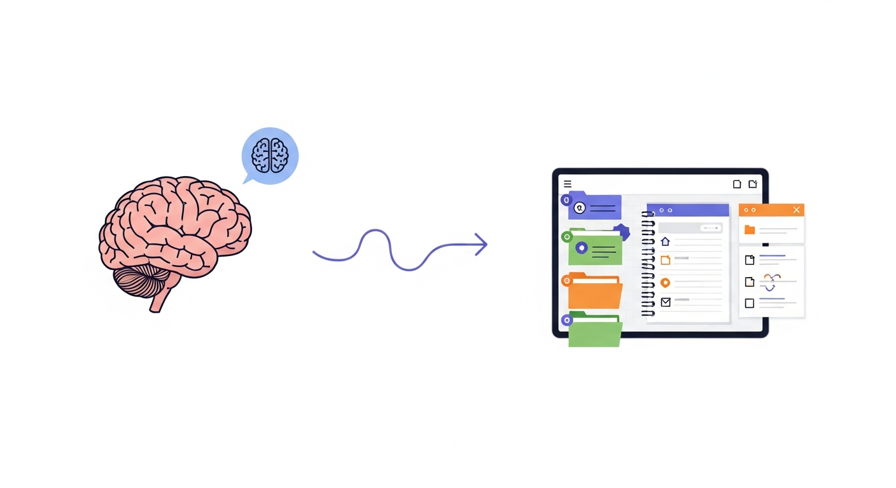
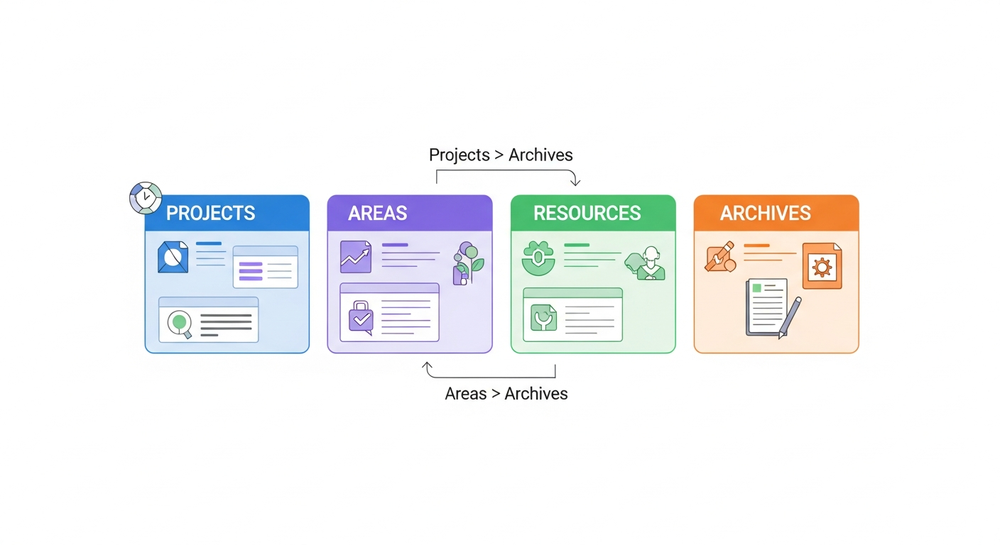
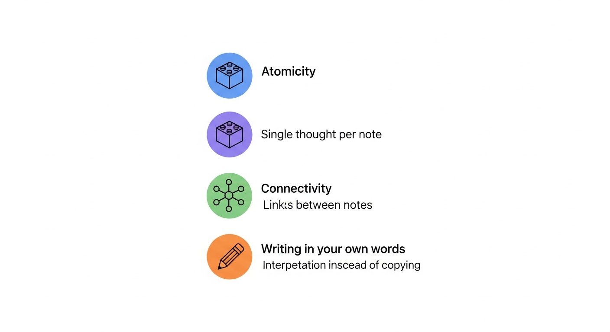
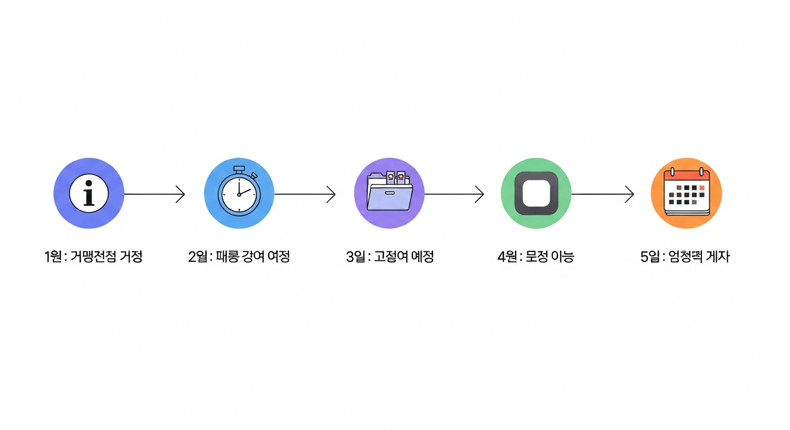
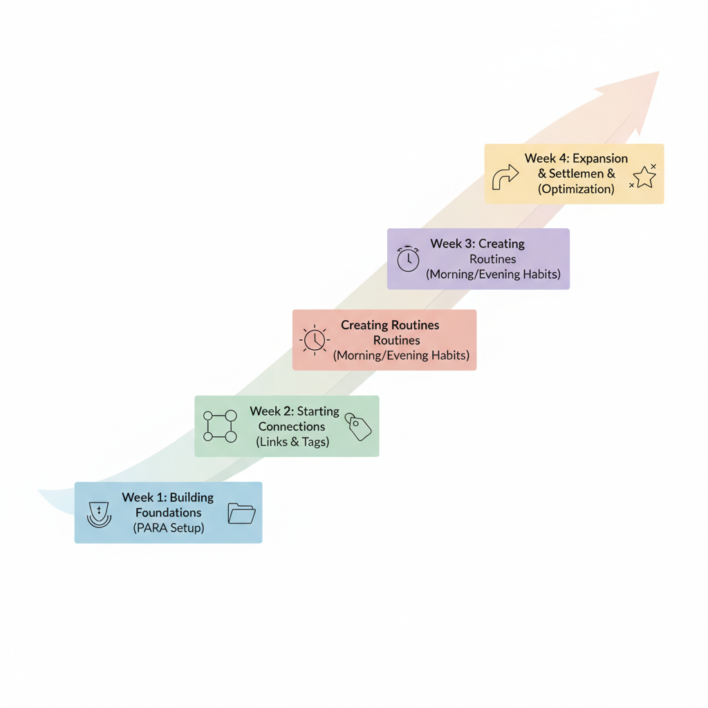
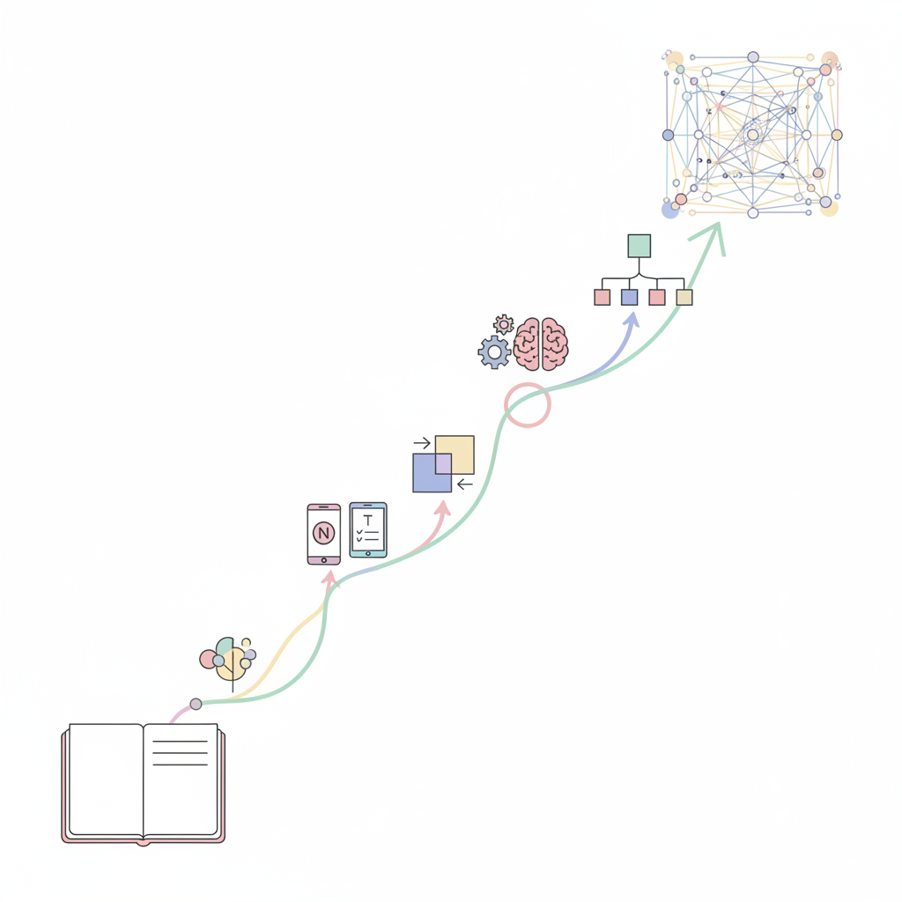

# 제11장: 나만의 세컨드 브레인 만들기 — 지식 관리 시스템 설계

이 책의 여정이 시작된 곳을 기억하십니까? 제1장에서 우리는 하루에 소설 한 권 분량의 정보가 머릿속을 스쳐 지나가는데, 뇌는 그중 대부분을 24시간 안에 잊어버린다는 이야기를 했습니다. 그리고 그 문제를 해결하기 위해 디지털 노트라는 세계로 함께 걸어 들어왔습니다.

지난 열 개의 장을 거치면서 여러분은 디지털 노트의 기본 원리를 배웠고, 노션과 옵시디언과 조플린의 특성을 이해했고, 태그와 링크와 폴더로 정보를 구조화하는 법을 익혔고, 앱 사이의 데이터 이동까지 마스터했습니다. 이제 마지막 장에서는 이 모든 조각을 하나로 엮는 작업을 하려 합니다.

바로 **나만의 세컨드 브레인(Second Brain)**을 설계하는 것입니다.

세컨드 브레인이라는 말이 거창하게 들릴 수 있습니다. 하지만 걱정하지 마세요. 이것은 천재들만의 비밀 기법이 아닙니다. 지금까지 이 책을 읽으며 하나씩 배운 것들을 **체계적으로 연결하는 방법**에 불과합니다. 마치 레고 블록을 하나씩 모아두다가, 이제 드디어 설계도를 보며 조립을 시작하는 것과 같습니다.

---

## 세컨드 브레인(Second Brain)이란?

### 내 머릿속 바깥에 있는 또 하나의 뇌

세컨드 브레인이라는 개념은 생산성 전문가 티아고 포르테(Tiago Forte)가 대중화한 용어입니다. 핵심 아이디어는 단순합니다. **우리 뇌가 기억하기 어려운 것들을 디지털 도구에 체계적으로 저장하고, 필요할 때 즉시 꺼내 쓸 수 있게 만드는 시스템**입니다.

비유를 하나 들어 보겠습니다. 여러분의 뇌를 주방이라고 생각해 보세요. 아무리 훌륭한 요리사라도 재료를 바닥에 아무렇게나 놓아두면 요리를 잘할 수 없습니다. 냉장고, 찬장, 양념장 — 재료를 종류별로 정리해 두는 시스템이 있어야 요리에 집중할 수 있습니다. 세컨드 브레인은 바로 그 **지식의 냉장고**입니다.

### 왜 필요한가

"그냥 노트 앱에 메모하면 되지, 왜 '시스템'까지 필요하지?"라고 생각하실 수 있습니다. 좋은 질문입니다. 차이는 시간이 지나면 드러납니다.

노트를 무작정 쌓기만 하면, 3개월 뒤에 노트가 500개를 넘기면서부터 문제가 시작됩니다. "분명히 어딘가에 적어뒀는데..." 하면서 자신의 노트 속에서 길을 잃습니다. 이것은 마치 서류를 정리 없이 상자에 쑤셔 넣다가, 나중에 필요한 서류 한 장을 찾으려고 상자 스무 개를 뒤지는 것과 같습니다.

세컨드 브레인은 이 문제를 해결합니다. **노트를 쓰는 것**뿐 아니라, **노트를 다시 찾아 쓰는 것**까지 설계된 시스템이기 때문입니다.

*그림 11-1. 세컨드 브레인의 개념을 보여주는 일러스트 — 왼쪽에 사람의 뇌(생각, 아이디어), 중앙에 화살표, 오른쪽에 디지털 기기 속 체계적으로 정리된 노트(폴더, 태그, 링크)가 연결된 모습*

### 세컨드 브레인의 네 가지 기능

티아고 포르테는 세컨드 브레인의 핵심 기능을 **CODE**라는 약어로 정리합니다.

1. **Capture (수집)**: 의미 있는 정보를 포착하여 기록합니다.
2. **Organize (정리)**: 수집한 정보를 체계적으로 분류합니다.
3. **Distill (증류)**: 핵심만 추출하여 나중에 쓸 수 있는 형태로 가공합니다.
4. **Express (표현)**: 정리된 지식을 활용하여 결과물을 만들어냅니다.

이 네 단계는 우리가 이 책에서 다뤘던 내용과 정확히 대응됩니다. 수집은 제2장에서 다룬 "빈 노트의 두려움 극복하기"에서, 정리는 제5장의 태그와 폴더 구조에서, 증류는 제6장의 양방향 링크에서, 그리고 표현은 제8장의 실전 프로젝트 관리에서 이미 연습한 것들입니다.

즉, 여러분은 이미 세컨드 브레인의 부품을 모두 가지고 있습니다. 이제 조립할 차례입니다.

---

## PARA 방법론 — 모든 것을 네 칸에 담기

### PARA란 무엇인가

세컨드 브레인을 만들 때 가장 먼저 부딪히는 문제는 "폴더를 어떻게 나눌 것인가"입니다. 제5장에서 폴더와 태그에 대해 배웠지만, 실제로 자신의 전체 노트를 어떤 큰 틀로 분류할지는 여전히 막막할 수 있습니다.

PARA 방법론은 이 문제에 대한 가장 간결한 해답 중 하나입니다. 역시 티아고 포르테가 만든 이 체계는 디지털 노트의 모든 내용을 단 **네 개의 카테고리**로 분류합니다.

- **P — Projects (프로젝트)**: 지금 진행 중인, 마감이 있는 일
- **A — Areas (영역)**: 끝나지 않는, 지속적으로 관리하는 책임 범위
- **R — Resources (자원)**: 언젠가 쓸모 있을 참고 자료
- **A — Archives (아카이브)**: 끝났거나 당장 필요 없는 것들의 보관소

이것이 전부입니다. 복잡한 분류 체계도, 20단계의 폴더 깊이도 필요 없습니다. 딱 네 칸입니다.

### 각 카테고리를 일상 언어로 이해하기

**프로젝트(Projects)는 "지금 하고 있는 일"입니다.**

기한이 있고, 완료 가능한 것입니다. 예를 들어:
- "3월까지 이직 준비하기"
- "다음 주 프레젠테이션 만들기"
- "여름휴가 여행 계획 짜기"
- "블로그에 연재할 시리즈 기획하기"

프로젝트 폴더에는 해당 프로젝트에 필요한 모든 자료가 들어갑니다. 리서치 메모, 초안, 참고 링크, 할 일 목록 — 한곳에 모아두면 작업할 때 이것저것 찾아 헤맬 필요가 없습니다.

**영역(Areas)은 "계속 신경 써야 하는 것"입니다.**

프로젝트와 달리 끝나는 시점이 없습니다. 삶에서 지속적으로 관리하는 영역입니다.
- "건강 관리" — 운동 기록, 식단, 건강 검진 결과
- "재무 관리" — 예산, 투자, 보험 정보
- "자기 계발" — 읽은 책, 배운 기술, 공부 노트
- "업무 역량" — 직무 관련 지식, 커리어 계획

영역 폴더는 자신의 삶에서 중요한 분야를 반영합니다. 사람마다 다를 수밖에 없습니다. 반려동물을 키우는 분은 "반려동물 관리"가 영역이 될 수 있고, 부모님을 모시는 분은 "가족 건강"이 영역이 될 수 있습니다.

**자원(Resources)은 "언젠가 쓸모 있을 것들"입니다.**

지금 당장 진행 중인 프로젝트나 관리 중인 영역에 속하지는 않지만, 관심 있는 주제의 참고 자료입니다.
- "UX 디자인 원칙 모음"
- "좋은 글쓰기 팁"
- "요리 레시피 컬렉션"
- "마음에 드는 인테리어 사례"

자원은 도서관의 참고 서가와 같습니다. 지금 당장 읽을 책은 아니지만, 필요할 때 가서 꺼내볼 수 있는 것들입니다.

**아카이브(Archives)는 "끝났거나 보류된 것들의 창고"입니다.**

완료된 프로젝트, 더 이상 관리하지 않는 영역, 오래된 자원 — 삭제하기는 아깝고, 눈앞에 두기에는 부담스러운 것들을 여기에 넣습니다.
- 완료된 프로젝트: "2024년 여름 유럽 여행" → 아카이브
- 더 이상 하지 않는 취미: "수채화 그리기" → 아카이브
- 이직 완료 후: "이직 준비" 프로젝트 → 아카이브

아카이브의 핵심은 **삭제가 아니라 이동**이라는 점입니다. 현재의 시야에서 치우되, 나중에 필요하면 언제든 다시 꺼낼 수 있습니다.

*그림 11-2. PARA 방법론의 네 가지 카테고리를 보여주는 다이어그램 — Projects(진행 중), Areas(지속 관리), Resources(참고 자료), Archives(보관소)가 네 개의 상자로 표시되고, 각 상자 안에 해당하는 예시들이 적혀 있으며, 화살표로 'Projects → Archives(완료 시)', 'Areas → Archives(종료 시)' 이동 방향이 표시됨*

### PARA를 실제로 적용하는 법

이론은 알겠는데, 실제로 어떻게 시작할까요? 단계별로 안내하겠습니다.

**1단계: 지금 하고 있는 일을 모두 적으세요.**

포스트잇이든, 빈 노트든, 어디에든 좋습니다. 현재 진행 중인 일을 전부 나열합니다. "회사 분기 보고서 작성", "아이 생일파티 준비", "온라인 강의 수강", "블로그 글 3편 쓰기" — 크든 작든 상관없습니다.

**2단계: 그중 마감이 있는 것을 Projects에 넣으세요.**

마감이 있거나, "완료"라는 상태가 존재하는 것들입니다. 끝나면 아카이브로 옮길 수 있는 것이 프로젝트입니다.

**3단계: 마감 없이 계속 관리하는 것을 Areas에 넣으세요.**

"건강", "재무", "육아", "업무 역량" — 프로젝트처럼 끝나지 않고 계속 신경 써야 하는 것들입니다.

**4단계: 나머지 관심 주제를 Resources에 넣으세요.**

지금 당장 쓰지는 않지만 흥미로운 것, 나중에 참고할 수 있는 것들입니다.

**5단계: 오래된 것들을 Archives로 이동하세요.**

현재 노트 앱에 이미 쌓여 있는 오래된 노트들이 있다면, 하나씩 살펴보면서 아카이브로 옮깁니다. 이 작업은 한 번에 다 하려고 하지 마세요. 일주일에 30분씩, 조금씩 해도 됩니다.

핵심은 완벽한 분류가 아니라 **"일단 네 칸 중 하나에 넣기"**입니다. 어디에 넣을지 10초 이상 고민되면, 그냥 Resources에 넣으세요. 나중에 언제든 옮길 수 있습니다.

---

## 제텔카스텐(Zettelkasten) — 생각을 연결하는 기술

### 독일 교수의 비밀 카드 상자

PARA가 "정보를 어디에 넣을 것인가"에 대한 답이라면, 제텔카스텐(Zettelkasten)은 "정보를 어떻게 연결할 것인가"에 대한 답입니다.

제텔카스텐은 독일어로 "메모 상자(Zettel = 메모, Kasten = 상자)"라는 뜻입니다. 이 방법을 유명하게 만든 사람은 독일의 사회학자 니클라스 루만(Niklas Luhmann)입니다. 루만은 이 시스템을 활용하여 30년간 **70권의 책과 400편 이상의 학술 논문**을 집필했습니다. 학계에서도 경이적인 생산성입니다.

루만의 비밀은 간단했습니다. 그는 종이 카드 한 장에 **하나의 생각만** 적고, 그 카드들을 서로 **연결**했습니다. 카드가 9만 장이 넘었지만, 연결 고리를 따라가면 관련된 아이디어를 빠르게 찾을 수 있었습니다.

이것을 디지털 노트 앱에서 구현하면 어떻게 될까요? 바로 제6장에서 배운 **양방향 링크**가 그 역할을 합니다.

### 디지털 제텔카스텐의 세 가지 원칙

루만의 종이 카드 시스템을 디지털 노트에 적용할 때, 핵심 원칙 세 가지만 기억하면 됩니다.

**원칙 1: 원자성(Atomicity) — 하나의 노트에 하나의 생각**

노트 하나에 여러 주제를 섞지 않습니다. "오늘 회의 내용 + 점심 메뉴 추천 + 내일 할 일"을 한 노트에 적는 것이 아니라, 각각 별도의 노트로 만듭니다.

왜 그래야 할까요? 나중에 연결하기 위해서입니다. "회의에서 나온 마케팅 아이디어"라는 노트는 "마케팅 전략" 노트와 연결할 수 있습니다. 하지만 "오늘 있었던 일 모음" 노트는 어디에도 깔끔하게 연결되지 않습니다.

비유하자면, 레고 블록을 만드는 것과 같습니다. 큰 덩어리보다 작은 블록이 더 다양한 형태로 조립할 수 있습니다.

**원칙 2: 연결성(Connectivity) — 노트 사이에 다리를 놓기**

새 노트를 만들 때마다 "이것은 기존의 어떤 노트와 관련이 있을까?"라고 스스로에게 묻습니다. 그리고 관련 있는 노트에 링크를 걸어줍니다.

옵시디언에서는 `[[노트 이름]]`으로, 노션에서는 `@페이지 이름`으로, 조플린에서는 내부 링크 기능으로 할 수 있습니다. 도구는 달라도 원리는 같습니다. **"이 생각은 저 생각과 연결되어 있다"는 것을 명시적으로 기록하는 것**입니다.

처음에는 어색할 수 있습니다. "굳이 링크를 걸어야 하나?" 싶을 겁니다. 하지만 노트가 100개, 200개를 넘어가면서부터, 이 연결 고리들이 놀라운 힘을 발휘합니다. 전혀 관련 없다고 생각했던 두 아이디어가 링크를 통해 연결되면서, 새로운 관점이 떠오르는 경험을 하게 됩니다.

**원칙 3: 자기 말로 쓰기(Elaboration) — 베끼지 말고 해석하기**

책에서 읽은 문장, 강의에서 들은 내용을 그대로 복사하지 않습니다. 대신 **자기 말로 다시 씁니다**. "이 저자는 이렇게 말하는데, 내가 이해한 바로는 이런 뜻이다" 또는 "이 개념은 내가 전에 읽은 그 책의 아이디어와 비슷하다" 같은 식으로요.

이것은 단순한 메모 습관이 아니라, 학습의 핵심 원리입니다. 교육심리학에서는 이것을 **정교화(Elaboration)**라고 부릅니다. 정보를 자기 말로 재구성하는 과정에서 이해가 깊어지고, 기억에 더 오래 남습니다.

*그림 11-3. 제텔카스텐의 세 가지 원칙을 보여주는 인포그래픽 — '1. 원자성: 노트 한 장에 생각 하나(레고 블록 아이콘)', '2. 연결성: 노트 사이에 링크(그물망 아이콘)', '3. 자기 말로 쓰기: 복사 대신 해석(연필 아이콘)'이 세로로 나열*

### 실전: 제텔카스텐 워크플로우

실제로 제텔카스텐을 적용하는 과정을 예시로 보겠습니다. 여러분이 "시간 관리"에 대한 책을 읽고 있다고 가정합니다.

**1. 플리팅 노트(Fleeting Note) — 일단 잡아두기**

책을 읽다가 인상 깊은 부분이 나오면, 빠르게 메모합니다. 완벽한 문장이 아니어도 됩니다.
> "파킨슨의 법칙 — 일은 주어진 시간만큼 늘어난다. 마감이 중요한 이유."

이것은 임시 메모입니다. 나중에 정리할 씨앗이라고 생각하세요.

**2. 문헌 노트(Literature Note) — 출처와 함께 정리하기**

플리팅 노트를 보면서, 출처와 함께 조금 더 정리합니다.
> "파킨슨의 법칙(Parkinson's Law): 시릴 노스코트 파킨슨이 1955년에 제안. 업무는 완료에 할당된 시간을 모두 채우도록 팽창하는 경향이 있다. 출처: 《파킨슨의 법칙》"

**3. 영구 노트(Permanent Note) — 자기 말로 연결하기**

이제 핵심 단계입니다. 자기 말로 다시 쓰고, 기존 노트와 연결합니다.
> "마감이 있는 일이 없는 일보다 더 효율적으로 진행되는 이유는 파킨슨의 법칙으로 설명할 수 있다. 이것은 PARA에서 Projects를 Areas보다 우선시하는 이유와도 맥이 닿는다. 프로젝트에는 마감이 있고, 마감이 있으면 일이 수축하기 때문이다. → 관련: [[PARA 방법론]], [[프로젝트 관리의 핵심]]"

보이십니까? 단순히 "파킨슨의 법칙"을 기록하는 것에서, PARA 방법론과의 연결까지 만들어냈습니다. 이것이 제텔카스텐의 마법입니다. **지식이 고립된 조각이 아니라, 서로 연결된 그물망이 되는 것**입니다.

---

## 나만의 워크플로우 설계하기

### 왜 "나만의" 워크플로우인가

여기까지 읽으셨다면 두 가지 대표적인 지식 관리 방법론을 알게 되셨습니다. PARA는 정보의 분류 체계를, 제텔카스텐은 정보의 연결 방식을 제공합니다. 그런데 중요한 것은, 이 방법론들을 **100% 그대로** 따를 필요가 없다는 점입니다.

모든 사람의 뇌는 다르고, 일하는 방식도 다르고, 삶의 상황도 다릅니다. 대학생과 직장인의 노트 습관이 같을 수 없고, 작가와 개발자의 정보 처리 방식이 같을 수 없습니다. 그래서 필요한 것이 **나만의 워크플로우**입니다.

### 워크플로우 설계 워크시트

다음 질문들에 답하면서 자신만의 워크플로우를 설계해 보세요. 노트를 열고 직접 적어보는 것을 권합니다.

**질문 1: 나는 주로 어떤 종류의 정보를 다루는가?**

- [ ] 업무 관련 문서와 메모
- [ ] 학습 자료 (강의, 책, 논문)
- [ ] 창작 아이디어 (글, 디자인, 기획)
- [ ] 일상 기록 (일기, 습관, 건강)
- [ ] 참고 자료 (레시피, 여행 정보, 리뷰)

**질문 2: 노트를 가장 많이 하는 시간과 상황은?**

- [ ] 출퇴근길 (모바일)
- [ ] 업무 중 (데스크톱)
- [ ] 공부할 때 (태블릿/데스크톱)
- [ ] 자기 전 (모바일)
- [ ] 불규칙적, 떠오를 때마다

**질문 3: 노트를 다시 찾아보는 빈도는?**

- [ ] 매일 (업무 참고)
- [ ] 주 2~3회 (학습 복습)
- [ ] 가끔 (필요할 때만)
- [ ] 거의 안 찾아봄 (기록만 하는 편)

**질문 4: 나에게 더 자연스러운 정리 방식은?**

- [ ] 폴더 (카테고리별 분류)
- [ ] 태그 (키워드로 검색)
- [ ] 링크 (연결 관계로 탐색)
- [ ] 혼합 (상황에 따라 다르게)

**질문 5: 어떤 노트 앱을 주로 사용하는가/사용할 것인가?**

- [ ] 노션 (구조화, 협업)
- [ ] 옵시디언 (연결, 개인 지식)
- [ ] 조플린 (프라이버시, 오픈소스)
- [ ] 복수 앱 병행

*그림 11-4. 워크플로우 설계 과정을 보여주는 플로우차트 — '1단계: 정보 유형 파악' → '2단계: 사용 패턴 분석' → '3단계: 정리 방식 선택' → '4단계: 도구 선택' → '5단계: 루틴 설정'이 순서대로 연결되고, 각 단계에 해당하는 아이콘(정보, 시계, 폴더, 앱, 캘린더)이 있음*

### 세 가지 워크플로우 템플릿

질문에 대한 답을 바탕으로, 세 가지 대표적인 워크플로우 유형을 제안합니다. 자신에게 가장 가까운 것을 선택하고, 필요에 맞게 수정하면 됩니다.

**유형 A: 직장인형 — "업무 효율 중심"**

- **분류 체계**: PARA 중심 (Projects가 핵심)
- **주 도구**: 노션 (협업) + 옵시디언 (개인 메모)
- **일일 루틴**: 아침에 오늘의 프로젝트 확인 → 업무 중 빠른 메모 → 퇴근 전 5분 정리
- **주간 루틴**: 금요일 오후 30분, 주간 노트 정리 + 아카이브 이동
- **핵심 원칙**: "3초 안에 찾을 수 없으면 정리가 안 된 것이다"

**유형 B: 학습자형 — "지식 축적 중심"**

- **분류 체계**: 제텔카스텐 중심 (연결이 핵심)
- **주 도구**: 옵시디언 (양방향 링크 활용)
- **일일 루틴**: 학습 중 플리팅 노트 → 학습 후 문헌 노트 정리 → 자기 전 영구 노트 1개 작성
- **주간 루틴**: 주말 1시간, 그래프 뷰 살펴보며 연결 보강
- **핵심 원칙**: "새 노트를 만들 때마다 기존 노트 2개 이상과 연결하기"

**유형 C: 일상 기록형 — "생활 관리 중심"**

- **분류 체계**: 간단한 폴더 + 태그 (PARA 간소화 버전)
- **주 도구**: 노션 또는 조플린 (모바일 접근성 중심)
- **일일 루틴**: 떠오를 때마다 빠른 메모 → 하루 끝에 10분 정리
- **주간 루틴**: 주 1회 태그 점검, 월 1회 아카이브 정리
- **핵심 원칙**: "일단 적고, 나중에 정리하자. 적지 않는 것보다 정리 안 된 메모가 낫다"

어떤 유형이든 완벽할 필요는 없습니다. 시작하는 것이 중요합니다. 2주 정도 사용해 보고 불편한 점이 있으면 조정하면 됩니다. 워크플로우는 살아있는 것이어서, 여러분과 함께 진화합니다.

---

## 30일 디지털 노트 습관 만들기 챌린지

### 왜 30일인가

새로운 습관이 자리 잡는 데 얼마나 걸릴까요? 흔히 "21일이면 습관이 된다"고 하지만, 런던 대학교의 연구에 따르면 실제로는 평균 66일이 필요합니다. 그렇다고 66일 챌린지를 하자는 것은 아닙니다. 30일은 **습관의 씨앗을 심기에 충분한 시간**이면서, **포기하지 않고 완주할 수 있는 현실적인 기간**입니다.

이 챌린지의 목표는 완벽한 세컨드 브레인을 만드는 것이 아닙니다. **디지털 노트를 "가끔 하는 일"에서 "매일 하는 일"로 바꾸는 것**이 목표입니다.

### 주차별 미션

**[1주차] 기초 세우기 — "일단 시작하기"**

| 날짜 | 미션 | 소요 시간 |
|------|------|-----------|
| Day 1 | 노트 앱 설치 및 기본 설정하기 | 15분 |
| Day 2 | PARA 폴더 4개 만들기 (Projects, Areas, Resources, Archives) | 10분 |
| Day 3 | 현재 진행 중인 프로젝트 3개를 Projects 폴더에 만들기 | 15분 |
| Day 4 | 관리 중인 영역 3개를 Areas 폴더에 만들기 | 10분 |
| Day 5 | 오늘 읽은 기사나 콘텐츠에서 인상 깊은 것 1개를 노트로 만들기 | 10분 |
| Day 6 | 기존 메모나 즐겨찾기를 3개 이상 Resources에 옮기기 | 15분 |
| Day 7 | 1주차 돌아보기: 어떤 점이 편했고, 어떤 점이 불편했는지 적기 | 10분 |

**[2주차] 연결 시작하기 — "노트에 다리 놓기"**

| 날짜 | 미션 | 소요 시간 |
|------|------|-----------|
| Day 8 | 어제 적은 노트를 다시 읽고, 관련 노트 1개와 링크 걸기 | 10분 |
| Day 9 | 오늘 배운 것을 "자기 말로" 노트에 적기 (영구 노트 연습) | 15분 |
| Day 10 | 태그를 5개 정하고, 기존 노트에 적용하기 | 15분 |
| Day 11 | "데일리 노트" 시도하기: 오늘 하루를 3줄로 요약하기 | 5분 |
| Day 12 | 노트 5개 이상을 서로 링크로 연결해 보기 | 15분 |
| Day 13 | 그래프 뷰(옵시디언) 또는 백링크 확인하기 | 10분 |
| Day 14 | 2주차 돌아보기: 연결이 만들어지는 느낌이 드는지 점검 | 10분 |

**[3주차] 루틴 만들기 — "자동으로 움직이게"**

| 날짜 | 미션 | 소요 시간 |
|------|------|-----------|
| Day 15 | 나만의 "아침 루틴" 정하기 (예: 오늘 할 일 3개 적기) | 10분 |
| Day 16 | 나만의 "저녁 루틴" 정하기 (예: 오늘 배운 것 1개 정리) | 10분 |
| Day 17 | 주간 리뷰 템플릿 만들기 | 15분 |
| Day 18 | 완료된 프로젝트 1개를 Archives로 이동하기 | 5분 |
| Day 19 | 모바일에서 빠른 메모 연습하기 (출퇴근길 활용) | 10분 |
| Day 20 | 가장 자주 쓰는 노트 3개에 바로가기 설정하기 | 5분 |
| Day 21 | 3주차 돌아보기: 루틴이 자연스러워지고 있는지 점검 | 10분 |

**[4주차] 확장과 정착 — "나의 세컨드 브레인"**

| 날짜 | 미션 | 소요 시간 |
|------|------|-----------|
| Day 22 | 제텔카스텐 방식으로 영구 노트 3개 만들기 | 20분 |
| Day 23 | 노트를 활용해서 실제 결과물 만들기 (이메일, 보고서, 블로그 글 등) | 30분 |
| Day 24 | 백업 설정하기 (3-2-1 원칙 적용) | 15분 |
| Day 25 | 노트 앱 설정 최적화하기 (플러그인, 단축키 등) | 15분 |
| Day 26 | 다른 사람에게 자신의 노트 시스템 설명해 보기 | 15분 |
| Day 27 | 향후 3개월간 관리할 프로젝트와 영역 정리하기 | 15분 |
| Day 28 | 노트 시스템의 현재 상태 전체 점검하기 | 15분 |
| Day 29 | 30일간의 여정을 돌아보는 회고 노트 작성하기 | 15분 |
| Day 30 | 세컨드 브레인 "운영 매뉴얼" 만들기: 나만의 규칙 5개 적기 | 20분 |

*그림 11-5. 30일 챌린지의 4주 구조를 보여주는 타임라인 — '1주차: 기초 세우기(PARA 설정)', '2주차: 연결 시작(링크와 태그)', '3주차: 루틴 만들기(아침/저녁 습관)', '4주차: 확장과 정착(활용과 최적화)'이 단계별로 나열되고, 전체적으로 상승하는 곡선이 그려진 타임라인*

### 챌린지 성공을 위한 세 가지 팁

**첫째, 완벽을 버리세요.** "이 노트는 어느 폴더에 넣어야 하지?" 하고 5분째 고민하고 있다면, 아무 데나 넣으세요. 디지털 노트의 가장 큰 장점은 언제든 옮길 수 있다는 것입니다. 완벽한 정리보다 **일단 기록하는 습관**이 훨씬 중요합니다.

**둘째, 작게 시작하세요.** 하루에 1시간씩 노트를 정리하겠다는 거창한 계획은 일주일을 못 갑니다. 하루 5~10분이면 충분합니다. 양치질처럼 짧지만 매일 하는 것이 핵심입니다.

**셋째, 빠진 날은 잊으세요.** 3일째 챌린지를 깜빡했다고요? 괜찮습니다. 그냥 4일째부터 다시 시작하면 됩니다. 습관 형성에서 가장 위험한 것은 "한 번 빠졌으니 다 끝났다"는 생각입니다. 전문가들은 이것을 **"What the hell 효과"**라고 부릅니다. 완벽하지 않아도 계속하는 것이 완벽하게 시작하고 3일 만에 그만두는 것보다 백 배 낫습니다.

---

## 챕터 요약

- **세컨드 브레인**은 우리 뇌가 기억하기 어려운 것들을 디지털 도구에 체계적으로 저장하고 활용하는 시스템입니다. 핵심 기능은 CODE(수집-정리-증류-표현)입니다.
- **PARA 방법론**은 모든 정보를 Projects(진행 중인 일), Areas(지속 관리 영역), Resources(참고 자료), Archives(보관소) 네 카테고리로 분류합니다. 완벽한 분류보다 "일단 네 칸 중 하나에 넣기"가 핵심입니다.
- **제텔카스텐**은 노트를 원자적으로(하나의 생각만) 만들고, 서로 링크로 연결하고, 자기 말로 다시 쓰는 지식 관리 방법입니다. 고립된 정보를 연결된 지식 그물망으로 바꿔줍니다.
- **나만의 워크플로우**는 자신의 정보 유형, 사용 패턴, 정리 방식, 도구 선호에 맞게 설계해야 합니다. 직장인형, 학습자형, 일상 기록형 중 가까운 것부터 시작하세요.
- **30일 챌린지**를 통해 디지털 노트를 매일의 습관으로 만들 수 있습니다. 완벽보다 지속이, 양보다 꾸준함이 중요합니다.

---

## 맺음말 — 당신의 머릿속은 이미 정리되기 시작했습니다

이 책의 제목은 《내 머릿속 정리법》입니다. 하지만 솔직히 말하면, 이 책이 정리해 준 것은 머릿속이 아닙니다. 이 책이 한 일은 여러분에게 **정리할 수 있는 도구와 방법을 손에 쥐어 준 것**뿐입니다. 실제로 머릿속을 정리하는 것은, 앞으로 여러분 자신이 할 일입니다.

그리고 저는 그것이 벌써 시작되었다고 생각합니다.

이 책의 첫 장을 펼쳤을 때, "디지털 노트"라는 단어가 막연하게만 느껴졌을 수 있습니다. "나는 IT에 약한데..." 하고 걱정했을 수도 있습니다. 하지만 열한 개의 장을 거치면서 여러분은 마크다운이 무엇인지 알게 되었고, 노션과 옵시디언의 차이를 이해하게 되었고, 태그와 링크로 정보를 구조화하는 법을 배웠고, 데이터를 안전하게 관리하는 전략까지 세우게 되었습니다.

이것은 작은 일이 아닙니다.

여러분은 "정보를 흘려보내는 사람"에서 **"정보를 붙잡아 두는 사람"**으로 한 발짝 옮겨 섰습니다. 에빙하우스의 망각 곡선이 여전히 작동하고 있지만, 이제 여러분에게는 그 곡선에 맞설 무기가 있습니다.

물론 시작이 완벽할 필요는 없습니다. 처음 만든 PARA 폴더가 엉성해도 괜찮습니다. 제텔카스텐의 영구 노트가 어색해도 괜찮습니다. 30일 챌린지에서 중간에 며칠 빠져도 괜찮습니다. 중요한 것은 **시작했다는 것**, 그리고 **계속할 의지가 있다는 것**입니다.

디지털 노트의 진짜 가치는 1주일이나 1개월 만에 나타나지 않습니다. 6개월쯤 지나서, 문득 "아, 이것 전에 어딘가에 적어뒀는데..." 하고 노트를 검색했을 때, 정확히 필요한 정보가 3초 만에 나오는 순간 — 그때 여러분은 세컨드 브레인의 진가를 체감하게 될 것입니다.

그리고 1년쯤 지나서, 수백 개의 노트가 링크로 촘촘히 연결된 자신만의 지식 그물망을 바라볼 때, 여러분은 깨닫게 될 것입니다. "이것은 단순한 메모장이 아니라, 내 생각의 지도다"라고요.

*그림 11-6. 책 전체의 여정을 요약하는 일러스트 — 왼쪽 하단에 빈 노트(1장)에서 시작해, 중간에 다양한 노트 앱과 정리 방법을 거쳐, 오른쪽 상단의 촘촘히 연결된 지식 그물망(세컨드 브레인)으로 이어지는 상승하는 경로. 경로 위에 작은 아이콘들로 각 장의 주제가 표시됨*

이 책을 덮으신 뒤, 부디 한 가지만 해주세요. 노트 앱을 열고, 새 노트를 하나 만들어 보세요. 제목은 이렇게 지으면 어떨까요.

> **"나의 세컨드 브레인, Day 1"**

그 첫 번째 노트가, 여러분만의 지식 세계의 시작점이 될 것입니다.

머릿속 정리의 여정에 함께해 주셔서 감사합니다. 여러분의 세컨드 브레인이 무럭무럭 자라나기를 진심으로 응원합니다.
